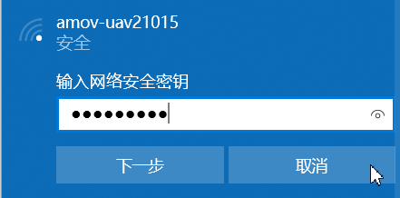
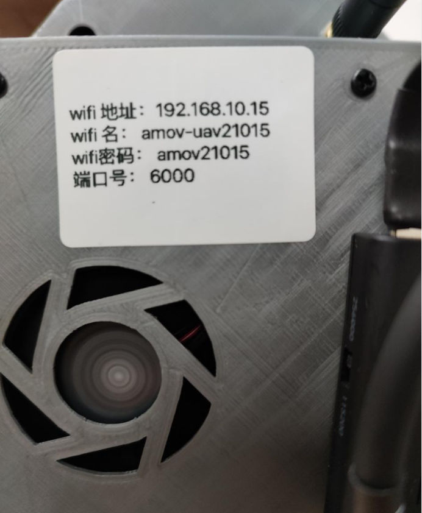

连接飞控
================

连接飞控有两种方式：一种是通过数据线连接。另一种是通过飞机的WiFi数传连接。

    1. 通过数据线连接
连接飞机与电脑，此时会自动连接QGC

    2. 通过WiFi数传连接
首先连接wifi，选择WiFi名称并输入密码。WIFI的标签在飞机底部。

然后输入IP地址与端口号。点击连接即可。

.. image:: ../../images/baseconfig_for_px4/0-connect-inputtcp.png

演示视频
------------------

.. raw:: html

    <iframe width="696" height="422" src="//player.bilibili.com/player.html?aid=971101299&bvid=BV15o4y1d7bW&cid=277323116&page=1" scrolling="no" border="0" frameborder="no" framespacing="0" allowfullscreen="true"> </iframe>
