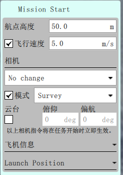
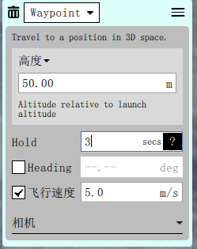
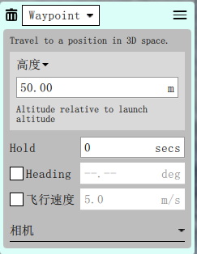
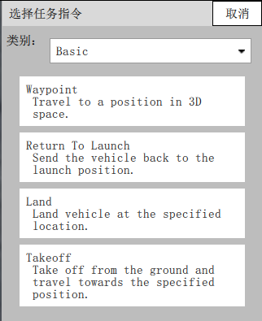
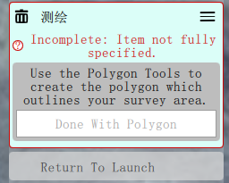

任务飞行
=================

点击如下界面，进入航点规划界面

点击“文件”，选择“Survey”

.. image:: ../../images/baseconfig_for_px4/10-mission-survey.png

进入航点规划界面，点击“航点”，即可设置若干个航点。

.. image:: ../../images/baseconfig_for_px4/10-mission-waypoint.png

在右侧可以设置“高度”与“速度”。在“Mission Start”上可以统一设置每个航点的高度与速度。

在每个航点上也可以设置高度、速度、与停留时间。如图所示，设置航点高度为50m，速度为5m/s，停留时间为3s。

点击航点旁边的“倒三角”，可以设置航点的类型，分别为任务点、返航点、降落点、起飞点。

在最后一行，标有“测绘”字样的航点旁边，点击“删除”，删掉最后一个任务点，否则不能上传任务。

点击右上角“需要上传”，航点规划就完毕了。

演示视频
------------------
.. raw:: html

    <iframe width="696" height="422" src="//player.bilibili.com/player.html?aid=971101299&bvid=BV18p4y1s77c&cid=277323116&page=1" scrolling="no" border="0" frameborder="no" framespacing="0" allowfullscreen="true"> </iframe>

演示视频
------------------

.. raw:: html

    <iframe width="696" height="422" src="//player.bilibili.com/player.html?aid=971101299&bvid=BV1xf4y1r785&cid=277323116&page=1" scrolling="no" border="0" frameborder="no" framespacing="0" allowfullscreen="true"> </iframe>
