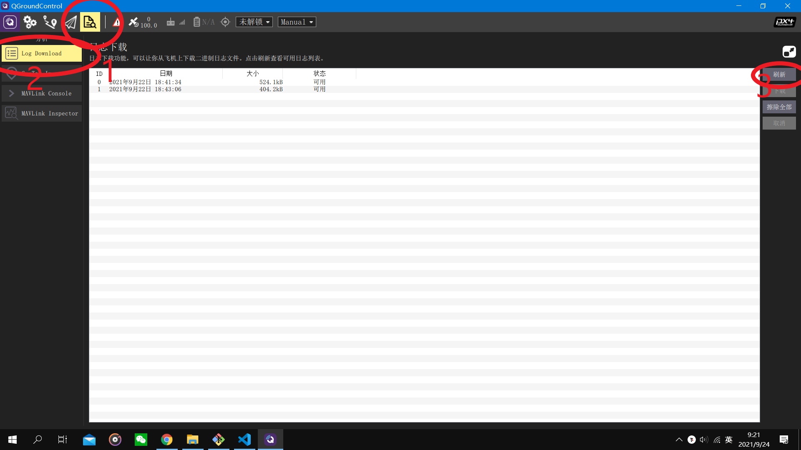
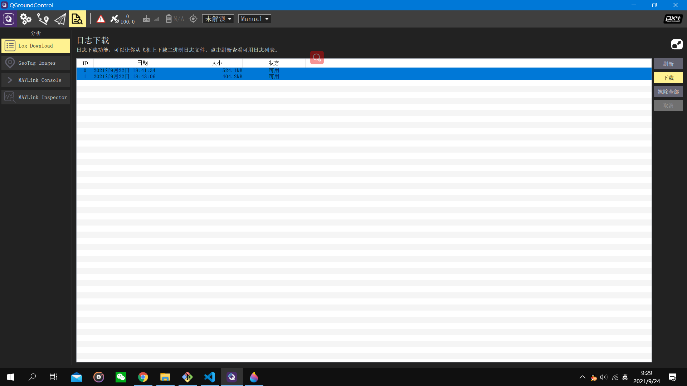
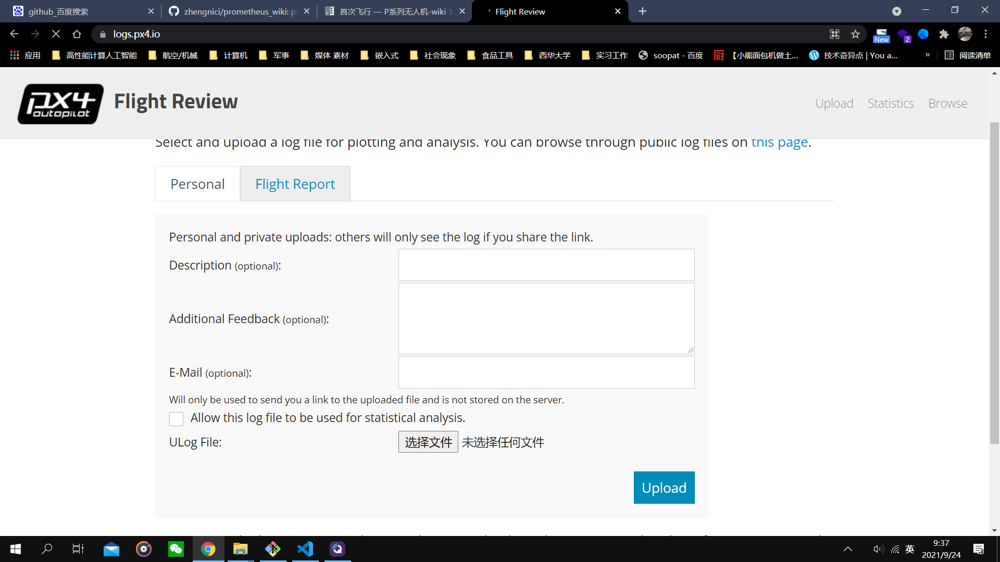
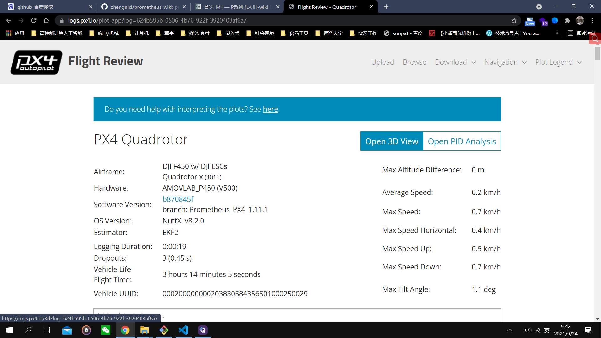
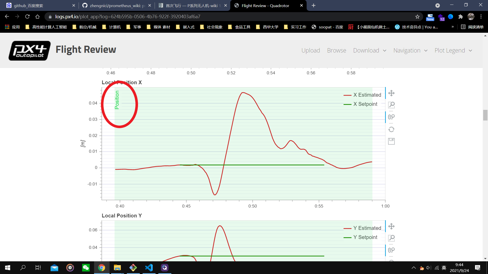

日志导出
=================

打开日志

.. attention::

    时间可能与电脑上的时间不同，最下面的日志就是最新的日志，只有解锁后才会记录日志。

点击日志，将想下载的日志选为蓝色，点击下载。

最新的日志后缀为.ulg 可以使用 `px4在线分析网站<https://logs.px4.io>`来分析日志
不需用特殊工具,多刷新几次就会出来

选择文件后点击upload就可以上传到网站分析也可以复制链接分享给分析人员

可以分析各项参数与姿态还有对应的模式
可以看到现在是定点模式可以如果出现t265掉线的情况可能就会切到定高模式

演示视频
------------------
.. raw:: html

    <iframe width="696" height="422" src="//player.bilibili.com/player.html?aid=971101299&bvid=bv1D64y1b7sC&cid=277323116&page=1" scrolling="no" border="0" frameborder="no" framespacing="0" allowfullscreen="true"> </iframe>
