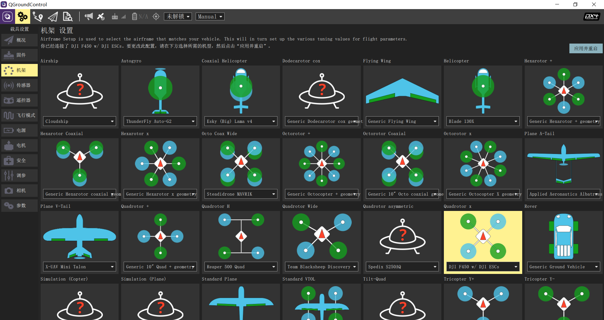

机架的选择
===============

如图所示，在“机架”界面选择标准四旋翼机架，选择DJI F450，然后在右上角点击“应用并重启”

演示视频
------------------

.. raw:: html

    <iframe width="696" height="422" src="//player.bilibili.com/player.html?aid=971101299&bvid=BV1Dt4y1B7cT&cid=277323116&page=1" scrolling="no" border="0" frameborder="no" framespacing="0" allowfullscreen="true"> </iframe>
