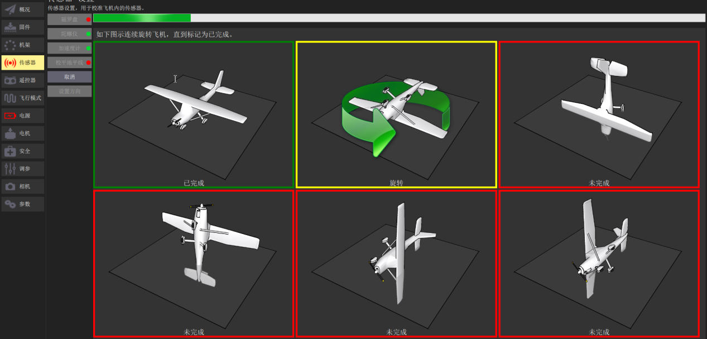
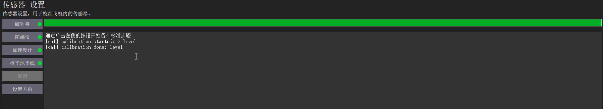

传感器校准
===============

磁力计校准
------------------

按照地面站界面所显示的相应摆放飞机的姿态，然后在水平面内朝一个方向旋转，直至下一个方向。

校准完成后如下图所示

.. image:: ../../images/baseconfig_for_px4/3-compass-calibrated.png

陀螺仪校准
-------------------

陀螺仪校准只需要把飞机平放即可，校准完成后会边框会显示为绿色。

.. image:: ../../images/baseconfig_for_px4/3-gyroscope-calibrated.png

加速度计校准
-------------------

加速度计校准为6面校准，只需要将飞机按照6个面分别摆放即可，没校准的边框为红色，正在校准中边框为黄色，校准完成边框为绿色。

.. image:: ../../images/baseconfig_for_px4/3-acceleroment-calibrating.png

水平面校准
------------------

水平面校准只需要将飞机放平即可，校准完成后会有“calibration done”的字样，意为校准完成。

演示视频
------------------

.. raw:: html

    <iframe width="696" height="422" src="//player.bilibili.com/player.html?aid=971101299&bvid=BV17v4y1Z7as&cid=277323116&page=1" scrolling="no" border="0" frameborder="no" framespacing="0" allowfullscreen="true"> </iframe>
