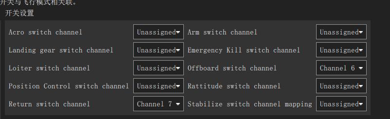

飞行模式设置
===================

飞行模式介绍
-----------------------

手动模式
^^^^^^^^^^^^^^^^^

ARCO：特技模式

遥控器输入被转换为横滚、俯仰和偏航速度，当摇杆回中时飞行器不会保持平衡，可以用于翻滚等特技飞行。

RATTITUDE：角速率模式

遥控器输入在极限区域被转换为横滚、俯仰的角度和偏航的速度，否则被转换为横滚、俯仰和偏航角度。

STABILIZED：稳定模式

遥控器输入被转换为横滚、俯仰的角度和偏航的速度，当摇杆回中后飞行器会保持平衡，之后会随风或其他因素漂移。

辅助模式
^^^^^^^^^^^^^^^^^^^

ALTITUDE CONTROL：高度模式
横滚、俯仰和偏航的输入与手动模式一致；
当摇杆在~50%油门左右，飞行器将保持当前高度；
油门有一个很大的死区，超出后控制上升或下降速度。
参数：MPC_Z_VEL_MAX_UP：最大上升速度,默认3.0m/s。
           MPZ_Z_VEL_MAX_DOWN：最大下降速度，默认1.0m/s。
           RCX_DZ：X通道（油门通道，由RC_MAP_THROTTLE设定）的死区；
           MPC_XXX：影响飞行表现的参数，例如MPC_THR_HOVER定义飞行器悬停的油门。

POSITION CONTROL：位置模式
横滚控制左右移动速度、俯仰控制前后移动速度，当摇杆回中时飞行器会保持位置；
偏航控制速度，与手动模式一致；
油门控制上升或下降的速率，与ALTITUDE一致；

自动模式
^^^^^^^^^^^^^^

HOLD：保持模式
保持在当前位置和姿态（依赖GPS）。
参数：MIS_LTRMIN_ALT：悬停最小高度（如果悬停高度低，飞行器会升高）。

RTL：返航模式
返回HOME位置等待或降落（依赖GPS）。
飞行器会首先上升到RTL_RETURN_ALT高度（默认60m，如果实际飞行高于此高度则保持），然后直线飞行HOME位置；
到达HOME后，会快速降低到RTL_DESCEND_ALT高度（缓降或停止高度，默认30m），会悬停RTL_LAND_DELAY时间后降落（默认0s，设置为-1表示永远悬停）；
参数：RTL_MIN_DIST：触发上升的最小距离，如果水平位置离HOME很近，飞行器将直接降落到HOME而非升高到返回高度。

TAKE OFF：起飞模式
起飞并等待下一步指令（依赖GPS）。
该模式为自动模式，遥控器失效（除非切换模式），启动前必须先解锁；
飞行器上升到MIS_TAKEOFF_ALT高度（默认2.5m）后等待，上升速度为MPC_TKO_SPEED（默认1.5m/s）。

LAND：降落模式
在当前位置降落。
该模式为自动模式（遥控器失效）；
飞行器在切换到该模式位置降落，下降速度为MPC_LAND_SPEED直至地面

MISSION：任务模式
飞行器接受地面站的程序控制指令，如果未收到任务，在当前位置悬停（依赖GPS）。
该模式为自动模式，遥控器失效，该模式工作前需解锁；
任务通常在QGC创建，也可以通过开发者API，上传到飞控。
如果任务已存储并且PX4在飞行，将从立即执行任务；
如果任务已存储但PX4着陆，PX4将执行任务，如果任务没有TAKEOFF命令，PX4将在执行剩下任务前飞行至最小高度；
如果任务未存储或PX4执行完所有任务命令，飞行状态飞行器会悬停，着陆状态飞行器会等待；
可以在QGC手动修改当前任务；
当飞行器锁定或新任务上传后，任务会重置；
任务可以通过HOLD模式暂停，重新激活后会从继续执行当前任务；

飞行模式设置
-------------------

可以在遥控器上设置通道，一般三挡开关对应飞行模式1、飞行模式4、飞行模式6。如图所示，此时通道5设置的三个模式分别为自稳模式、定点模式、降落模式。

.. image:: ../../images/baseconfig_for_px4/5-flightmodes.png

如有需要板载计算机模式和返航模式，也可在开关设置下自行设置。如图所示，设置通道6为offboard模式，通道7为返航模式。

演示视频
------------------

.. raw:: html

    <iframe width="696" height="422" src="//player.bilibili.com/player.html?aid=971101299&bvid=BV1sN411R7of&cid=277323116&page=1" scrolling="no" border="0" frameborder="no" framespacing="0" allowfullscreen="true"> </iframe>

