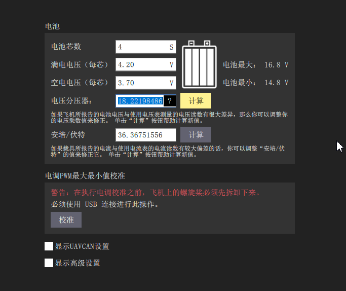
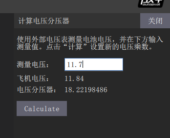
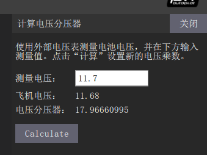

电池校准
==================

用BB响（低压报警器）测出飞机实际电压，如下图所示

.. image:: ../../images/baseconfig_for_px4/6-BB.png

在电源界面下，选择“电压分压器”，点击计算

如图所示，在测量电压下输入已经测得的实际电压，然后点击“Calculate”

等到“测量电压”与“飞机电压”数字接近时，表面电压校准已经完成，此时点击关闭即可。

演示视频
------------------

.. raw:: html

    <iframe width="696" height="422" src="//player.bilibili.com/player.html?aid=971101299&bvid=BV1No4y197cV&cid=277323116&page=1" scrolling="no" border="0" frameborder="no" framespacing="0" allowfullscreen="true"> </iframe>
