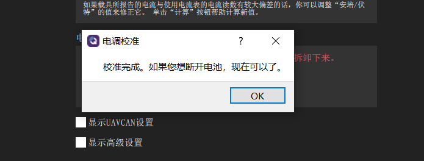

电调校准
=======================

在电源设置界面下，点击如箭头所指的“校准”。

注意：校准前不允许给飞机上电，把桨叶拆卸下来。

.. image:: ../../images/baseconfig_for_px4/7-esc-calibration.png

.. image:: ../../images/baseconfig_for_px4/7-esc-calibrating.png

给飞机上电，飞机会自动进行电调校准，几秒钟后就会校准完成了。

演示视频
------------------

.. raw:: html

    <iframe width="696" height="422" src="//player.bilibili.com/player.html?aid=971101299&bvid=BV1ev411e7Bj&cid=277323116&page=1" scrolling="no" border="0" frameborder="no" framespacing="0" allowfullscreen="true"> </iframe>
