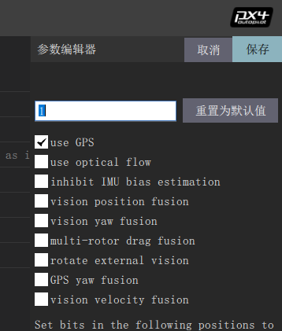
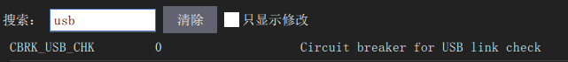
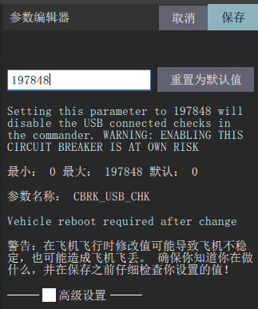
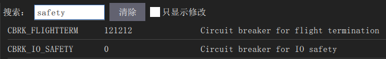
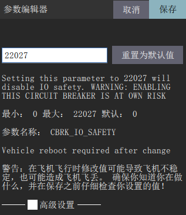

常用的参数设置
=====================

在参数设置下面的搜索界面，搜索关键字即可调整参数。

.. image:: ../../images/baseconfig_for_px4/8-parameters.png

常用参数：

aid_mask：位置估计来源选择

hgt_mode：高度估计来源选择

.. image:: ../../images/baseconfig_for_px4/8-parameters-hgt.png

Mag_sides:传感器校准面数选择

.. image:: ../../images/baseconfig_for_px4/8-parameters-mag-sides.png

Usb_chk：当用数据线调试飞机时，有时会显示“usb is not safe”，此时搜索“usb_chk”把数值调到197847最大值即可。

CBRK_I0_Safety：安全开关

当提示无法解锁飞机时，把CBRK_IO_SAFETY数值调到最大值22027，相当于禁用安全开关。

演示视频
------------------

.. raw:: html

    <iframe width="696" height="422" src="//player.bilibili.com/player.html?aid=971101299&bvid=BV1ev411e7Bj&cid=277323116&page=1" scrolling="no" border="0" frameborder="no" framespacing="0" allowfullscreen="true"> </iframe>
