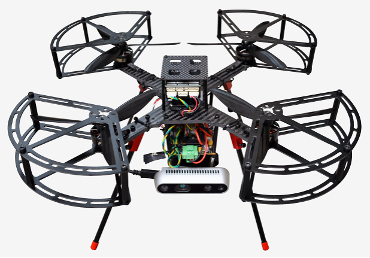

总览
----------------------

1.概述
>>>>>>>>>>>>>>>>>>>>>>>>>>>

欢迎大家使用查看本wiki，本wiki是关于P230系列飞机的详解。

**简介：** Prometheus 230（P230）是阿木实验室专为科研工作者与航天器开发者打造的小型化无人机开发平台，
适用于无GPS环境下基于视觉的无人机定位/导航/避障算法的验证与开发，以及室内无人机组网编队的研究。P230采用类穿越机的设计，机身采用一体碳板结构，极大的减轻重量同时保留了机载电脑、视觉传感器和飞控的拓展空间。
P230搭载了PX4 mini开源飞控与英伟达Jetson Xavier NX边缘AI计算机，预装基于PX4+ROS的Prometheus自主无人机机载系统。
标配Intel Realsense D435i深度相机，可通过内置的VINS-Fusion和EGO-Planner等算法，实现室内定点飞行、路径规划和自主避障等功能。
P230还被广泛应用于室内环境下的无人机编队，支持接入主流的MOCAP动作捕捉和UWB等外部定位系统，通过ROS组网实现室内的编队飞行。

2安全指导手册
>>>>>>>>>>>>>>>>>>>>>>>>>>>

.. 安全指导手册:

=======================
安全指导手册
=======================

:abbr:`注意！！！ (仔细阅读本wiki)`

:1: 本产品不适合未满 18 周岁及其他不具备完全民事行为能力的人士使用

:2: 本产品具有较大的机身尺寸、高速旋转的螺旋桨和强大的飞行动力，在运行时具有一定的危险性。未按要求操作和使用本产品可能会发生危险和伤害

:3: 使用本产品时，请远离机场、铁路、高速公路、高层建筑、电线等危险环境

:4: 使用本产品时，请远离手机基站，大功率发射设备等高电磁干扰的环境。

:5: 使用本产品时，请远离各种载人飞行器。

:6: 使用本产品时，请绑定安全绳操作，避免安全事故发生。

:7: 请勿在下雨、雷电、沙尘、雾气、下雪、大风、低温等恶劣环境使用本产品。

:8: 在高于 3000 米海拔以上飞行时，环境因素会导致飞行性能下降，请谨慎使用本产品。

:9: 本产品为非防水设计，请勿尝试在水面降落。

:10: 操作本产品在低空飞行时，请始终保持无人机和人或动物保持10米以上的安全距离。

:11: 在非人烟稀少的地区使用本产品时，请始终保持无人机在操作者目视范围内飞行。

:12: 不要将本产品悬停或飞越人群上空，请勿以惊吓他人为乐。

:13: 当有围观人群靠近时，请小心操控，尽快降落离开该场所，避免发生意外。

:14: 请勿在儿童嬉戏的场所附近操作本产品。

:15: 请勿使用本产品追逐交通工具或影响交通工具的正常运行。

:16: 非极其必要情况，请勿当本产品在空中飞行时关闭电机。

:17: 本产品不可在饮酒、疲劳、服用药物、身体不适等情况下使用。

:18: 请在每次使用前对本产品进行检查，包括但不限于零部件的牢固度、机体和螺旋桨的裂痕和磨损、电池电量、指示灯的有效性等。当发现异常时，请立即停止使用并更换相应配件。

:19: 工作状态异常的无人机可能会发生意外，切勿启动螺旋桨或勉强飞行。

:20: 请勿尝试阻止本产品工作中的任何运动部件。

:21: 请勿改装本产品，或将本产品用于非原设计用途。

:22: 本产品不包括载物功能，请勿用于运输用途。

:23: 请使用原厂配件进行维护和替换。

:24: 转借给其他人员操作，请确保操作人员理解和遵守本安全须知。

:25: 请访问www.amovlab.com获取最新的免责声明和安全须知。

3.官网链接
>>>>>>>>>>>>>>>>>>>>>>>>>

www.amovlab.com