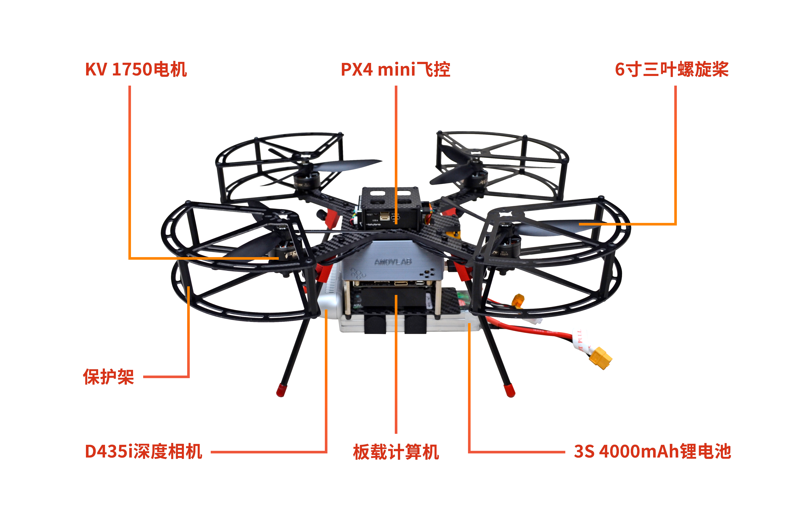
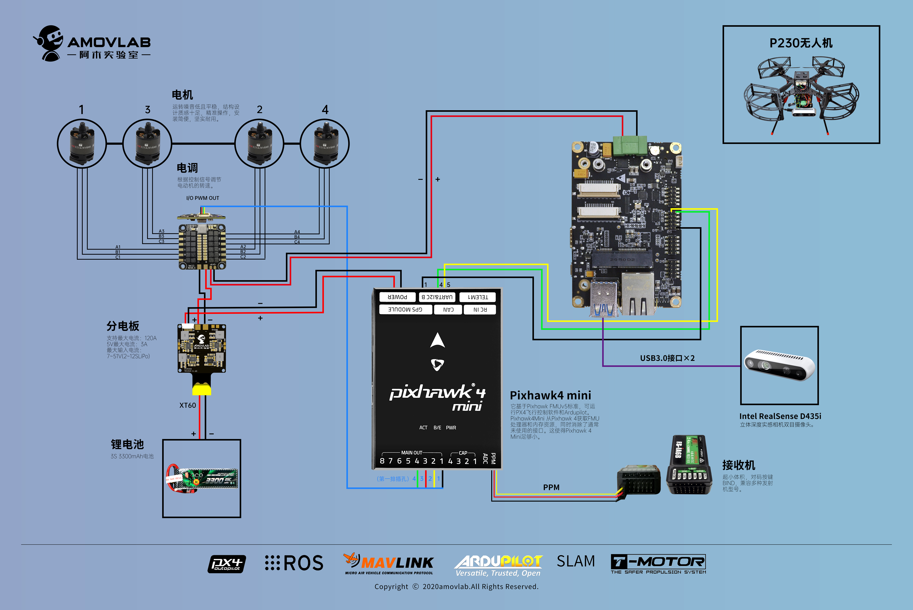
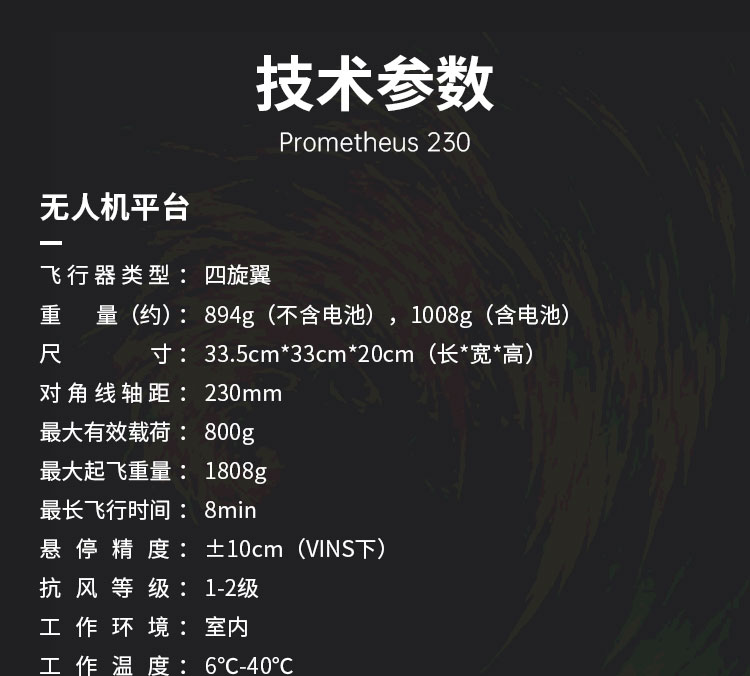
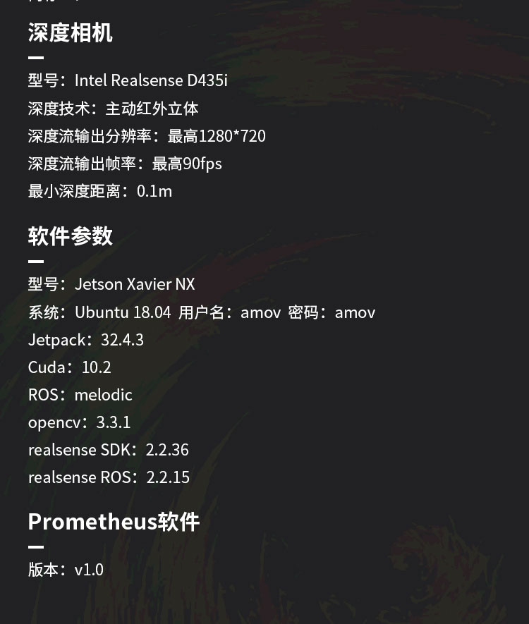
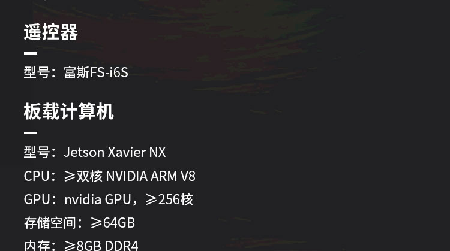
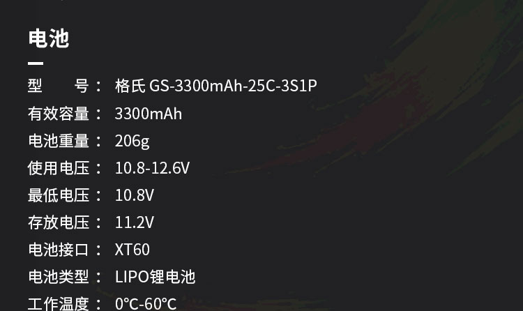

技术参数
-----------------------------

1.特征
>>>>>>>>>>>>>>>>>>>>>>>

P230基于Px4 mini开源飞控架构，通过自主设计的走线设计完成了高性能旋翼系统，使用者可轻易实现室内的飞行控制；
同时搭载Nvidia Jeston XavierNX 机载计算机，内置ROS环境下的无人机控制程序，可一键启动定点模式和视觉避障功能。
除此之外，我们还部署了港科大的VINS_FUSION 算法，可以取代T265用作视觉定位。
但是考虑到每个人的机器差异，我们只部署了环境以及数据链路的打通，可以在P230上进行二次SLAM算法开发。

2.规格
>>>>>>>>>>>>>>>>>>>>

作为Prometheus系列的第四代无人机平台，P230采用了轻量化碳管机架和环外保护架的设计。在进一步压缩重量的同时，提高了传感器的使用率，提高了续航时间。

硬件接线图

3.参数
>>>>>>>>>>>>>>>>>>>>>>>>>>

