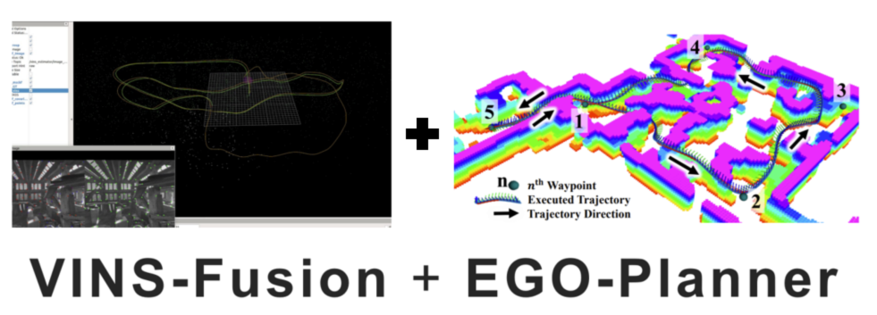
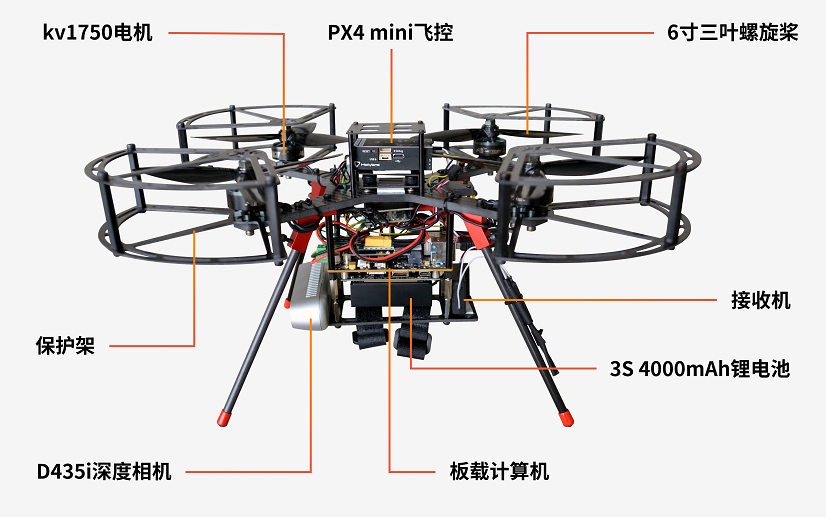
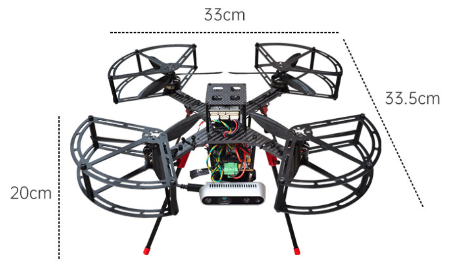
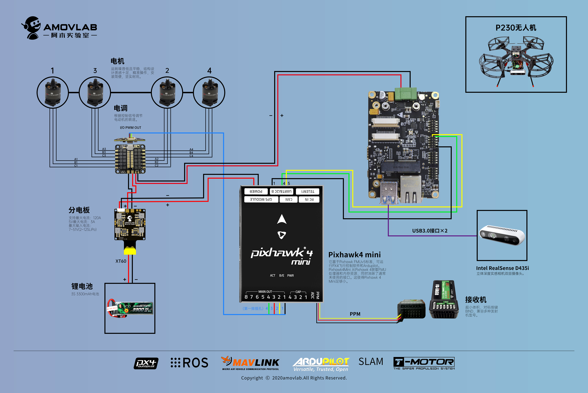
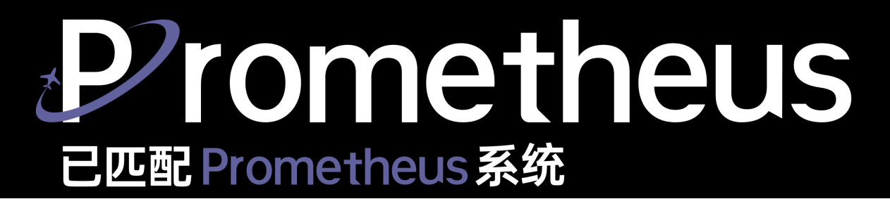
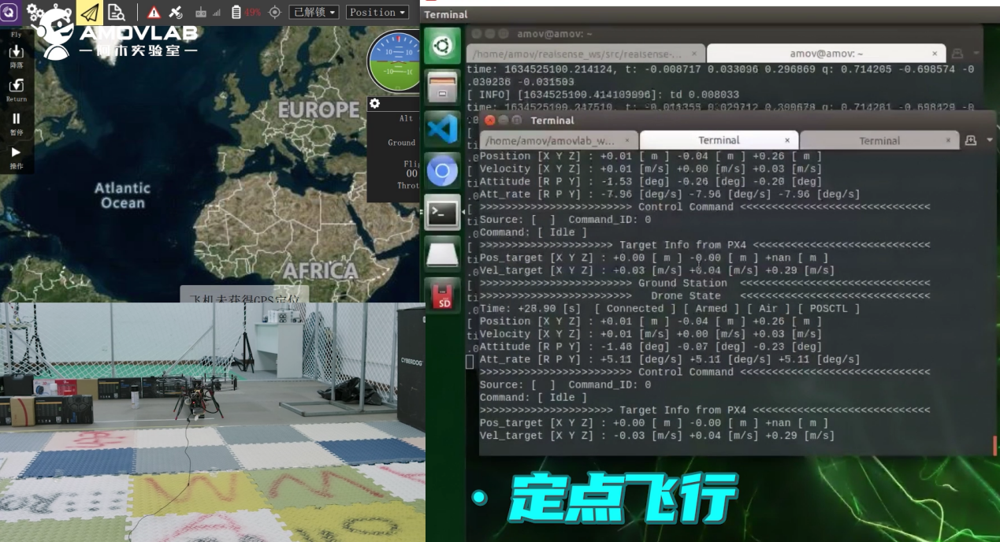
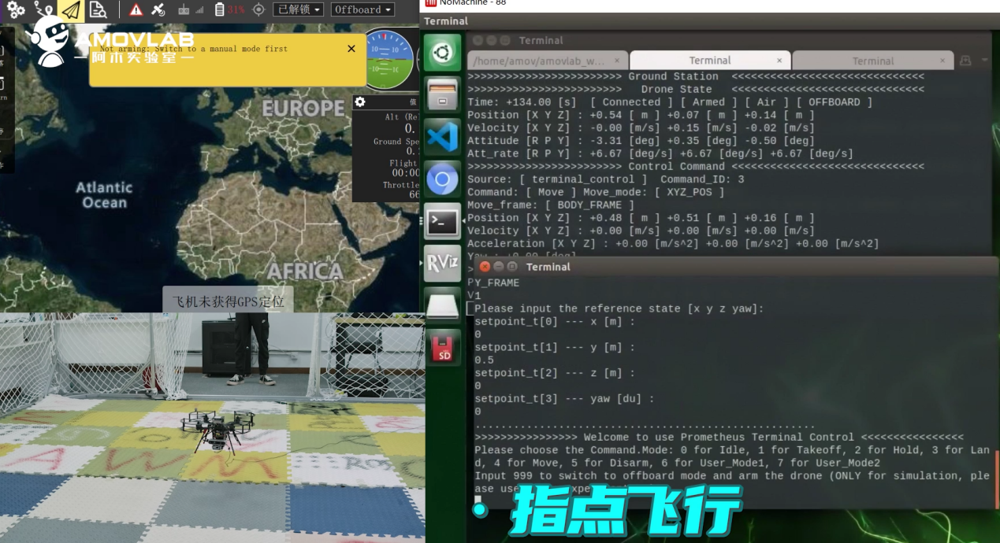
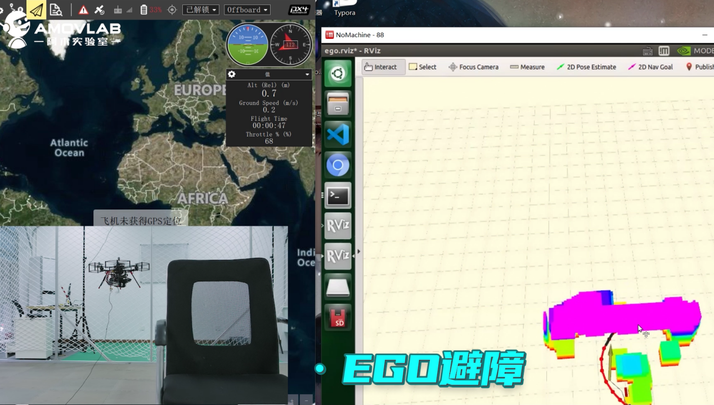

技术参数
-----------------------------

1.特色
>>>>>>>>>>>>>>>>>>>>>>>

P230在Prometheus无人机家族中，与搭载多种传感器、应用全面的P450和搭载大型设备、用于室外场景的P600都有所不同。
采用PX4 mini飞控、穿越机电机和仅搭载一台深度相机作为传感器都是为了尽可能减小P230的尺寸，是专为无GPS环境飞行、视觉SLAM导航避障和室内编队设计的型号。
P230以英伟达NX作为板载计算机，内置基于ROS机器人操作系统的无人机控制程序，可一键启动定点飞行和视觉避障功能，并通过控制终端给出飞行指令。
P230在P450的EGO-Planner视觉避障算法的基础上，进一步融合了港科大的VINS_Fusion VIO算法，使D435i深度相机得以取代T265追踪相机，用一台传感器和一套融合后的算法就可同时实现无人机的视觉定位与视觉避障。

2.规格
>>>>>>>>>>>>>>>>>>>>

P230是完全开源的飞行平台，可在其基础上进行相关算法的二次开发；所有DEMO及算法源码均通过开源项目Prometheus发布在Github中，包含代码注释与ROS仿真脚本。在标准的P230套件中，我们已部署了VINS-Fusion专用的运行环境，并完全接入了Prometheus系统中的控制模块，到手即可使用。同时，开发者也无需再为复现算法耗费时间部署环境，仅需在P230中对部分参数进行更改或算法优化，即可实现视觉定位飞行，并应用在自己的项目中。

尺寸体积

硬件接线图

3.技术参数
>>>>>>>>>>>>>>>>>>>>>>>>>>

型号：P230

飞行器类型：四旋翼

重量：894g(不含电池),1008g(含电池)

尺寸：33.5cm*32cm*20cm

对角线轴距:230mm

最大有效载荷:800g

最大起飞重量:1808g

最长飞行时间:8min

悬停精度:±10cm（VINS-Fusion视觉定位情况下）

抗风登记:1-2级

工作环境:室内

工作温度:6℃-40℃

遥控器：富斯FS-i6S

电池：3S-4000mah锂聚合物电池

通信链路：WIFI数传模组（建议搭配阿木实验室推荐的路由器使用）

机载计算机：Nvidia Jetson Xavier NX

机载系统：Prometheus V1.0

视觉传感器：Intel RealSense D435i深度相机

4.主要功能
>>>>>>>>>>>>>>>>>>>>>>>>>>

P230搭载了开源无人机机载系统Prometheus V1.0-stable。内置基于PX4-ROS的控制模块和SLAM、自主决策、编队、避障等多种算法，
开发者无需再耗费大量时间在开源飞控和ROS的系统联调以及算法的部署复现上，可专注于算法本身的调试与开发。

P230仅搭载一台深度相机作为传感器，无法直接使用Prometheus中的全部功能。与此相对的，P230的机载系统单独适配了VINS-Fusion算法，是一款完全依赖视觉实现自主飞行与避障的无人机平台。

.. important::
   关于Prometheus项目：Prometheus是一套开源的自主无人机软件平台，为无人机的智能与自主飞行提供全套解决方案。本项目集成了PX4开源飞控固件与ROS开发环境，可为开发者提供成熟可用的机载电脑端开发程序，实现更加简洁快速的开发体验。目前已集成建图、定位、规划、控制及目标检测等模块，并配套有Gazebo仿真测试代码。

控制模块
^^^^^^^^^^^

Prometheus V1.0中的无人机控制终端可通过简单的控制指令接口，实现无人机的一键解锁，起飞，悬停，降落，紧急上锁，惯性系及机体系下的控制指令等操作。
在PX4 飞控的offboard模式下，英伟达NX通过发送控制指令，给飞控发送期望位置，实现对无人机的飞行控制。P230中，控制模块可利用接入的VINS-Fusion定位视觉，实现室内的无人机飞行控制。

视觉定位模块
^^^^^^^^^^^^^^^^

不同于之前的T265视觉定位， P230可以通过VINS-Fusion ，一组由港科大开源的VIO算法，实现基于IMU和双目相机的即时定位。
P230的机载系统中实现了Prometheus系统与VINS-Fusion算法之间的通信，并且将VINS-Fusion融合到了EGO-Planner的建图中。
在测试中，英伟达NX上可实现无延迟传输，为用户在此基础上开发属于自己的视觉SLAM算法提供了高效率的的平台。

视觉避障模块
^^^^^^^^^^^^^^^^^^^

尽管激光SLAM算法较为成熟，但是在一些条件下具有一定的使用限制，因此阿木实验室一直在寻求完全基于视觉的无人机自主飞行规划算法。
现在，P230可通过EGO-Planner，一组开源的快速路径规划算法，实现基于视觉的实时避障和路径规划。我们对上一代EGO-Planner算法进行了本地优化，轨迹规划更加有效，其在陌生环境中的避障速度和准确率都有了较大提升。

室内编队飞行平台
^^^^^^^^^^^^^^^^^^^^^
P230在作为单独套件推出之前，一直作为编队专用的小型无人机活跃于阿木实验室的室内无人机编队项目中。
P230支持接入大部分带有ROS驱动的主流MOCAP动作捕捉系统和超带宽UWB定位系统，通过一台路由器即可实现室内的无人机多机组网编队。

.. attention::

    除上述功能以外，P230同样可通过深度相机的RGB模组实现Prometheus中的各种机器视觉相关功能，也可自行拓展传感器实现其他内置算法。同时，我们将保持机载系统Prometheus V1.0持续的免费更新，在未来支持更多Prometheus项目中集成算法与功能。

