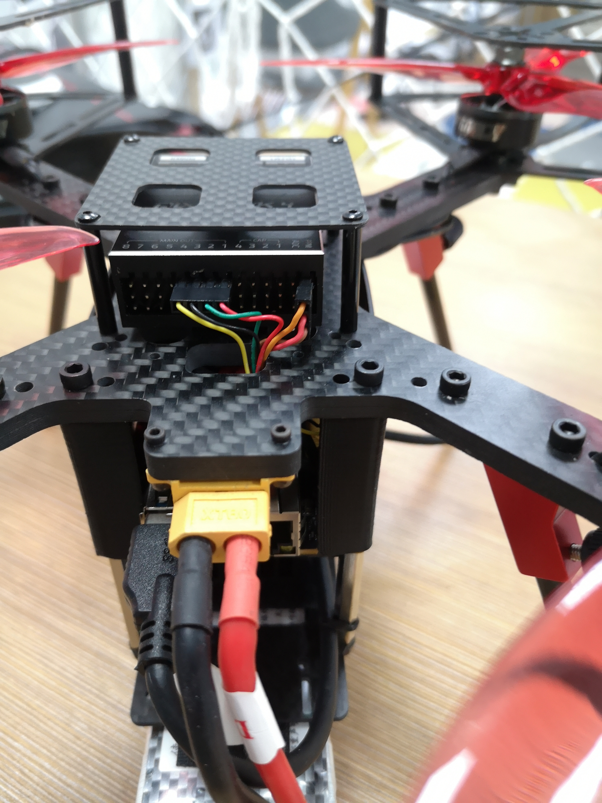
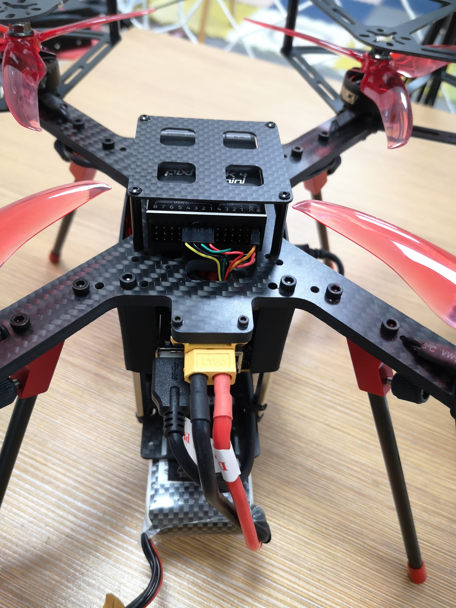
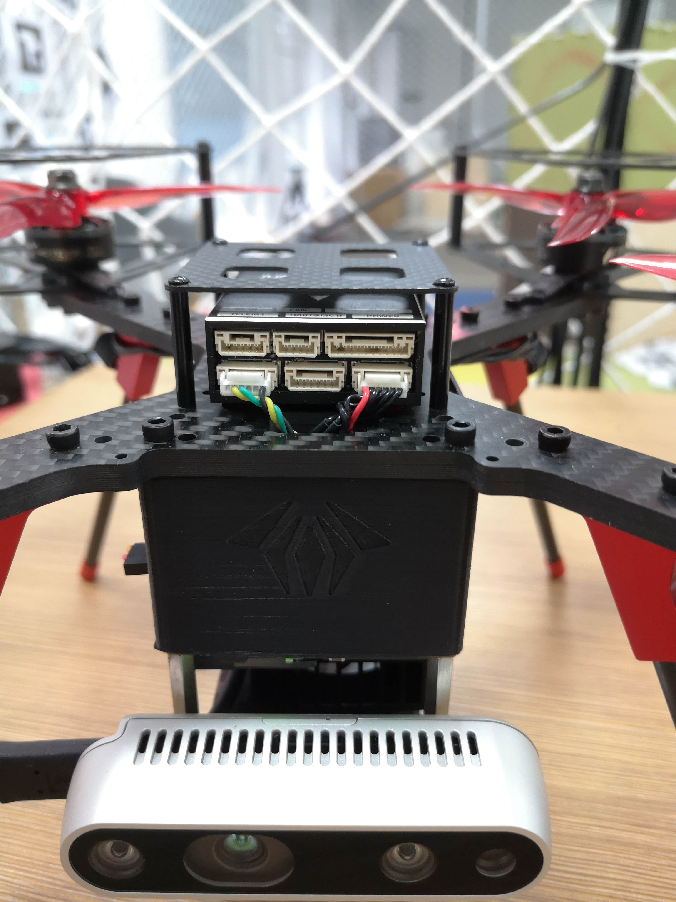
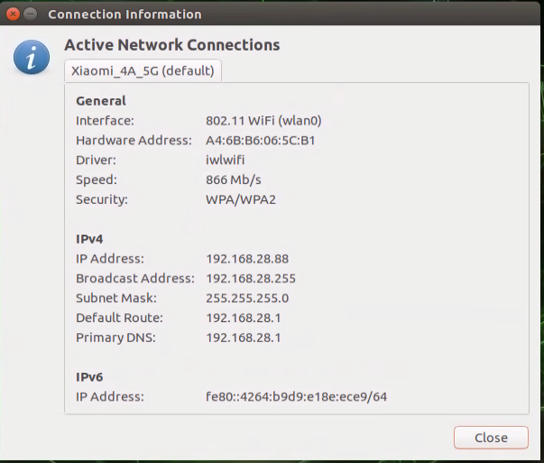
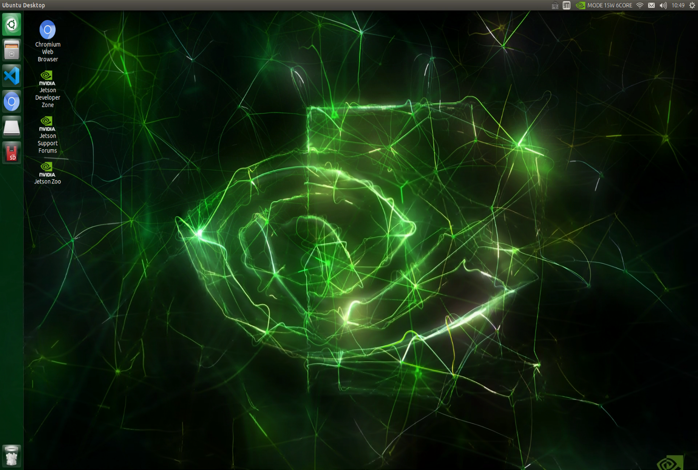
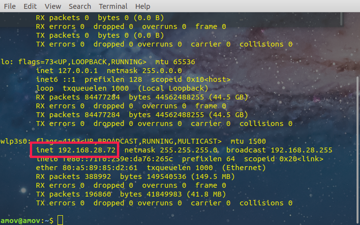
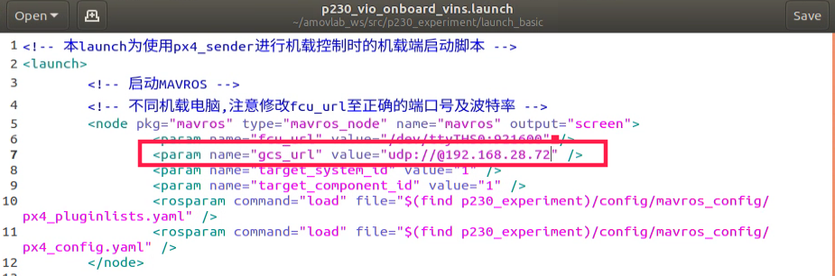
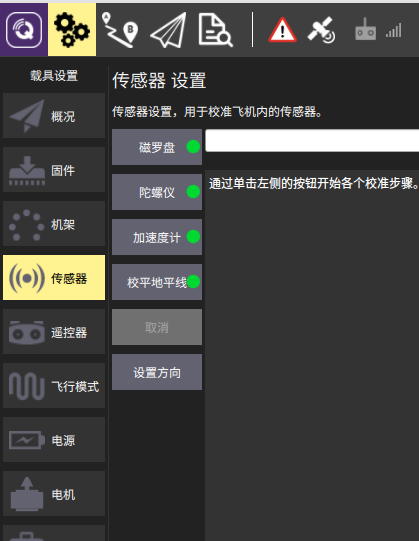

快速入门
====================

1.使用前须知
------------------------

使用者需要仔细阅读本wiki，避免炸机。

.. attention::

    受限于开源飞控硬件性能，飞机在长时间不用后会出现位姿漂移，要求每次飞行前电池重新上电以重启飞控和板载计算机，并严格按照wiki规范操作，避免炸机风险。

2.开箱视频
-------------------------

需补充。

3.电脑设置
----------------------------

准备一台笔记本电脑，电脑系统不做要求，可以是Windows7，Windows10或者是Ubuntu系统。需要安装QGroundControl(以下简称QGC)和nomachine。
QGC的作用是连接到飞机，监控飞机本身的状态（传感器是否正常，参数配置是否正常）；nomachine用作远程连接到板载计算机。

.. hint::

    软件安装包请在百度网盘自主下载
    `网盘链接 <https://pan.baidu.com/share/init?surl=M2ucIqRqnKoFI8ylLpgquQ>`_
    
    提取码: **amov**

.. image:: ../../images/p450/first_fly/package.png

从图中可以看到，有不同操作系统下的安装包，根据自己笔记本电脑系统安装相应的QGC和nomachine。

安装QGC地面站
^^^^^^^^^^^^^^^^^^^^^^^

正确安装上面安装包之后，打开QGC地面站：

.. image:: ../../images/p450/first_fly/1-qgc.png

.. attention::

    最下方的版本是V4.0.8

.. image:: ../../images/p450/first_fly/1-qgc-vision.png

安装nomachine
^^^^^^^^^^^^^^^^^^^^^^^

正常安装按完成之后，打开nomachine：

.. image:: ../../images/p450/first_fly/1-nomachine.png

装完软件后，我们就可以先给无人机上电了。上电之前我们需要先做些准备工作。

4.使用前的检查和注意事项
-----------------------------------

使用前需要准备以下硬件
^^^^^^^^^^^^^^^^^^^^^^^^^^

p230无人机+富斯i6s遥控器

.. image:: ../../images/p230/p230_外观_1.jpg
   :alt: None
   :align: center

4000mah航模锂电池

.. image:: ../../images/p450/first_fly/2-4000mah.png
   :height: 800px
   :width: 800px
   :scale: 50%
   :alt: None
   :align: center

遥控器电池

.. image:: ../../images/p450/first_fly/2-rcbattery.png
   :height: 912px
   :width: 807px
   :scale: 40%
   :alt: None
   :align: center

安全绳

.. image:: ../../images/p450/first_fly/2-safestring.png
   :height: 434px
   :width: 769px
   :scale: 60%
   :alt: None
   :align: center

5.组装及链接
----------------------------

无人机电源上电如下图所示
^^^^^^^^^^^^^^^^^^^^^^^^^^^

   
需要检查下各个接口有没有因为运输造成的接口松动。
电机和遥控器接收机与飞控的连接。

飞控与板载电脑的连接。

需要检查下各个接口有没有因为运输造成的接口松动。

查看板载计算机ip
^^^^^^^^^^^^^^^^^^^^^^^^^^^^^

我们配置了一个专用路由器用于连接板载计算机和使用者的电脑，P230和使用者的笔记本需要在同一个局域网内，在第一次连接不知道板载电脑IP的情况下，需要为板载计算机外接一个显示器查看ip，以后的连接在不更换路由器的情况下，ip一般不会变化。

nomachine远程连接板载计算机
^^^^^^^^^^^^^^^^^^^^^^^^^^^^^^^

点击New

.. image:: ../../images/p450/first_fly/4-nom-1.png
   :height: 232px
   :width: 1004px
   :scale: 50%
   :alt: None
   :align: center

在Protocol下选择NX，点击Continue。

.. image:: ../../images/p450/first_fly/4-nom-2.png
   :height: 676px
   :width: 956px
   :scale: 70%
   :alt: None
   :align: center

在“Host”下填写板载计算机的ip地址，板载计算机地址参考步骤2，“Port”下默认4000。

.. image:: ../../images/p230/12.png
   :align: center

在Proxy下默认是“Don’t use a proxy”，点击“Continue”。

.. image:: ../../images/p450/first_fly/4-nom-5.png
   :height: 687px
   :width: 983px
   :scale: 70%
   :alt: None
   :align: center

在Save as下会生成默认的name，可以不做更改，点击“Done”。

.. image:: ../../images/p230/13.png
   :align: center

按照上述步骤操作，会自动生成如下图所示用红框标起的链接，点击“Connect”。

.. image:: ../../images/p230/14.png
   :alt: None
   :align: center

在“Username”和“Password”下输入“amov”

.. image:: ../../images/p450/first_fly/4-nom-8.png

Nomachine成功连接板载计算机后会显示如下界面

6.校准
---------------------------------

qgc远程连接到飞机
>>>>>>>>>>>>>>>>>>>>>

不同于P450的wifi数传，P230并不携带数传，我们需要通过UDP的方式连接到地面站。
这里的IP地址是自己主机的IP地址，并且需要在一个局域网内。

然后修改p230_vio_onboard_vins.launch文件中的内容，把如下图所示的地址更改为使用者主机的ip地址：

在终端执行roslaunch p230_experiment p230_vio_onboard_vins.launch,就可以连接到地面站。

需要校准的传感器如下：

.. attention::
    如果做无人机室内测试，需要在地面站修改参数EKF2_AID_MASK，EKF2_HGT_MODE，详细操作如下：

    首先点击参数（Parameters）按钮，进入参数修改界面，如下。

    .. image:: ../../images/p450/first_fly/3-parameters.png

    在search栏输入aid，选择EKF2_AID_MASK参数

    .. image:: ../../images/p450/first_fly/3-aid1.png

    在窗口右上侧会弹出子页面,如下图所示。

    .. image:: ../../images/p450/first_fly/3-aid2.png

    一般默认选择第一项use GPS,由于我们室内飞行使用的是T265作为位置定位源，所以需将此参数改为4、5项，修改后保存。

    在search栏输入hgt,选择EKF2_HGT_MODE参数栏

    .. image:: ../../images/p450/first_fly/3-hgt1.png

    在窗口右上弹出的子页面上，点击下拉菜单，选择vision，如下图所示

    .. image:: ../../images/p450/first_fly/3-hgt2.png

   在执行飞行之前，都需要检查参数和检查飞机桨叶是否上紧，检查螺丝是否有松动。
   一般传感器参数我们都会调整好，但运输过程可能会对飞机产生影响。这时就需要自己调整参数。
   调整完，记得重启飞控。

   最后保存退出,记得重启飞控。

   至此 那么我们已经做完了飞行前的所有工作，接下来我们就可以进行定点和指点飞行。
    

