使用手册
=====================

1.基本准备
---------------------------

因为跟前文类似，这里就不在赘叙，需要的可以点击下面链接自行查看。

file:///home/cch/prometheus_wiki/doc/build/html/docs/p230/3-%E5%BF%AB%E9%80%9F%E5%85%A5%E9%97%A8.html

2.初级功能
----------------------------------------

定点飞行
>>>>>>>>>>>>>>>>>>>>>>>>

.. attention::
      在室内操作时，注意在QGC地面中查看自己的位置源是否更改，参数EKF2_AID_MASK设定如下图，EKF2_HGT_MODE设定为Vision。
        .. image:: ../../images/p450/first_fly/3-aid2.png
        
启动脚本
^^^^^^^^^^^^^^^^^^^^^

首先在终端输入“rs-sensor-control”,查看有没有传感器连接，正常情况下如
下图所示，会显示传感器的序列号。

.. image:: ../../images/p450/first_fly/5-sensor-control.png
   :height: 187px
   :width: 497px
   :scale: 100%
   :alt: None
   :align: center

启动脚本在下图所示的目录下面

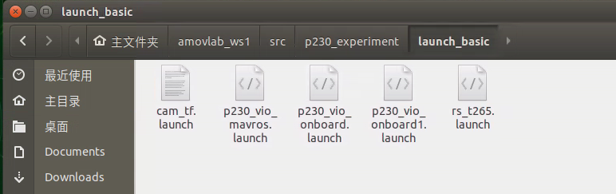

在终端输入如下命令，启动脚本

启动脚本后如下图所示

.. image:: ../../images/p450/first_fly/5-roslaunch.png

检查各项数据是否正常
^^^^^^^^^^^^^^^^^^^^^^^^^

在启动脚本后，首先查看地面站，地面站上会显示飞机的航向为正东，就是“E”。

.. image:: ../../images/p450/first_fly/6-qgc-e.png
   :height: 364px
   :width: 248px
   :scale: 100%
   :alt: None
   :align: center

第一个终端正常情况下如下图所示，各项数据均正常

.. image:: ../../images/p450/first_fly/6-first.png

第二个终端如下图所示，查看飞机的位置、速度、角度与角速度信息是否正常,移动飞机,查看飞机的位置信息是否正常，飞机向前为X轴正方向，向左为Y轴正方
向，向上为Z轴正方向。下图例子为将飞机向后向上各移动大概1m，数据显示正常。

 .. image:: ../../images/p450/first_fly/6-twice.png

 第三个终端如下图所示，显示“Program is running”即表示脚本正常运行。

  .. image:: ../../images/p450/first_fly/6-third.png

遥控器定点模式飞行
^^^^^^^^^^^^^^^^^^^^^^^^^^

如下图所示，将“SWC”开关拨到中间一档， 切到“定点模式”

.. image:: ../../images/p450/first_fly/7-pos.png
   :height: 745px
   :width: 998px
   :scale: 60%
   :alt: None
   :align: center

然后左手“右下”解锁飞机，如下图所示。

.. image:: ../../images/p450/first_fly/7-arm.png

起飞后如下图所示，进行定点模式飞行。

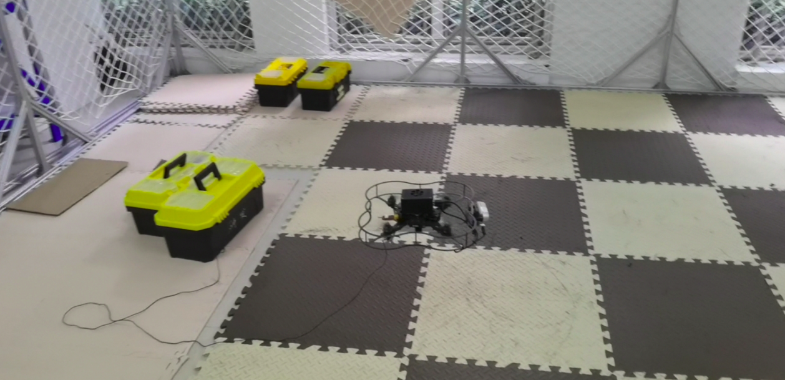

降落
^^^^^^^^^^^^^^^^^^^^^^^

我们轻轻将油门杆推到最低，飞机降落后，等待飞机上锁即可。

视频演示
^^^^^^^^^^^^^^^^^^^^^^^^^

本段飞行演示视频时间为00.00-03.20

.. raw:: html

  <iframe height=600 width=650 src='https://player.youku.com/embed/XNTE5NTI4Mjc2NA==' frameborder=0 'allowfullscreen'></iframe>

指点飞行
>>>>>>>>>>>>>>>>>>>>>>>

本节主要讲解P230系列无人机在室内的指点飞行演示。视频紧接上节内容 **指点飞行**  ，默认已经连接到QGC地面站和nomachine远程连接到板载计算机，
主要分为一下几点进行讲解：启动指令，命令行控制终端详解，起飞，指点飞，以及最后的视频演示。

.. attention::

    受限于开源飞控硬件性能，飞机在长时间不用后会出现位姿漂移，要求每次飞行前电池重新上电以重启飞控和板载计算机，并严格按照wiki规范操作，避免炸机风险。

启动指令
^^^^^^^^^^^^^^^^^^^^^^

.. attention::
      在室内操作时，注意在QGC地面中查看自己的位置源是否更改，参数EKF2_AID_MASK设定如下图，EKF2_HGT_MODE设定为Vision。
        .. image:: ../../images/p450/first_fly/3-aid2.png

首先启动基本vio脚本 

`roslaunch p230_experiment p230_vio_onboard.launch`

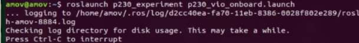

然后再启动控制脚本

`roslaunch p230_experiment p230_vio_control.launch`

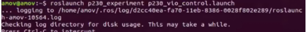

之后会出现终端控制界面，提示有两种控制的输入方式，第一种是通过命令输入控制方式，另外一种是通过键盘按键控制方式。

.. image:: ../../images/p450/室内指点/终端控制选择.png
   :height: 327px
   :width: 647 px
   :scale: 80 %
   :alt: None
   :align: center

两种方式都可以控制无人机，一般在做实机实验过程中选择第一种通过命令输入控制方式；第二种键盘控制不太安全。接下来会详细讲解如何使用第一种命令输入控制方式实现指点飞行。

命令行控制终端详解
^^^^^^^^^^^^^^^^^^^^^^^^^^^

.. image:: ../../images/p450/室内指点/命令行控制终端.png
   :height: 327px
   :width: 647 px
   :scale: 80 %
   :alt: None
   :align: center

其中 0 表示的是 怠速；意思就是飞机会进入offboard模式，但是在该模式下，没有对飞机进行任何指令的发送。飞机也不会有任何动作。这个指令一般也可以不用。

1 表示的是 起飞；起飞点为当前点，起飞高度通过 yaml参数文档设置，单位是米，默认起飞高度是0.5m

2 表示的是 悬停；飞机正在飞行过程中如何接受到 2 指令，会在当前时刻进入悬停状态。

3 表示的是 降落；降落速度通过 yaml参数文档设置，单位是m/s ，默认降落速度为0.2m/s 。还有一个上锁高度，到达上锁高度之后飞机会进入飞控的本身降落模式进而缓缓着地，
上锁高度通过 yaml 参数文档进行设置，单位是米，默认是 0.18m，即认为离地不到20cm的时候进入飞控本身的降落飞行模式。

4 表示的是 move模式；该模式就包含我们所称的指点飞行功能，在此模式下，又有5种子模式：
0对应XYZ_POS,空间位置控制；
1对应XY_POS_Z_VEL,水平面位置控制，高度速度控制；
2对应XY_VEL_Z_POS,水平面速度控制，高度定高控制；
3对应XYZ_VEL,空间速度控制；
5对应TRAJECTORY，轨迹跟踪控制。

.. image:: ../../images/p450/室内指点/move模式介绍.png
   :height: 148px
   :width: 645 px
   :scale: 100 %
   :alt: None
   :align: center

常用的模式为0空间位置控制（指点飞行），接下来会讲讲实机过程中起飞的具体实现。

起飞
^^^^^^^^^^^^^^^^^^^

通过控制终端发送1起飞指令，这时候飞机通过板载计算机已经给飞机一直发送起飞指令，但是目前飞机还没有进入offboard模式和解锁，所以飞机是没有响应的。

.. image:: ../../images/p450/室内指点/起飞.png
   :height: 601px
   :width: 840 px
   :scale: 80 %
   :alt: None
   :align: center

发送完起飞指令之后，遥控器切换到position模式，然后遥控器操作“内八”进行解锁，最后拨动offboard飞行模式开关。飞机就会慢慢起飞起来，保持在0.5m的高度。

可以看到飞机起飞已经完成，保持在0.5m高度，接下来进行指点操作，这时候就不需要遥控器操作了，只需要看好遥控器，防止意外事情发生；进入指点飞行过程。

指点飞
^^^^^^^^^^^^^^^^^^^^^

选择 4 move飞行模式，然后选择 0 空间位置控制，然后选择 0 ENU_FRAME惯性坐标系，最后输入期望的状态，空间位置xyz和航向角yaw。

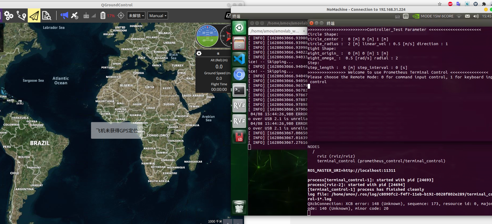

这里我们发送的指令是x为0，y为0，z为0，yaw为0.让飞机往前x轴飞行0m，往左y轴飞行0m，往上z轴飞行到0.5m，航向角保持不变发送为0.

飞机开始移动到我们设定空间位置

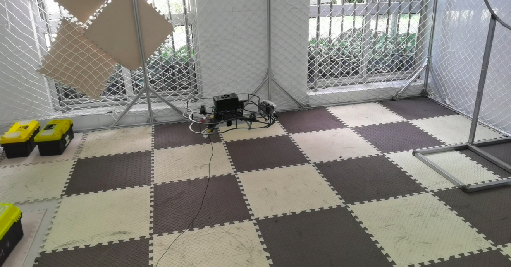

上图可看飞机已经到达并且稳定到我们设定的空间位置。

视频演示
^^^^^^^^^^^^^^^^^^

拍摄一段测试视频，预祝复现室内指点飞行成功。

本段飞行演示视频时间为03.34-06.09

.. raw:: html

  <iframe height=600 width=650 src='https://player.youku.com/embed/XNTE5NTI4Mjc2NA==' frameborder=0 'allowfullscreen'></iframe>

3.中级功能
--------------------------

EGO-planner
>>>>>>>>>>>>>>>>>>>>>

本节主要讲解P230系列无人机的EgoPlanner飞行演示。视频紧接上节内容 **首次飞行**  ，默认已经通过UDP协议连接到QGC地面站和nomachine远程连接到板载计算机，
主要分为一下几点进行讲解：传感器检查，操作，降落，以及最后的视频演示。

.. attention::

    受限于开源飞控硬件性能，飞机在长时间不用后会出现位姿漂移，要求每次飞行前电池重新上电以重启飞控和板载计算机，并严格按照wiki规范操作，避免炸机风险。

传感器检查
^^^^^^^^^^^^^^^^^^^
首先在终端输入下面命令，查看是否T265和D435i都已经被系统识别到

`rs-sensor-control`

.. image:: ../../images/p450/fastplanner/传感器检查.png
   :height: 270px
   :width: 593px
   :scale: 100%
   :alt: None
   :align: center

操作
^^^^^^^^^^^^^^^^^^^^

在终端输入下面命令启动，依次查看每个终端是否有报错

`/home/amov/amovlab_ws/src/ego_sh/ego.sh`

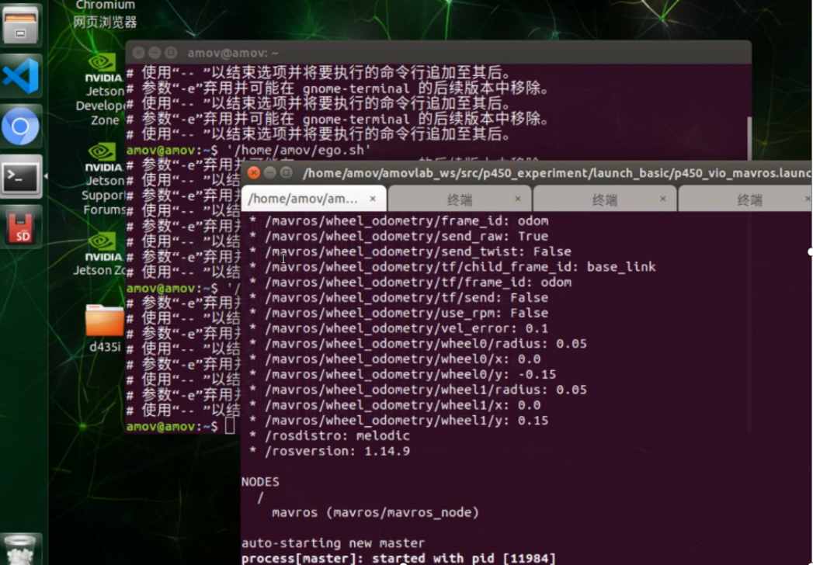

会自动弹出rviz界面，并可以看到建图效果，里面可以看到障碍物

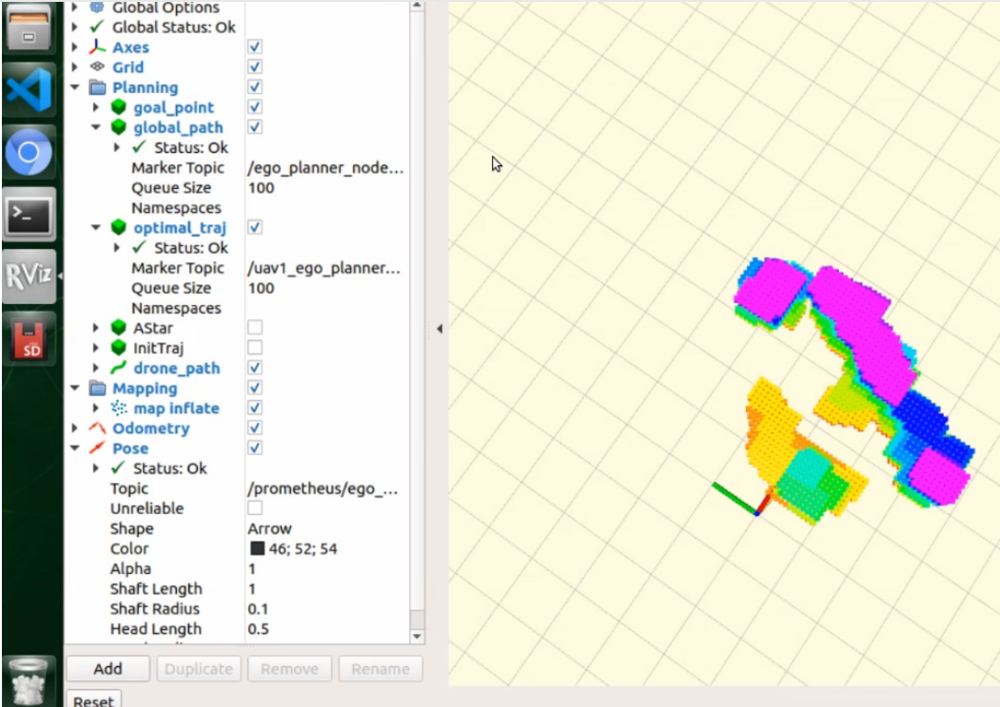

确认参数和设置没有问题后，在此终端输入1并敲回车,然后遥控器先切到定点模式，在此终端继续输入1并敲回车，解锁无人机

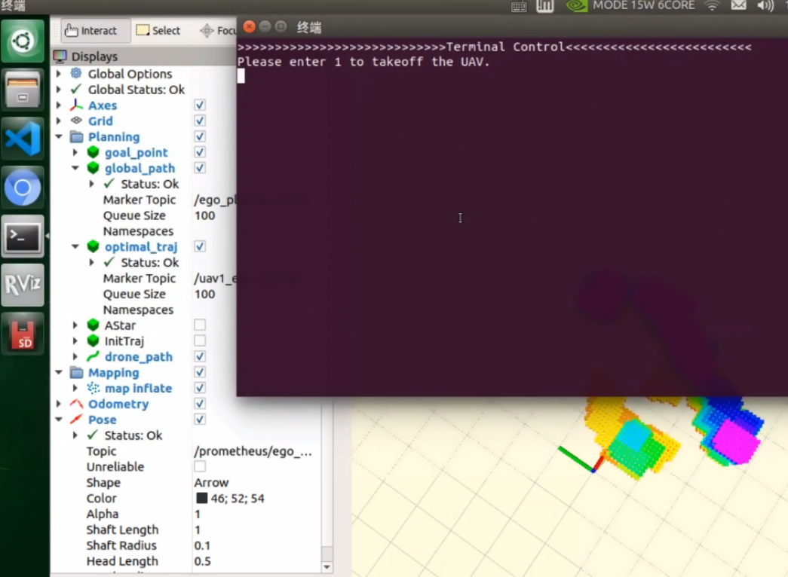

然后遥控器先切到定点模式，在此终端继续输入1并敲回车，解锁无人机

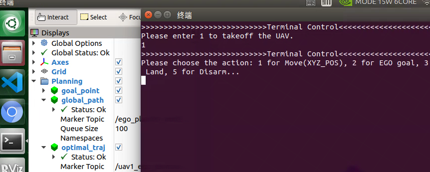

解锁完之后，我们切offboard模式，飞机会起飞到一个稳定高度。

等到无人机起飞到一个稳定高度，也即是我们设定的起飞高度后，回到rviz界面，点击选择2D Nav Goal

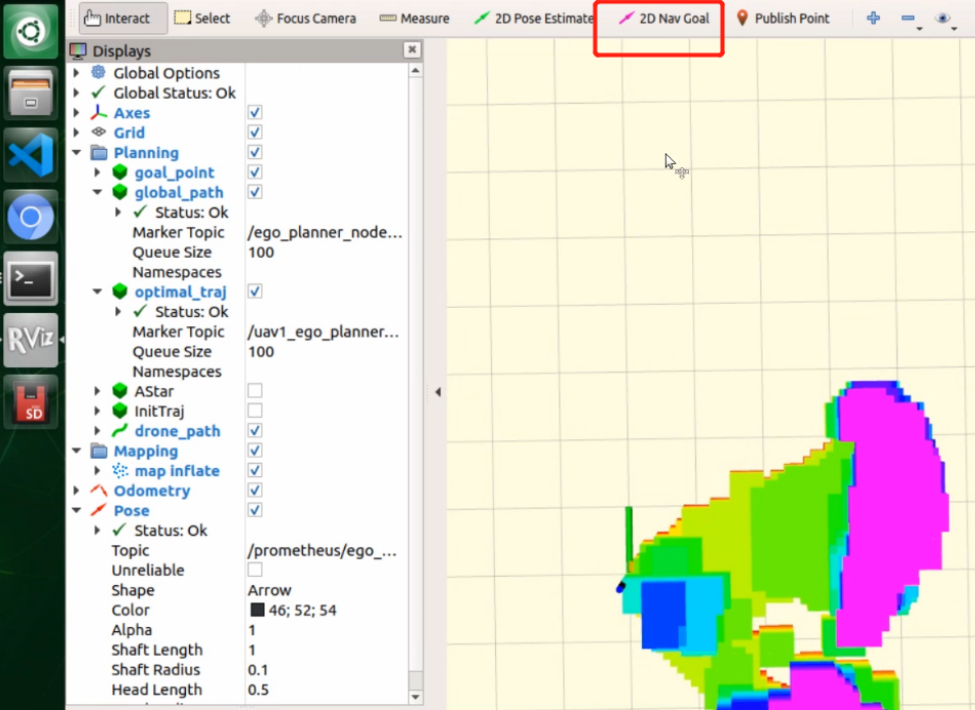

在rviz上点击一个点作为目标点，会自动生成一个绕开障碍物的路径

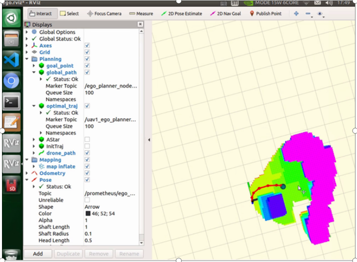

此时无人机会沿着这个生成的路径飞，绕开障碍物，且高度会保持不变。

降落
^^^^^^^^^^^^^^^^^^^^^^

无人机飞到目标点后，可以遥控器拨动offboard飞行模式开关切出offboard模式，并缓慢手动降落。

视频演示
^^^^^^^^^^^^^^^^^^

拍摄两段测试视频，预祝复现室内ego避障飞行成功。

本段飞行演示视频时间为06.18-08.37

.. raw:: html

  <iframe height=600 width=650 src='https://player.youku.com/embed/XNTE5NTI4Mjc2NA==' frameborder=0 'allowfullscreen'></iframe>

4.高级功能
----------------------------

VINS_FUSION
>>>>>>>>>>>>>>>>>>>>>>>>>

本节主要讲解P230系列无人机的VINS_FUSION。视频紧接上节内容 **首次飞行**  ，默认已经通过UDP协议连接到QGC地面站和nomachine远程连接到板载计算机，
主要分为一下几点进行讲解：传感器检查，操作，降落，以及最后的视频演示。

.. attention::

    在开始这个使用功能之前，需要仔细阅读本wiki，避免炸机。
 

不同于携带T265鱼眼相机的视觉定位，我们考虑仅使用一种传感器来实现定位+避障的功能，定位方面我们使用了港科大开源的slam算法 VINS_FUSION。
为极大地方便用户进行二次开发，我们打通了VINS和Prometheus之间的通信链路，用户仅需要在我们平台上进行算法的研究即可，而不需要考虑安装烦人的环境。
考虑到个人的环境差异，我们仅部署了VINS_FUSION，具体的参数以及算法优化还需要自己修改。

环境部署
^^^^^^^^^^^^^^^^^^^^
SLAM组成中，前端中的特征点提取以及匹配是最消耗CPU的过程，因此我们引入了GPU版本的VINS实现对OpenCV提取和匹配特征点的加速，极大的降低延时性。
所以我们需要安装CUDA，这个过程可以自行百度解决，也可以直接购买我们的平台。这里默认你已经做好环境准备。

代码组成
^^^^^^^^^^^^^^^^^^^^^

在开始启动指令之前，我们需要先了解一下VINS的代码组成以及配置文件

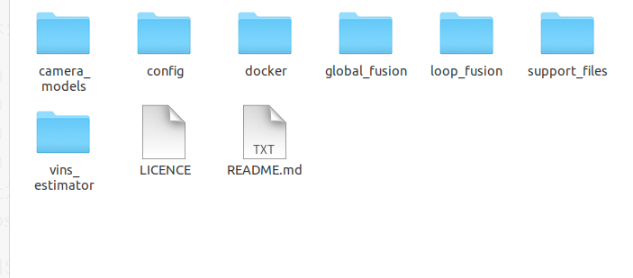

config文件夹存放我们需要的配置文件，docker文件夹存放的是docker镜像，global_fusion文件夹存放的是全局位姿融合，loop_fusion是局部位姿融合，vins_setimator文件夹存放的是
位姿估计，视觉惯性对齐，IMU预积分及初始化等。

标定环境
^^^^^^^^^^^^^^^^^^^^^^
.. attention::
如果您已经购买我们的标定环境，就可以跳过以下安装步骤，只看标定环节。

我们需要使用Kalibr来标定IMU和相机的之间变换矩阵，这对VINS极为重要，变换精度如果小于1-2°，整体的精度就会大打折扣。
标定的具体流程我们会单独放在wiki上，这里就不占用过多篇幅。如果用户想省去安装的麻烦，也可以直接购买我们的标定环境。
这里默认你已经做好标定。

安装kalibr
^^^^^^^^^^^^^^^^^^^^^^
1.依赖安装

sudo apt install python-setuptools

sudo apt install python-setuptools python-rosinstall ipython libeigen3-dev libboost-all-dev doxyen

sudo apt install ros-melodic-vision-opencv ros-melodic-image-transport-plugins ros-melodic-cmake-modules python-software-properties software-properties
software-properties-common libpoco-dev python-matplotlib python-scipy python-git python-pip ipython libtbb-dev libblas-dev liblapack-dev python-catkin_tools libv4l-dev

2.下载源码

mkdir -p kalibr_ws/src

git clone https://github.com/ethz-asl/Kalibr.git

cd ~/kalibr_ws

catkin build -DCMAKE_BUILD_TYPE=Release -j4

安装IMU_Utils
^^^^^^^^^^^^^^^^^^^^^^

首先是一些依赖的安装

1.ceres的安装

1.1下面安装ceres的依赖

sudo apt-get install liblapack-dev libsuitesparse-dev libcxsparse3.1.2 libgflags-dev 

sudo apt-get install libgoogle-glog-dev libgtest-dev

1.2下载编译ceres-solver

git clone https://github.com/ceres-solver/ceres-solver.git

cd ceres-solver

mkdir build

cd build

cmake ..

make && sudo make install

2.安装code_utils

mkdir -p ~/kalibr_workspace/src

cd ~/kalibr_workspace

catkin_make

sudo apt-get install libdw-dev

cd kalibr_workspace/src

git clone https://github.com/gaowenliang/code_utils.git

cd ..

catkin_make

3.安装IMU_Utils

cd kalibr_workspace/src

git clone https://github.com/gaowenliang/imu_utils.git

cd ..

catkin_make

到此为止如果没有问题，就代表IMU_utils已经安装好了

标定流程
^^^^^^^^^^^^^^^^^^^^^^

imu的标定

1录制imu的数据集

这里的话题名字需要自己根据自己的修改，建议录制两小时。

rosbag record /mavros/imu/data -O imu_D435i.bag

2.标定启动文件 imu.launch

 <launch>
    <node pkg="imu_utils" type="imu_an" name="imu_an" output="screen">
        <param name="imu_topic" type="string" value= "/marvos/imu/data"/>
        <param name="imu_name" type="string" value= "imu_px4"/>
        <param name="data_save_path" type="string" value= "$(find imu_utils)/data/"/>
        <param name="max_time_min" type="int" value= "120"/>
        <param name="max_cluster" type="int" value= "100"/>
    </node>
</launch>

3.随后启动imu_utils 标定IMU

roslaunch imu_utils imu.launch

rosbag play -r 200 imu_D435I.bag

会在IMU的data文件夹下得到一个imu_px4的标定文件，我们只需要使用里面的一些参数。

4.新建一个imu.yaml文件，内容如下

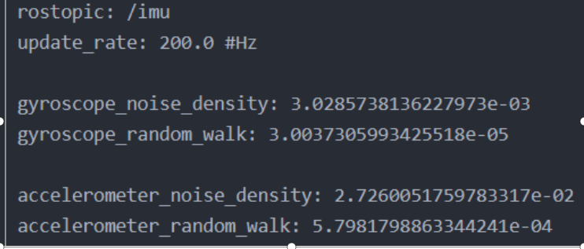

相机标定
^^^^^^^^^^^^^^^^^^^^^

1.改变相机发布频率

话题名需要根据自己的话题名更改，降低发布频率主要是为了减小录制包的大小 

rosrun topic_tools throttle messages /camera/infra1/image_raw 4.0 

rosrun topic_tools throttle messages /camera/infra2/image_raw 4.0 

2.录制bag包

rosbag record /cmaera/infra1/image_raw /camera/infra2/image_raw -O camera.bag

3.标定

我这里使用的标定板是官方提供的标定板，并不是常见的棋盘格。大小也需要根据自己的实际大小修改，不可直接粘贴复制！

kalibr_calibrate_cameras --target april_6x6_24x24mm.yaml --bag camera.bag --bag-from-to 5 30  --models pinhole-radtan pinhole-radtan --topics /camera/infra1/image_raw /camera/infra2/image_raw

之后会得到一个标定好的yaml文件，我的是camchain.yaml,具体看你自己。这个yaml文件是为我们联合标定做准备的。

校准相机和imu
^^^^^^^^^^^^^^^^^^^

把IMU和相机固定在一起录制bag 包，录制的时候需要充分激励IMU的各个轴，绕3个轴旋转和3个方向的平移。这里附上官方标定动作，需要挂梯子。

https://www.youtube.com/watch?app=desktop&v=puNXsnrYWTY

这里需要修改imu的发布频率,官方推荐为200HZ

rosrun topic_tools throttle messages /camera/imu 200.0 /imu

1.录制相机和IMU的bag包

rosbag record /camera/infra1/image_rect_raw /camera/infra2/image_rect_raw /imu -o camera_imu.bag

2.执行标定

kalibr_calibrate_imu_camera --target april_6x6_24x24mm.yaml –bag camera_imu.bag --cam camchain.yaml  --imu  imu.yaml 

得到了几个配置文件

参数配置
^^^^^^^^^^^^^^^^^^^^^^

我们需要将标定出来的参数配置到VINS中，主要是IMU和双目相机之间的变换矩阵，标定出来的结果对系统有着极为重要的影响，精度越高，系统的误差就越小。

我们需要更改的参数如下，当然我们已经都修改好，根据自己的实际情况适当修改。

首先需要更改自己实际订阅的IMU以及双目图像发布话题以及输出路径

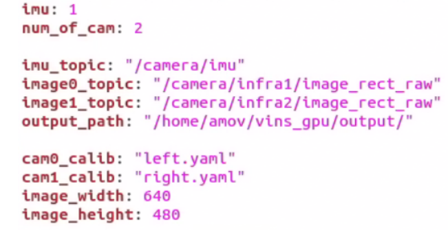

下面的矩阵涉及IMU和相机的相对变换，可以由之前的联合标定得到

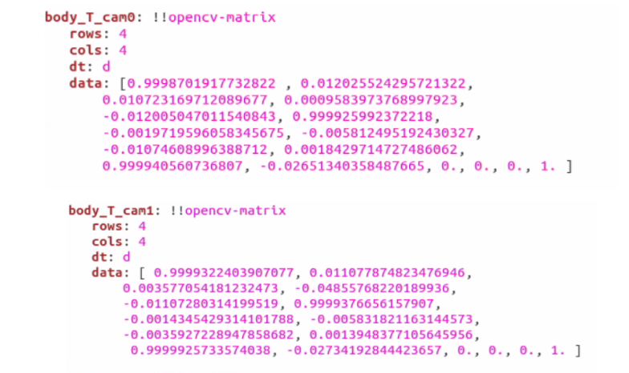

IMU的数据也是由之前的标定得到

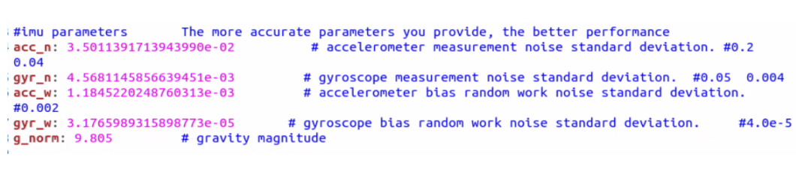

下面参数的意思是在线估计IMU的相机之间的时间差，虽然
Intel说D435i已经做好硬件同步，但是Kalibr标定出来还是会有0.06的时间偏差

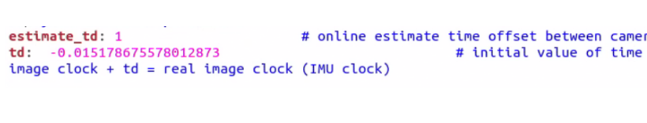

接入Prometheus
^^^^^^^^^^^^^^^^^^^^^^
 
 我们需要在下面这个文件中修改内容。

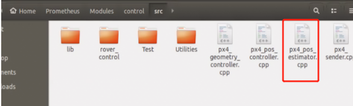

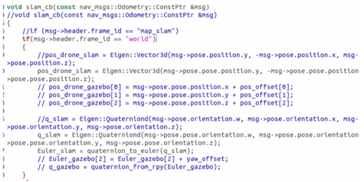

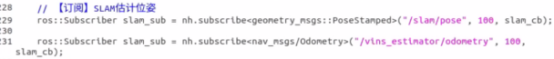

以及在vio_onboard.launch文件中修改定位数据来源

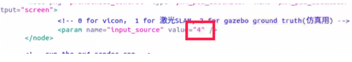

到此为止，我们已经做好了所有的部署功能，下面就可以启动VINS了。

启动指令
^^^^^^^^^^^^^^^^^^^

先启动D435i相机节点，作为获取数据来源。

"rolaunch realsense2_camera rs_camera.launch"

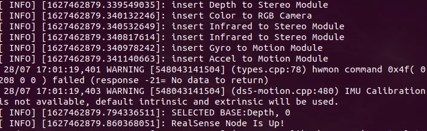

在启动VINS节点，处理D435i获取到的数据，并发布出来。

"rosrun vins vins_node /home/amov/vins_gpu/src/VINS-Fusion-gpu/config/realsense/realsense2.yaml"

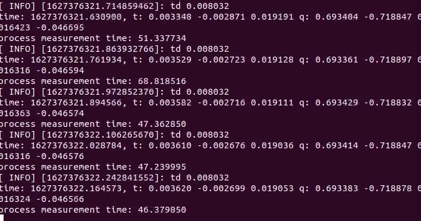

最后启动Prometheus节点，订阅VINS发布出来的数据，并发送给PX4以及地面站。

"roslaunch p230_expriments p230_vio_onboard.launch"

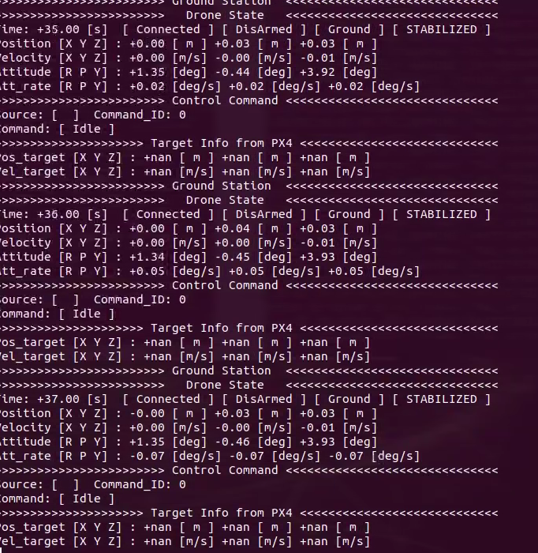

节点图已经正确发布出来

我们可以看到终端已经把VINS发布出来的数据正确打印出来，并且地面站上的航向角也是正确的

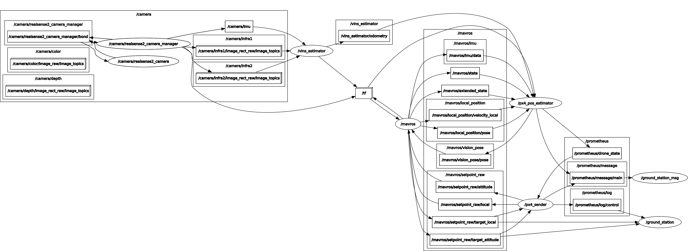

接下来我们我们可以先拿着飞机手动走一圈，看看数据精度是否能够满足飞行要求。

如果数据没有问题我们就可以进行定点飞行。

定点飞行
^^^^^^^^^^^^^^^^^^^^^^^^^
待补充

最后，我们进行vins+px4+ego-planner实验

vins+px4+ego-planner实验
^^^^^^^^^^^^^^^^^^^^^^^^^^^^
待补充

