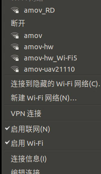
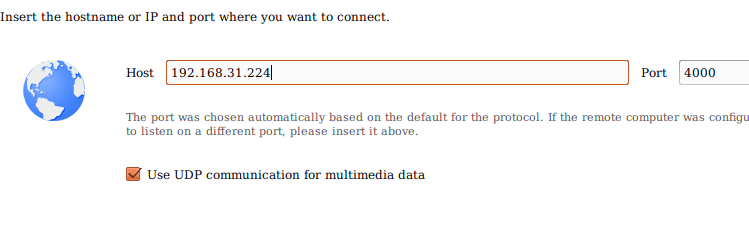
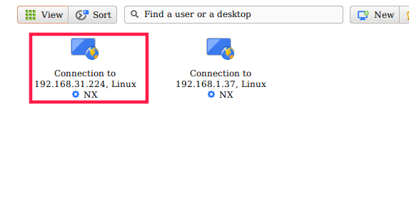
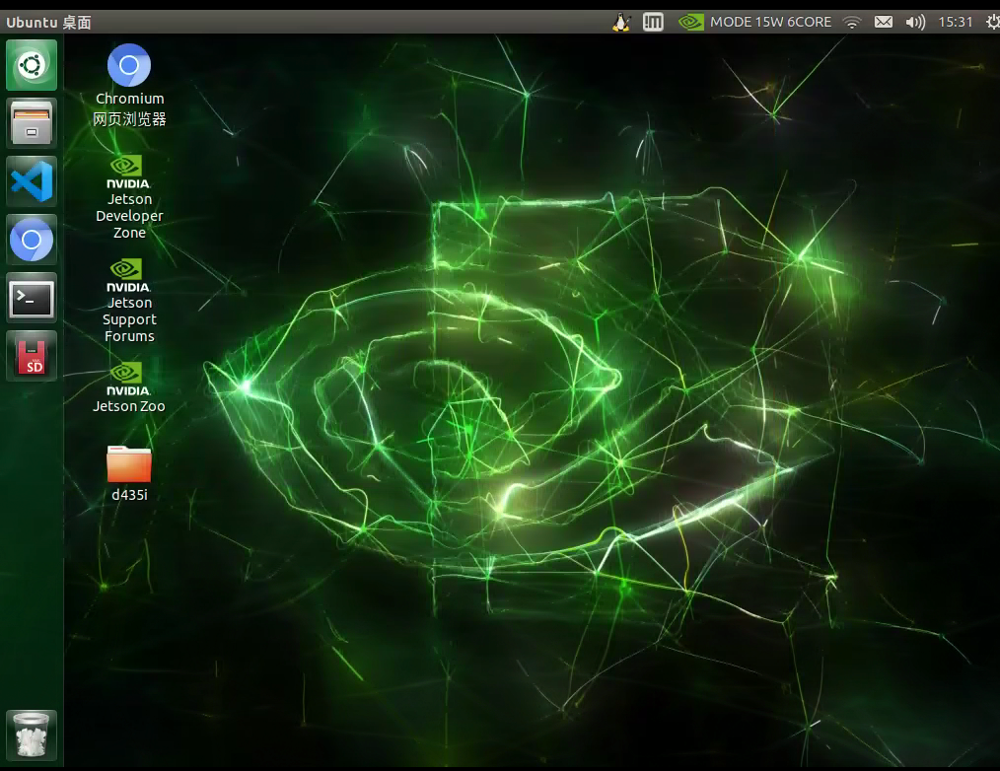
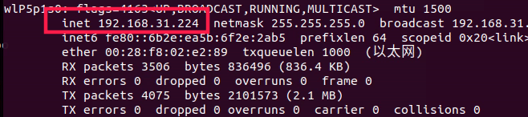
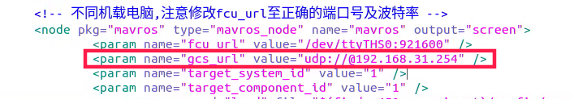
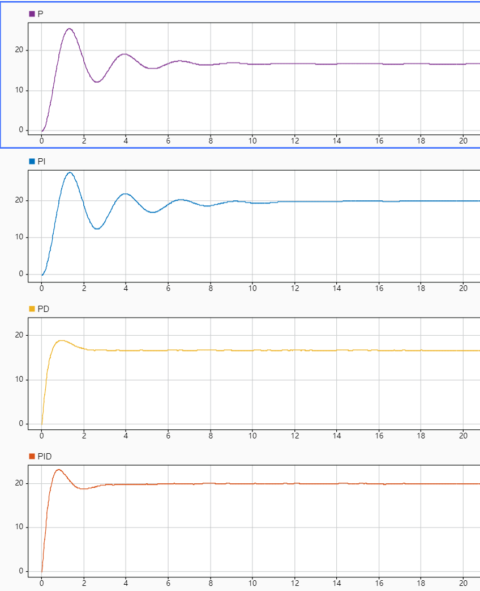

PX4基础功能及配置
======================

1.PX4基本介绍
>>>>>>>>>>>>>>>>>>>>>>>>>

PX4是一款自动驾驶软件，可以驱动无人机或者无人车。它可以被烧写在某些硬件内，并与地面控制站一起组成一个完全独立的自动驾驶系统。

2.连接飞控
>>>>>>>>>>>>>>>>>>>>>>>>>>>

p230不同于其他p系列无人机，由于自身不携带wifi数传，所以我们需要通过UDP的方式连接QGC

首先需要一个局域网，可以用路由器，主机和板载计算机需要都连接上局域网

查看板载计算机ip
^^^^^^^^^^^^^^^^^^^^^^^^^^

我们需要一个局域网，P230和我们的笔记本需要在同一个局域网内。

nomachine远程连接板载计算机
^^^^^^^^^^^^^^^^^^^^^^^^^^^^^^^

点击New

.. image:: ../../images/p450/first_fly/4-nom-1.png
   :height: 232px
   :width: 1004px
   :scale: 50%
   :alt: None
   :align: center

在Protocol下选择NX，点击Continue。

.. image:: ../../images/p450/first_fly/4-nom-2.png
   :height: 676px
   :width: 956px
   :scale: 70%
   :alt: None
   :align: center

在“Host”下填写板载计算机的ip地址，板载计算机地址参考步骤2，“Port”下默认4000。

在Proxy下默认是“Don’t use a proxy”，点击“Continue”。

.. image:: ../../images/p450/first_fly/4-nom-5.png
   :height: 687px
   :width: 983px
   :scale: 70%
   :alt: None
   :align: center

在Save as下会生成默认的name，可以不做更改，点击“Done”。

按照上述步骤操作，会自动生成如下图所示用红框标起的链接，点击“Connect”。

在“Username”和“Password”下输入“amov”

.. image:: ../../images/p450/first_fly/4-nom-8.png

Nomachine成功连接板载计算机后会显示如下界面

qgc远程连接到飞机
^^^^^^^^^^^^^^^^^^^^^^^^^^^^^^^^

不同于P450的wifi数传，P230并不携带数传，我们需要通过UDP的方式连接到地面站。
这里的IP地址是自己主机的IP地址，并且需要在一个区域网内。

然后修改p230_vio_onboard.launch文件中的内容：

在终端执行roslaunch p230_experimentp230_vio_onboard.launch,就可以连接到地面站。

演示视频
^^^^^^^^^^^^^^^^^^^^^^^^^^

.. raw:: html

    <iframe width="696" height="422" src="//player.bilibili.com/player.html?aid=971101299&bvid=BV15o4y1d7bW&cid=277323116&page=1" scrolling="no" border="0" frameborder="no" framespacing="0" allowfullscreen="true"> </iframe>

3.固件编写
>>>>>>>>>>>>>>>>>>>>>>>>>>>>>

选择烧写固件
^^^^^^^^^^^^^^^^^^^

操作界面选择在三个齿轮下，在“固件”界面下，用usb线连接电脑与飞控。会弹出如图所示的界面，右方点击“高级设置”，选择标准版。点击确定。
如果有自己的固件，可以选择“自定义固件”，找到自己的固件相应路径，点击确定即可烧写。

.. image:: ../../images/baseconfig_for_px4/1-firmware-upgrade.png

烧写过程
^^^^^^^^^^^^^^^^^^^^^^^

固件正在刷写中，最后一行显示为固件的版本。

.. image:: ../../images/baseconfig_for_px4/1-firmware-flashing.png

烧写完成
^^^^^^^^^^^^^^^^^^^

固件烧写成功后入下图所示，会有升级完成的提示

.. image:: ../../images/baseconfig_for_px4/1-firmware-flashed.png

演示视频
^^^^^^^^^^^^^^^^^^^^^^^

.. raw:: html

    <iframe width="696" height="422" src="//player.bilibili.com/player.html?aid=971101299&bvid=BV1EK4y1n7MC&cid=277323116&page=1" scrolling="no" border="0" frameborder="no" framespacing="0" allowfullscreen="true"> </iframe>

4.传感器自检和校准
>>>>>>>>>>>>>>>>>>>>>>>>>>>>>

磁力计校准
^^^^^^^^^^^^^^^^^^

按照地面站界面所显示的相应摆放飞机的姿态，然后在水平面内朝一个方向旋转，直至下一个方向。

.. image:: ../../images/baseconfig_for_px4/3-compass-calibrating.png

校准完成后如下图所示

.. image:: ../../images/baseconfig_for_px4/3-compass-calibrated.png

陀螺仪校准
^^^^^^^^^^^^^^^^^^^^

陀螺仪校准只需要把飞机平放即可，校准完成后会边框会显示为绿色。

.. image:: ../../images/baseconfig_for_px4/3-gyroscope-calibrated.png

加速度计校准
^^^^^^^^^^^^^^^^^^^^

加速度计校准为6面校准，只需要将飞机按照6个面分别摆放即可，没校准的边框为红色，正在校准中边框为黄色，校准完成边框为绿色。

.. image:: ../../images/baseconfig_for_px4/3-acceleroment-calibrating.png

水平面校准
^^^^^^^^^^^^^^^^^^^^

水平面校准只需要将飞机放平即可，校准完成后会有“calibration done”的字样，意为校准完成。

.. image:: ../../images/baseconfig_for_px4/3-level-horizo-calibrated.png

演示视频
^^^^^^^^^^^^^^^^^^^^^^^

.. raw:: html

    <iframe width="696" height="422" src="//player.bilibili.com/player.html?aid=971101299&bvid=BV17v4y1Z7as&cid=277323116&page=1" scrolling="no" border="0" frameborder="no" framespacing="0" allowfullscreen="true"> </iframe>

5.遥控器连接与校准
>>>>>>>>>>>>>>>>>>>>>>>>>>

点击校准，然后将油门拨到最低，如下图所示

.. image:: ../../images/baseconfig_for_px4/4-radio-1.png

然后按照界面右方的操作指示拨动摇杆

.. image:: ../../images/baseconfig_for_px4/4-radio-2.png

当全部操作校准完成后，会显示如下界面，此时将油门拨到最低，然后点击下一步。

.. image:: ../../images/baseconfig_for_px4/4-radio-3.png

当连续点击两次下一步后，会有如下界面，就表示此时校准已经完成。

.. image:: ../../images/baseconfig_for_px4/4-radio-4.png

演示视频
^^^^^^^^^^^^^^^^^^^^^

.. raw:: html

    <iframe width="696" height="422" src="//player.bilibili.com/player.html?aid=971101299&bvid=BV1iU4y1x7Ma&cid=277323116&page=1" scrolling="no" border="0" frameborder="no" framespacing="0" allowfullscreen="true"> </iframe>

6.电池校准
>>>>>>>>>>>>>>>>>>>>>>>

用BB响（低压报警器）测出飞机实际电压，如下图所示

.. image:: ../../images/baseconfig_for_px4/6-BB.png

在电源界面下，选择“电压分压器”，点击计算

.. image:: ../../images/baseconfig_for_px4/6-voltage-divider.png

如图所示，在测量电压下输入已经测得的实际电压，然后点击“Calculate”

.. image:: ../../images/baseconfig_for_px4/6-voltage-divider-calculate.png

等到“测量电压”与“飞机电压”数字接近时，表面电压校准已经完成，此时点击关闭即可。

.. image:: ../../images/baseconfig_for_px4/6-voltage-divider-calculated.png

演示视频
^^^^^^^^^^^^^^^^^^^

.. raw:: html

    <iframe width="696" height="422" src="//player.bilibili.com/player.html?aid=971101299&bvid=BV1No4y197cV&cid=277323116&page=1" scrolling="no" border="0" frameborder="no" framespacing="0" allowfullscreen="true"> </iframe>

7.电调校准
>>>>>>>>>>>>>>>>>>>>>>>>>

在电源设置界面下，点击如箭头所指的“校准”。

注意：校准前不允许给飞机上电，把桨叶拆卸下来。

.. image:: ../../images/baseconfig_for_px4/7-esc-calibration.png

.. image:: ../../images/baseconfig_for_px4/7-esc-calibrating.png

给飞机上电，飞机会自动进行电调校准，几秒钟后就会校准完成了。

.. image:: ../../images/baseconfig_for_px4/7-esc-calibrated.png

演示视频
^^^^^^^^^^^^^^^^^^^^^^

.. raw:: html

    <iframe width="696" height="422" src="//player.bilibili.com/player.html?aid=971101299&bvid=BV1ev411e7Bj&cid=277323116&page=1" scrolling="no" border="0" frameborder="no" framespacing="0" allowfullscreen="true"> </iframe>

8.常用参数设置
>>>>>>>>>>>>>>>>>>>>>>>>>>

在参数设置下面的搜索界面，搜索关键字即可调整参数。

.. image:: ../../images/baseconfig_for_px4/8-parameters.png

常用参数：

aid_mask：位置估计来源选择

.. image:: ../../images/baseconfig_for_px4/8-parameters-aid.png

hgt_mode：高度估计来源选择

.. image:: ../../images/baseconfig_for_px4/8-parameters-hgt.png

Mag_sides:传感器校准面数选择

.. image:: ../../images/baseconfig_for_px4/8-parameters-mag-sides.png

Usb_chk：当用数据线调试飞机时，有时会显示“usb is not safe”，此时搜索“usb_chk”把数值调到197847最大值即可。

.. image:: ../../images/baseconfig_for_px4/8-parameters-usb.png

.. image:: ../../images/baseconfig_for_px4/8-parameters-usbvalue.png

CBRK_I0_Safety：安全开关

当提示无法解锁飞机时，把CBRK_IO_SAFETY数值调到最大值22027，相当于禁用安全开关。

.. image:: ../../images/baseconfig_for_px4/8-parameters-safety.png

.. image:: ../../images/baseconfig_for_px4/8-parameters-safetyvalue.png

演示视频
^^^^^^^^^^^^^^^^^^^

.. raw:: html

    <iframe width="696" height="422" src="//player.bilibili.com/player.html?aid=971101299&bvid=BV1ev411e7Bj&cid=277323116&page=1" scrolling="no" border="0" frameborder="no" framespacing="0" allowfullscreen="true"> </iframe>

9.PID调参
>>>>>>>>>>>>>>>>>>>>>>>>>

PID调节图示
^^^^^^^^^^^^^^^^^^^

p为比例项、i为积分项、d为微分项。pid简单来说是一种传函，是在执行器机构传函确定好以后，期望值与观测值有误差，不符合期望值，所以使用pid作为一种调节手段使飞机的观测值达到期望值。pid调参可用如下一张图来解释说明。下图中的期望值为20
纯比例P作用下在稳定后有静态误差，为了弥补静态误差，因此引入积分项I。
PI作用下，虽然弥补了静态误差，但是因为引入了积分项，使得调节过程中峰值增加，调节周期增长，所以也有不足之处。
PD作用下，加快了调节时间减小了调节幅度，但是当系统稳定时与输入有较大误差，D项作用过大的话会引起一定的震动。
综合以上，PID作用下，调节的又快又好还没有误差，因此PID调节是理想的控制调节策略。

参数调节
^^^^^^^^^^^^^^^^^^^^^^^^^

在调节参数之前，应该了解px4的代码框架，了解位置控制与姿态控制的关系，内环与外环的关系。

姿态控制的角度环参数

.. image:: ../../images/baseconfig_for_px4/9-pid-att.png

姿态控制的角速度环参数

.. image:: ../../images/baseconfig_for_px4/9-pid-rate.png

位置控制参数

.. image:: ../../images/baseconfig_for_px4/9-pid-position.png

演示视频
^^^^^^^^^^^^^^^^^^

.. raw:: html

    <iframe width="696" height="422" src="//player.bilibili.com/player.html?aid=971101299&bvid=BV1Az4y1U76L&cid=277323116&page=1" scrolling="no" border="0" frameborder="no" framespacing="0" allowfullscreen="true"> </iframe>

演示视频
^^^^^^^^^^^^^^^^^^^

.. raw:: html

    <iframe width="696" height="422" src="//player.bilibili.com/player.html?aid=971101299&bvid=BV16K4y1p71S&cid=277323116&page=1" scrolling="no" border="0" frameborder="no" framespacing="0" allowfullscreen="true"> </iframe>

10.任务飞行
>>>>>>>>>>>>>>>>>>>>>>>

手动模式
^^^^^^^^^^^^^^^^^

ARCO：特技模式

遥控器输入被转换为横滚、俯仰和偏航速度，当摇杆回中时飞行器不会保持平衡，可以用于翻滚等特技飞行。

RATTITUDE：角速率模式

遥控器输入在极限区域被转换为横滚、俯仰的角度和偏航的速度，否则被转换为横滚、俯仰和偏航角度。

STABILIZED：稳定模式

遥控器输入被转换为横滚、俯仰的角度和偏航的速度，当摇杆回中后飞行器会保持平衡，之后会随风或其他因素漂移。

辅助模式
^^^^^^^^^^^^^^^^^^^

ALTITUDE CONTROL：高度模式
横滚、俯仰和偏航的输入与手动模式一致；
当摇杆在~50%油门左右，飞行器将保持当前高度；
油门有一个很大的死区，超出后控制上升或下降速度。
参数：MPC_Z_VEL_MAX_UP：最大上升速度,默认3.0m/s。
           MPZ_Z_VEL_MAX_DOWN：最大下降速度，默认1.0m/s。
           RCX_DZ：X通道（油门通道，由RC_MAP_THROTTLE设定）的死区；
           MPC_XXX：影响飞行表现的参数，例如MPC_THR_HOVER定义飞行器悬停的油门。

POSITION CONTROL：位置模式
横滚控制左右移动速度、俯仰控制前后移动速度，当摇杆回中时飞行器会保持位置；
偏航控制速度，与手动模式一致；
油门控制上升或下降的速率，与ALTITUDE一致；

自动模式
^^^^^^^^^^^^^^

HOLD：保持模式
保持在当前位置和姿态（依赖GPS）。
参数：MIS_LTRMIN_ALT：悬停最小高度（如果悬停高度低，飞行器会升高）。

RTL：返航模式
返回HOME位置等待或降落（依赖GPS）。
飞行器会首先上升到RTL_RETURN_ALT高度（默认60m，如果实际飞行高于此高度则保持），然后直线飞行HOME位置；
到达HOME后，会快速降低到RTL_DESCEND_ALT高度（缓降或停止高度，默认30m），会悬停RTL_LAND_DELAY时间后降落（默认0s，设置为-1表示永远悬停）；
参数：RTL_MIN_DIST：触发上升的最小距离，如果水平位置离HOME很近，飞行器将直接降落到HOME而非升高到返回高度。

TAKE OFF：起飞模式
起飞并等待下一步指令（依赖GPS）。
该模式为自动模式，遥控器失效（除非切换模式），启动前必须先解锁；
飞行器上升到MIS_TAKEOFF_ALT高度（默认2.5m）后等待，上升速度为MPC_TKO_SPEED（默认1.5m/s）。

LAND：降落模式
在当前位置降落。
该模式为自动模式（遥控器失效）；
飞行器在切换到该模式位置降落，下降速度为MPC_LAND_SPEED直至地面

MISSION：任务模式
飞行器接受地面站的程序控制指令，如果未收到任务，在当前位置悬停（依赖GPS）。
该模式为自动模式，遥控器失效，该模式工作前需解锁；
任务通常在QGC创建，也可以通过开发者API，上传到飞控。
如果任务已存储并且PX4在飞行，将从立即执行任务；
如果任务已存储但PX4着陆，PX4将执行任务，如果任务没有TAKEOFF命令，PX4将在执行剩下任务前飞行至最小高度；
如果任务未存储或PX4执行完所有任务命令，飞行状态飞行器会悬停，着陆状态飞行器会等待；
可以在QGC手动修改当前任务；
当飞行器锁定或新任务上传后，任务会重置；
任务可以通过HOLD模式暂停，重新激活后会从继续执行当前任务；

飞行模式设置
>>>>>>>>>>>>>>>>>>>>>>>>>>>>>>

可以在遥控器上设置通道，一般三挡开关对应飞行模式1、飞行模式4、飞行模式6。如图所示，此时通道5设置的三个模式分别为自稳模式、定点模式、降落模式。

.. image:: ../../images/baseconfig_for_px4/5-flightmodes.png

如有需要板载计算机模式和返航模式，也可在开关设置下自行设置。如图所示，设置通道6为offboard模式，通道7为返航模式。

.. image:: ../../images/baseconfig_for_px4/5-flightmodes-additional.png

演示视频
^^^^^^^^^^^^^^^^^^^^^^^^^

.. raw:: html

    <iframe width="696" height="422" src="//player.bilibili.com/player.html?aid=971101299&bvid=BV1sN411R7of&cid=277323116&page=1" scrolling="no" border="0" frameborder="no" framespacing="0" allowfullscreen="true"> </iframe>

