硬件介绍
=================

**简介：** Prometheus450（简称P450）是一款专为科研工作者及无人机开发者设计的无人机实验平台，适用于无人机专业应用研究和开发。本开发平台基于Prometheus开源项目，提供丰富的demo例程，涵盖控制模块、slam模块、规划模块以及目标检测模块等多个无人机及机器视觉相关研究方向，为无人机科研开发助力，致力于让研发更加高效。

.. attention::
    下列展示的所有功能适配NX版的p450，Nano版的p450目前所支持的功能为室内外定点、指点、二维码降落、圆框跟踪，操作、外观与NX版的均相同，只是少搭载了传感器。
    
    在室内外操作时，注意查看自己的位置源是否更改，即参数EKF2_AID_MASK，EKF2_HGT_MODE，后面介绍地面站安装教程时会详细介绍如何更改参数。

NX版最高配置为：P450+T265+D435I+S1+单目

Nano版最高配置为：P450+T265+单目

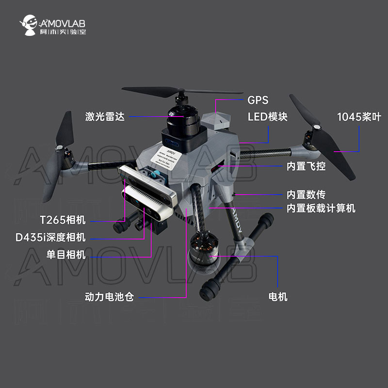

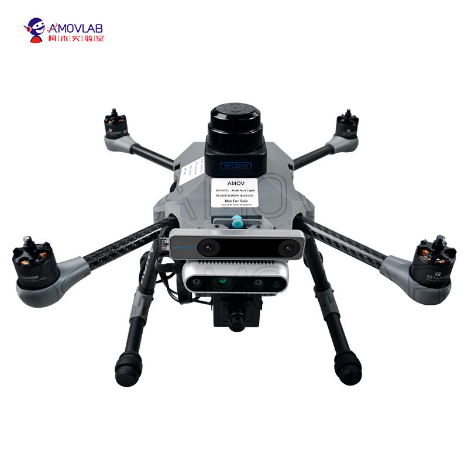
.. note::
   无人机正视图
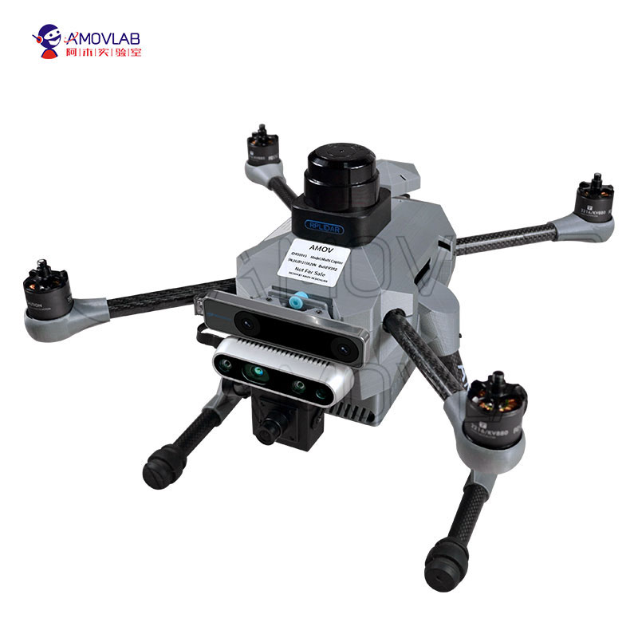
.. note::
   无人机侧视图
.. image:: ../../images/p450/hardware/俯视图.jpg
   :height: 800px
   :width: 800 px
   :scale: 80 %
   :alt: None
   :align: center
.. note::
   无人机俯视图

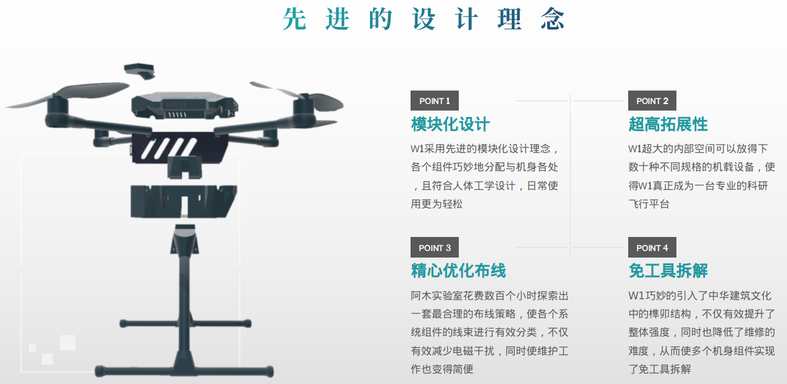

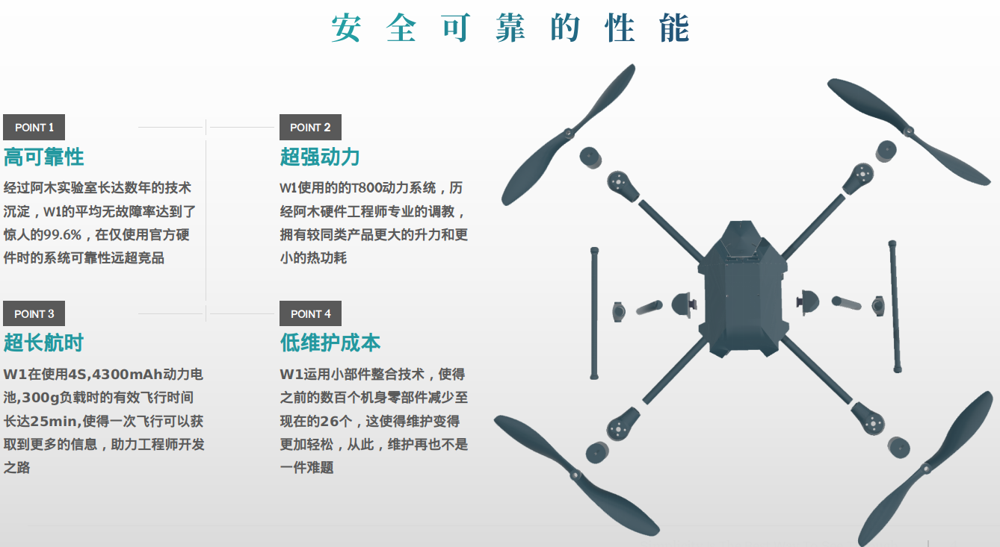

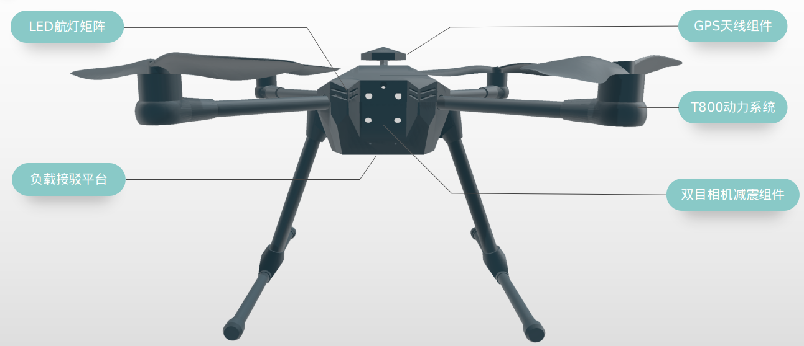

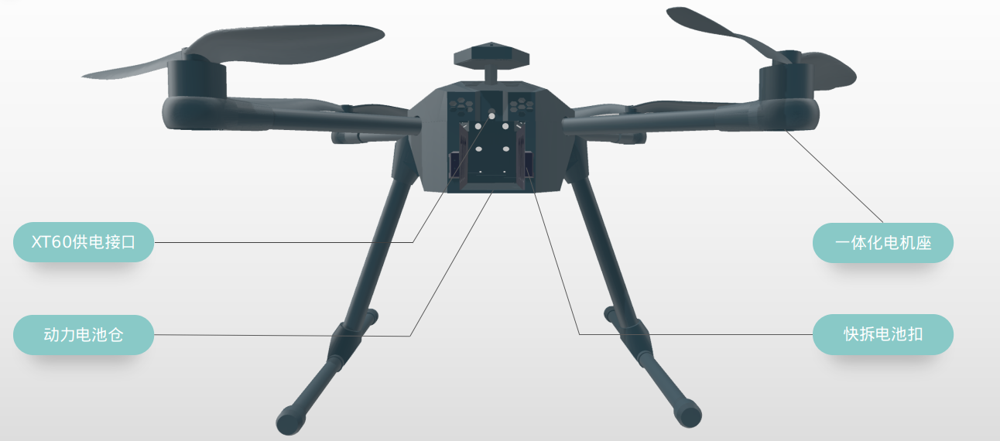

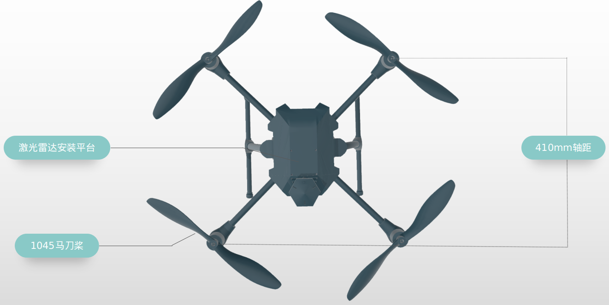

开箱讲解
-------------

接下来主要说明飞机到手之后的开箱讲解

1.检查产品外包装
>>>>>>>>>>>>>>>>>>>>>>>>>>>>>>>>>>>>

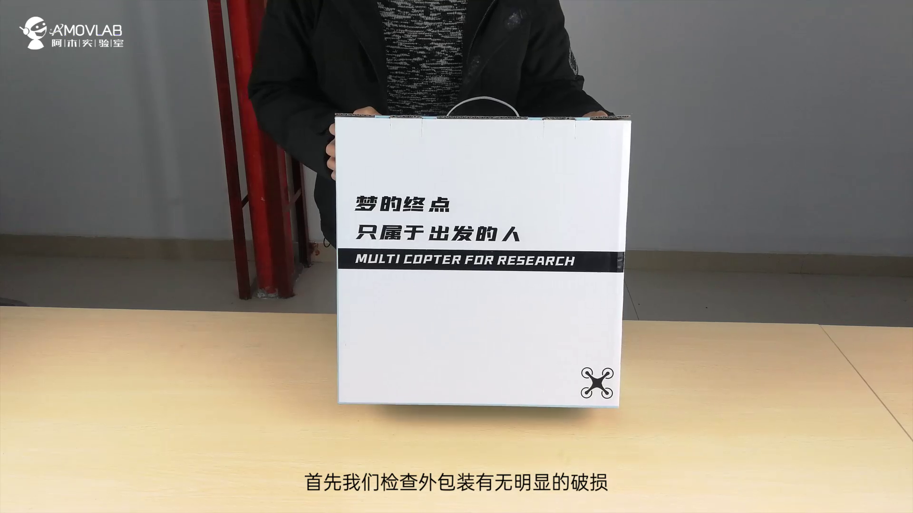

.. attention::
   首先先检查产品外包装有无明显的破损以及严重磕碰，如发现上述情况，请联系我们的售后客服进行相应的处理。

2.打开产品外包装
>>>>>>>>>>>>>>>>>>>>>>>>>>>>>>>>>>

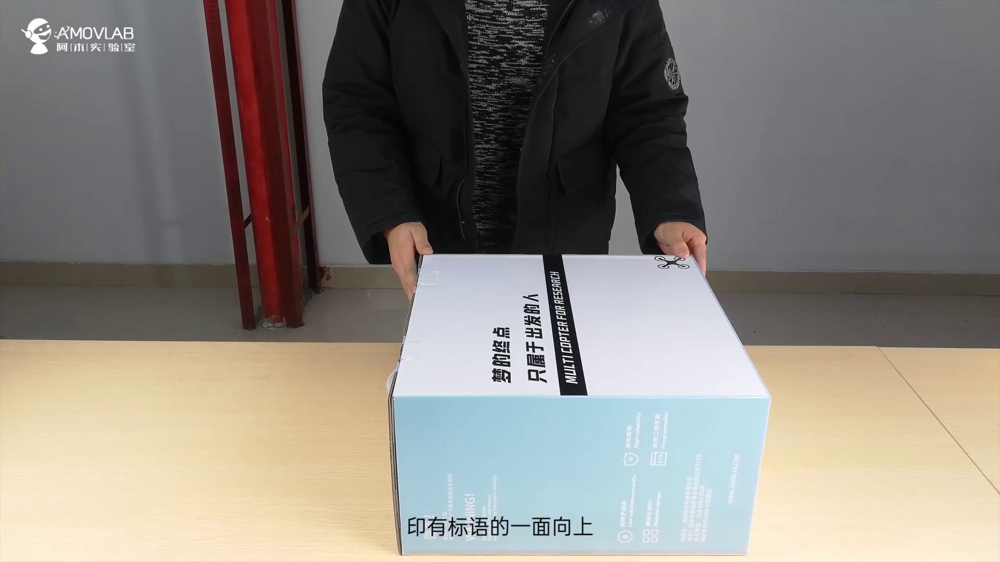

.. tip::
   打开产品外包装，注意请将产品包装箱平放，印有标语的一面向上，然后打开侧面的箱盖，请注意在此处不宜使用较大的力气，以免损坏包装箱，后期可能影响产品相关的售后服务，打开包装箱，我们可以看到黑色的内衬，这时您可一只手按住产品外箱，一只手轻轻将内衬抽出。

3.清点产品数量
>>>>>>>>>>>>>>>>>>>>>>>>>>>>>>>>>>>>>>>>>

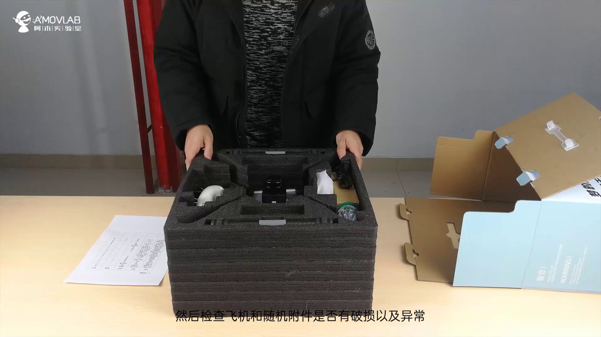

.. attention::
   清点产品数量，首先请对照发货清单检查飞机和附件数量，然后检查飞机和随机附件外观是否有破损及异常.

4.安装飞机脚架
>>>>>>>>>>>>>>>>>>>>>>>>>>>>>>>>>>>>>

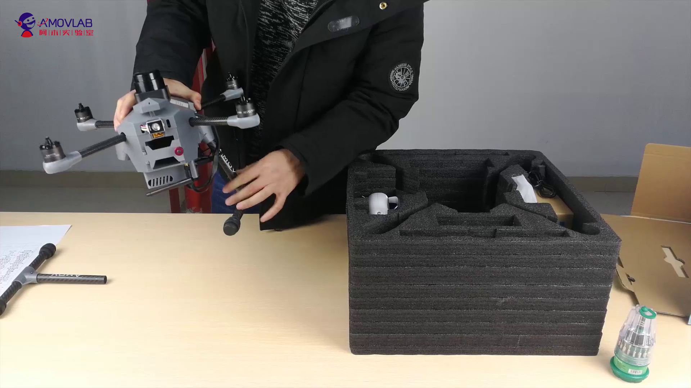

.. important::
   安装飞机脚架，首先将脚架从内衬两侧取出，然后轻轻插入飞机两侧的脚架安装孔位。

.. attention::
   此处请注意印有AMOV字样的面向外!

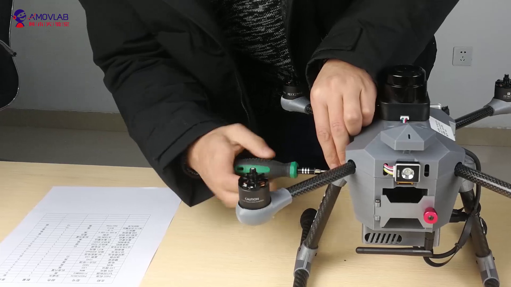

.. important::
   从箱底取出附带的M1.5X8螺丝，使用随机附赠的螺丝刀将其拧紧，注意此处请适当用力，以免损坏螺丝。

5.开箱视频
>>>>>>>>>>>>

详细可以观看开箱视频：

.. raw:: html

    <iframe width="696" height="422" src="//player.bilibili.com/player.html?aid=289495747&bvid=BV1sf4y1478z&cid=311385198&page=1" scrolling="no" border="0" frameborder="no" framespacing="0" allowfullscreen="true"> </iframe>

硬件设备说明及用途
--------------------

P450硬件接线图
>>>>>>>>>>>>>>>>>>>>>>

.. image:: ../../images/p450/hardware/P450-Pixhawk4线路图.jpg
   :height: 4000px
   :width: 6000 px
   :scale: 12 %
   :alt: None
   :align: center

视频介绍如下：

.. raw:: html

   <iframe width="696" height="422" src="//player.bilibili.com/player.html?aid=289495747&bvid=BV1sf4y1478z&cid=321023958&page=2" scrolling="no" border="0" frameborder="no" framespacing="0" allowfullscreen="true"> </iframe>
