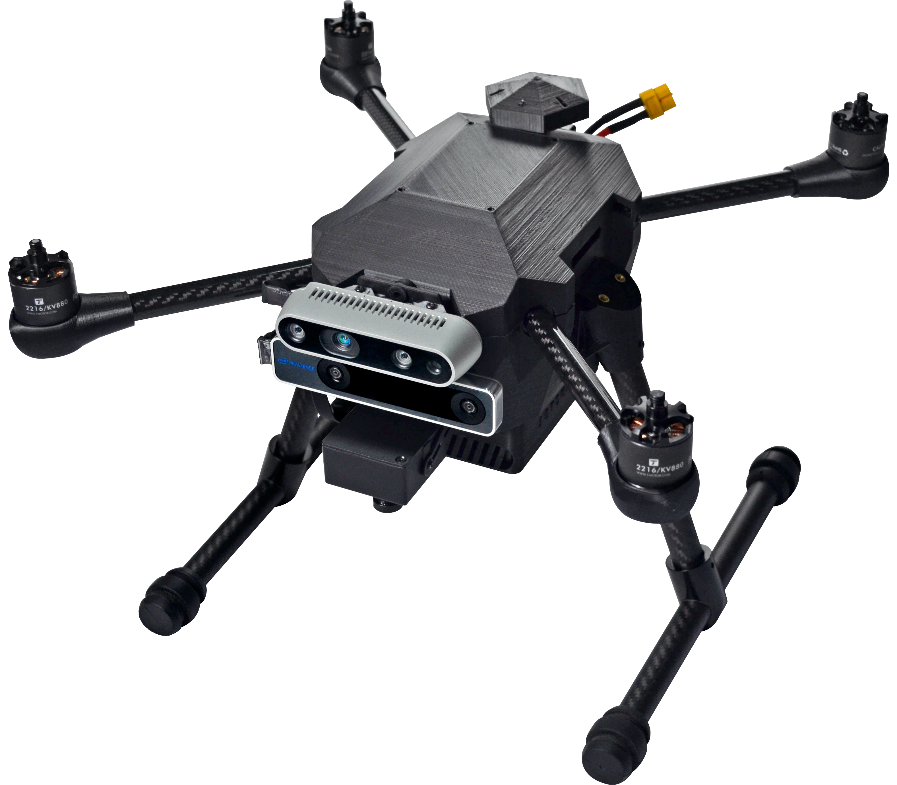

硬件介绍
=================

.. image:: ../../images/p450/1-main-view.png
   :height: 700px
   :width: 700 px
   :scale: 50 %
   :alt: None
   :align: center
.. note::
   无人机正视图

.. note::
   无人机侧视图
.. image:: ../../images/p450/1-bird's-eye-view.png
   :height: 700px
   :width: 700 px
   :scale: 50 %
   :alt: None
   :align: center
.. note::
   无人机俯视图

开箱讲解
-------------

1.检查产品外包装
>>>>>>>>>>>>>

.. image:: ../../images/p450/2检查外包装.png
   :height: 1080px
   :width: 1920px
   :scale: 20 %
   :alt: None
   :align: center

.. attention::
   首先先检查产品外包装有无明显的破损以及严重磕碰，如发现上述情况，请联系我们的售后客服进行相应的处理。

2.打卡产品外包装
>>>>>>>>>>>>>

.. image:: ../../images/p450/3平放_标语在上.png
   :height: 1080px
   :width: 1920px
   :scale: 20 %
   :alt: None
   :align: center

.. tip::
   打开产品外包装，注意请将产品包装箱平放，印有标语的一面向上，然后打开侧面的箱盖，请注意在此处不宜使用较大的力气，以免损坏包装箱，后期可能影响产品相关的售后服务，打开包装箱，我们可以看到黑色的内衬，这时您可一只手按住产品外箱，一只手轻轻将内衬抽出。

3.清点产品数量
>>>>>>>>>>>>>

.. image:: ../../images/p450/4检查飞机和配件.png
   :height: 1080px
   :width: 1920px
   :scale: 20 %
   :alt: None
   :align: center

.. attention::
   清点产品数量，首先请对照发货清单检查飞机和附件数量，然后检查飞机和随机附件外观是否有破损及异常.

4.安装飞机脚架
>>>>>>>>>>>>>

.. image:: ../../images/p450/5安装机架.png
   :height: 1080px
   :width: 1920px
   :scale: 20 %
   :alt: None
   :align: center

.. important::
   安装飞机脚架，首先将脚架从内衬两侧取出，然后轻轻插入飞机两侧的脚架安装孔位。

.. attention::
   此处请注意印有AMOV字样的面向外!

.. image:: ../../images/p450/6安装机架螺丝.png
   :height: 1080px
   :width: 1920px
   :scale: 20 %
   :alt: None
   :align: center

.. important::
   从箱底取出附带的M1.5X8螺丝，使用随机附赠的螺丝刀将其拧紧，注意此处请适当用力，以免损坏螺丝。

5.开箱视频
>>>>>>>>>>>>

.. raw:: html

    <iframe width="696" height="422" src="//player.bilibili.com/player.html?aid=971101299&bvid=BV1gA411g7UM&cid=277323116&page=1" scrolling="no" border="0" frameborder="no" framespacing="0" allowfullscreen="true"> </iframe>

硬件设备说明及用途
--------------------

