软件介绍
===============

在板载计算机上面存在两套ROS包，一个是Prometheus功能包，另一个是实机启动p450_experiment功能包。

Prometheus软件框架及基本含义
------------------------------------------------

.. =========   =========
.. 代码目录         功能    
.. =========   =========  
.. Modules     各模块功能的源代码

.. Simulator   仿真飞行相关代码
.. Experiment  真实飞行相关代码
.. =========   =========  

Prometheus的软件框架如下图所示，

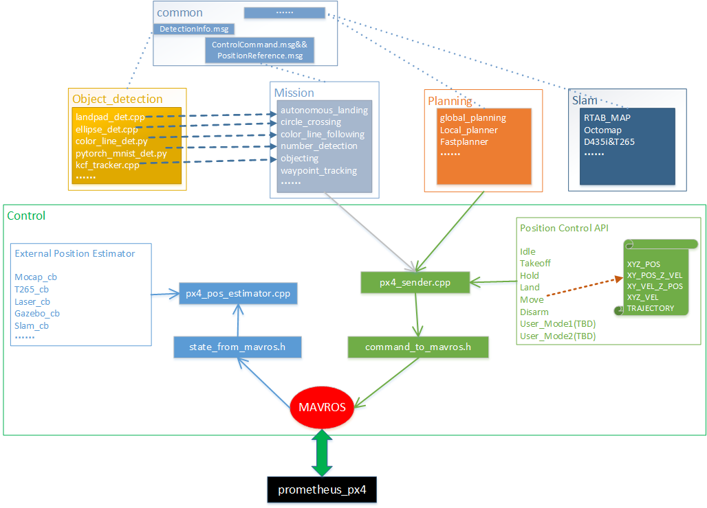

基本上分为以下几个模块：

控制模块（Prometheus/Modules/control）
>>>>>>>>>>>>>>>>>>>>>>>>>>>>>>>>>>>>>>>>>

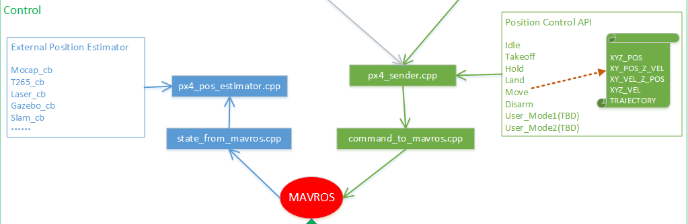

控制模块主要与MAVROS进行信息交互，分为两个部分，一部分是输入，一部分是输出.

-   px4_pos_estimator.cpp   ：主要将板载计算机处理之后的位置数据传给飞控，读取飞控当前的状态信息
-   px4_sender.cpp  ：主要将控制指令接口通过px4_sender发送给mavros，从而控制飞机进行相应的动作指令

支持的板载计算机提供位置的数据来源有：动捕系统mocap，英特尔T265双目相机，激光雷达定位建图，仿真器gazebo提供模型位置数据，以及SLAM提供位置数据

本项目提供的控制飞机的API包括：

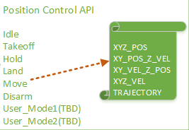

-   Idle：怠速；意思就是飞机会进入offboard模式，但是在该模式下，没有对飞机进行任何指令的发送。飞机也不会有任何动作。这个指令一般也可以不用。
-   Takeoff：起飞；起飞点为当前点，起飞高度通过 yaml参数文档设置，单位是米，默认起飞高度是0.5m
-   Hold：悬停；飞机正在飞行过程中如何接受到 2 指令，会在当前时刻进入悬停状态。
-   Land：降落；降落速度通过 yaml参数文档设置，单位是m/s ，默认降落速度为0.2m/s 。还有一个上锁高度，到达上锁高度之后飞机会进入飞控的本身降落模式进而缓缓着地，上锁高度通过 yaml 参数文档进行设置，单位是米，默认是 0.18m，即认为离地不到20cm的时候进入飞控本身的降落飞行模式。
-   Move模式：该模式就包含我们所称的指点飞行功能，在此模式下，又有5种子模式：
    
    -   XYZ_POS,空间位置控制
    -   XY_POS_Z_VEL,水平面位置控制高度速度控制
    -   XY_VEL_Z_POS,水平面速度控制高度定高控制
    -   XYZ_VEL,空间速度控制
    -   TRAJECTORY，轨迹跟踪控制

规划模块(Prometheus/Modules/planning)
>>>>>>>>>>>>>>>>>>>>>>>>>>>>>>>>>>>>>>>>>>>>>>

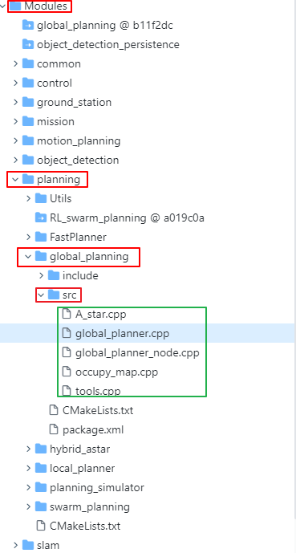

目前实际使用的规划模块是全局规划模块，使用的是A星算法。

绿色框选部分为Astar全局规划的代码，

-   A_star.cpp ：为A星算法的实现
-   global_planner.cpp ：为全局规划策略主节点
-   occupy_map.cpp：栅格地图处理，根据膨胀系数，生成安全距离

SLAM模块(Prometheus/Modules/slam)
>>>>>>>>>>>>>>>>>>>>>>>>>>>>>>>>>>>>>>>>>>>>>>>

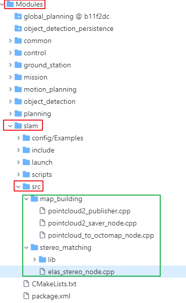

SLAM模块一块为建图模块，另一块为定位模块。

绿色框选部分为建图模块

-   pointcloud_to_octomap_node.cpp：订阅点云数据，发布八叉树栅格地图
-   elas_stereo_node.cpp：调用双目匹配算法，计算出稠密视差图，生成深度图，发布全局点云

目前板载计算机所搭载的相机包括有D435i和T265，可以利用realsense-ros官方提供的功能包实现RTAB-Map建图

另外一部分为定位模块

-   定位模块目前是使用的是T265本身输出的slam结果，具体调用可查看控制模块中的px4_pos_estimator.cpp细节处理。

目标检测模块(Prometheus/Modules/object_detection)
>>>>>>>>>>>>>>>>>>>>>>>>>>>>>>>>>>>>>>>>>>>>>>>>>>>>>>>>

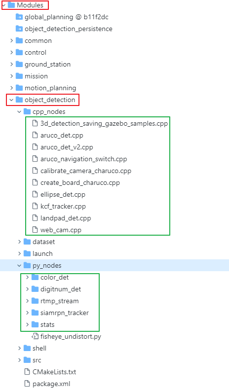

目标检测模块比较多，如图中绿色框选所示

-   web_cam.cpp：USB相机发布ROS下话题
-   ellipse_det：椭圆检测处理节点
-   kcf_tracker.cpp：框选跟踪节点处理
-   landpad_det.cpp：降落板检测
-   color_det：颜色识别节点
-   digitnum_det：手写数字识别节点

目前常用就这些，还有很多其他的识别节点，更多请详细Prometheus开源项目仔细查看。

任务模块(Prometheus/Modules/mission)
>>>>>>>>>>>>>>>>>>>>>>>>>>>>>>>>>>>>>>>>>>>>

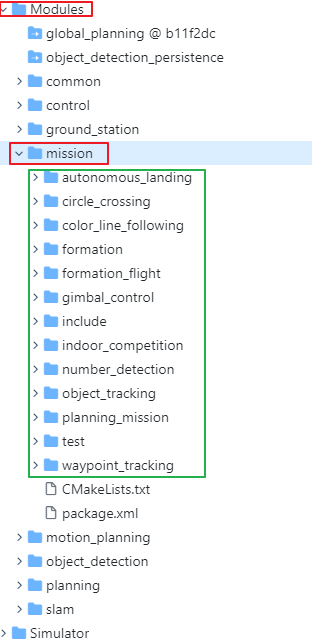

任务模块属于上层应用模块，具体实现某一种功能。

-   autonomous_landing：自主降落程序
-   circle_crossing：圆形穿框（在真实飞机中简单修改策略，实现圆形跟踪）
-   color_line_following：颜色巡线
-   number_detection：数字识别无人机跟踪
-   object_detection：无人机目标框选KCF跟踪
-   planning_mission：路径规划的航点处理（多航点，单航点，多机航点，qgc航点读取）
-   waypoint_tracking：航点跟踪节点（类似与走一个四边形，走其他航线图形）

还有很多具体的应用型节点，这些节点都是对control，object_detection，planning等等各个模块的结合使用，如果想学习如何调用API接口，可以参考其中的代码实现。

公用模块(Prometheus/Modules/common)
>>>>>>>>>>>>>>>>>>>>>>>>>>>>>>>>>>>>>>>>>>>>

.. image:: ../../images/p450/软件介绍/msg模块.png
   :height: 815px
   :width: 460 px
   :scale: 70 %
   :alt: None
   :align: center

公用模块中比较核心的就是自定义的msg消息，定义的msg如上图绿色框选所示

-   ControlCommand.msg：控制无人机指令的msg格式，掌握API首先掌握msg定义
-   DetectionInfo.msg：目标检测模块的输出结果
-   DroneState.msg：无人机当下各个状态信息（与板载计算机是否通信连接，解锁或者上锁，当前飞行模式，当前的状态量位置速度加速度及姿态）
-   LogMessageControl.msg：控制端的日志打印信息记录

等等还有很多的自定义msg，规划模块，多机模块的，更多细节可以在板载计算机中查看Prometheus代码或者在Prometheus开源Github上查看。

×下面附上在板载计算机中Prometheus的代码目录框架×

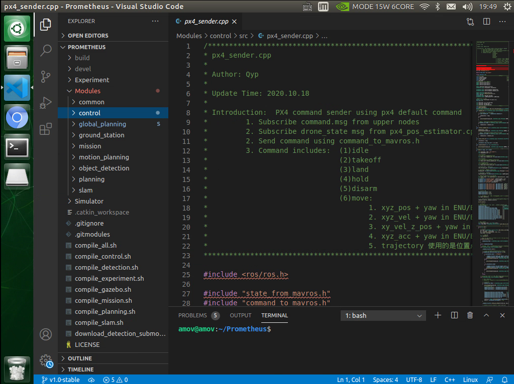

p450_experiment功能包使用及含义
---------------------------------

p450_experiment功能包是适配prometheus开源代码的实机闭源功能包。

该文件位置：amovlab_ws/src/p450_experiment

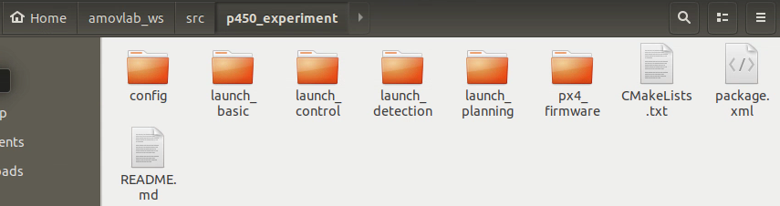

此功能包主要包含

-   参数配置文件config
-   基本的launch文件launch_basic
-   控制相关的launch文件launch_control
-   目标检测相关的launch文件launch_detection
-   路径规划相关的launch文件launch_planning
-   飞控的固件和参数文件px4_firmware

接下来分别从上面各个文件阐述文件里面的内容

config
>>>>>>>>>>>>>>>>>>>

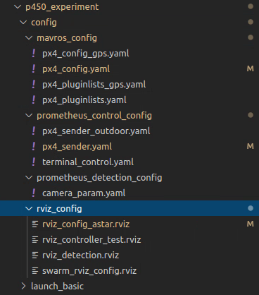

-   mavros_config：对mavros相关参数的配置（分为室内一组，室外一组）

- 室内
    -   px4_config.yaml
    -   px4_pluginlists.yaml
- 室外
    -   px4_config_gps.yaml
    -   px4_pluginlists_gps.yaml

launch_basic
>>>>>>>>>>>>>>>>>>
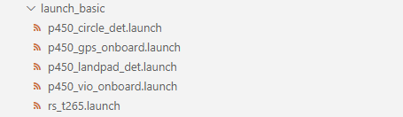

p450_circle_det.launch：  圆框检测launch文件

p450_gps_onboard.launch：  室外GPS定点launch文件

p450_landpad_det.launch：  二维码检测launch文件

p450_vio_onboard.launch：  室内T265定点launch文件

rs_t265.launch：  T265启动launch文件

launch_control
>>>>>>>>>>>>>>>>>>>>

p450_gps_control.launch：  室外GPS指点launch文件

p450_vio_control.launch：  室内T265指点launch文件

launch_detection
>>>>>>>>>>>>>>>>>>>>>>
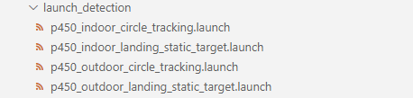

p450_indoor_circle_tracking.launch：  室内圆框跟踪launch文件

p450_indoor_landing_static_target.launch：  室内二维码降落launch文件

p450_outdoor_circle_tracking.launch：  室外圆框跟踪launch文件

p450_outdoor_landing_static_target.launch：  室外二维码降落launch文件

launch_planning
>>>>>>>>>>>>>>>>>>>>
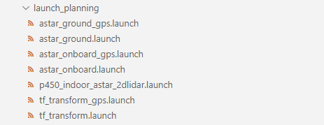

室内避障launch文件：

astar_onboard.launch

astar_ground.launch

tf_transform.launch

室外避障launch文件：

astar_onboard_gps.launch

astar_ground_gps.launch

tf_transform_gps.launch

