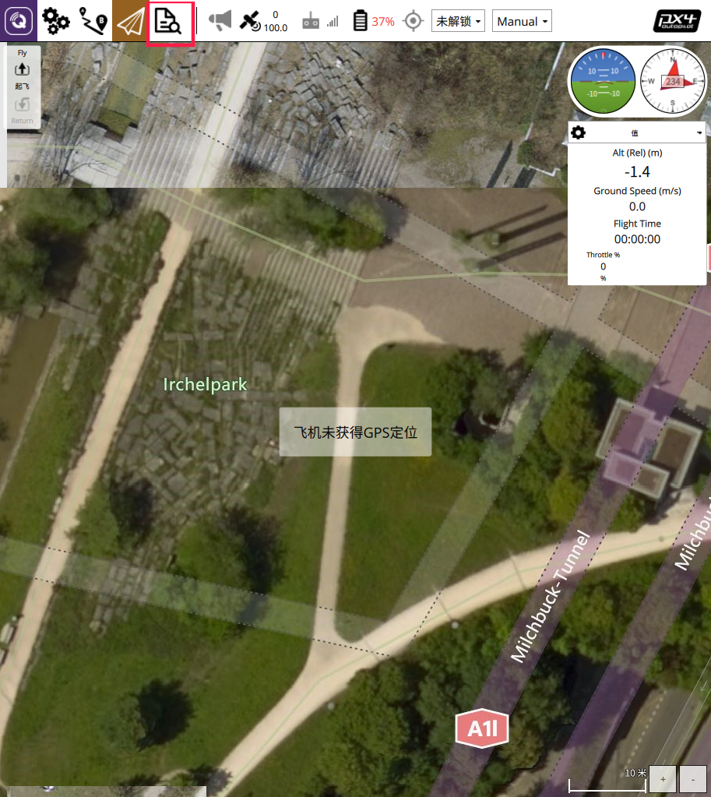
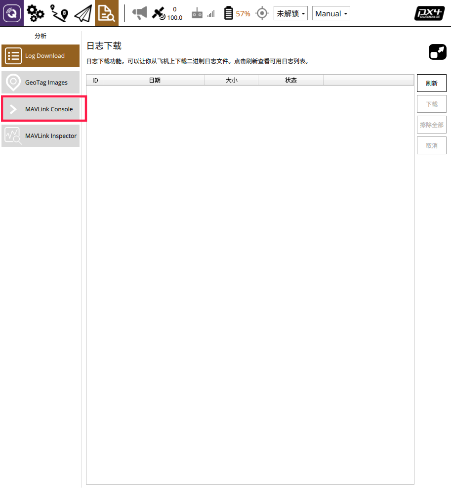
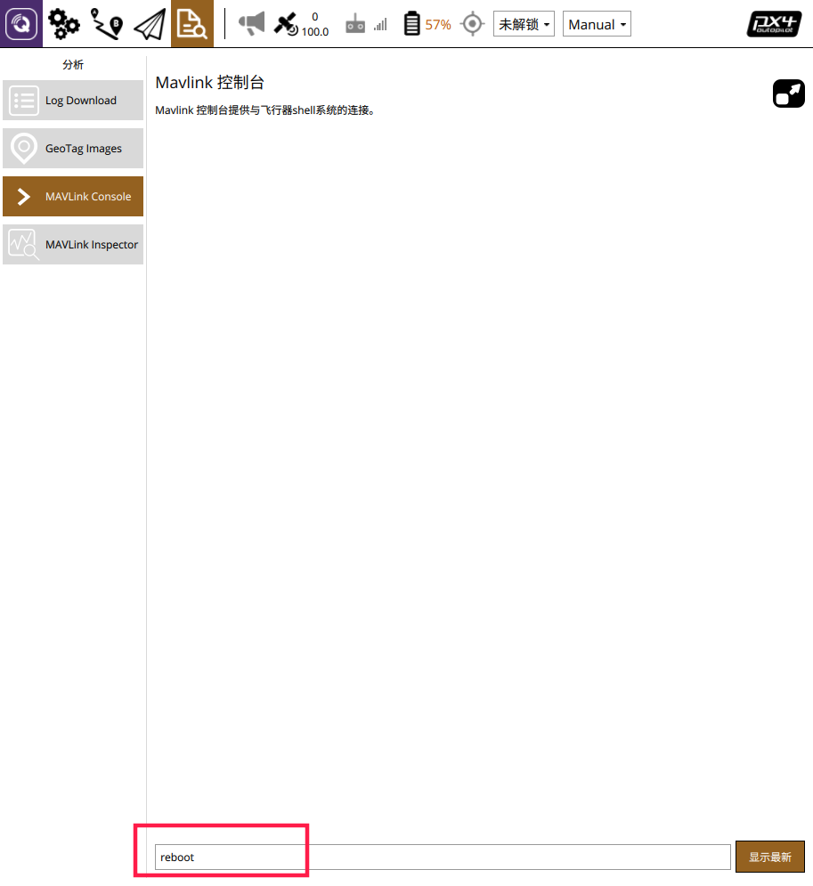

首次飞行(室外)
==============

本节主要讲解GPS配置下无人机室外的首次飞行。

电脑软件准备工作
------------------

准备一台笔记本电脑，电脑系统不做要求，可以是Windows7，Windows10或者是Ubuntu系统。需要安装QGroundControl(以下简称QGC)和nomachine。
QGC的作用是连接到飞机，监控飞机本身的状态（传感器是否正常，参数配置是否正常）；nomachine用作远程连接到板载计算机。

.. hint::

    软件安装包请在百度网盘自主下载
    `网盘链接 <https://pan.baidu.com/share/init?surl=M2ucIqRqnKoFI8ylLpgquQ>`_
    
    提取码: **amov**

.. image:: ../../images/p450/first_fly/package.png

从图中可以看到，有不同操作系统下的安装包，根据自己笔记本电脑系统安装相应的QGC和nomachine。

安装QGC地面站
^^^^^^^^^^^^^^^^^^^^^^^

正确安装上面安装包之后，打开QGC地面站：

.. image:: ../../images/p450/first_fly/1-qgc.png

.. attention::

    最下方的版本是V4.0.8

.. image:: ../../images/p450/first_fly/1-qgc-vision.png

安装nomachine
^^^^^^^^^^^^^^^^^^^^^^^

正常安装按完成之后，打开nomachine：

.. image:: ../../images/p450/first_fly/1-nomachine.png

硬件准备工作
------------------

p450无人机+富斯i6s遥控器

.. image:: ../../images/p450/first_fly/2-p450vehicle-logo.jpg

5300mah/4000mah航模锂电池

.. image:: ../../images/p450/first_fly/2-5300mah.png
   :height: 800px
   :width: 800px
   :scale: 50%
   :alt: None
   :align: center

.. image:: ../../images/p450/first_fly/2-4000mah.png
   :height: 800px
   :width: 800px
   :scale: 50%
   :alt: None
   :align: center

遥控器电池

.. image:: ../../images/p450/first_fly/2-rcbattery.png
   :height: 912px
   :width: 807px
   :scale: 40%
   :alt: None
   :align: center

安全绳

.. image:: ../../images/p450/first_fly/2-safestring.png
   :height: 434px
   :width: 769px
   :scale: 60%
   :alt: None
   :align: center

qgc远程连接到飞机
-----------------

首先连接到飞机的数传wifi，命名为amov-uav#####,“#####”代表出厂序列号。

.. image:: ../../images/p450/first_fly/3-connectwifi.png
   :height: 184px
   :width: 453px
   :scale: 80%
   :alt: None
   :align: center

密码为12345678

电脑连上飞机的数传wifi后，打开QGC地面站，在通讯连接下面选择“添加”

.. image:: ../../images/p450/first_fly/3-addwifi.png

类型选择“	TCP”，主机地址为“192.168.10.###”，“###”为wifi名字的后三位数字。端口号为“6000”。

.. image:: ../../images/p450/first_fly/3-tcp-ip.png
   :height: 317px
   :width: 417px
   :scale: 90%
   :alt: None
   :align: center

然后点击“连接”，连接成功后如下图所示

.. image:: ../../images/p450/first_fly/3-connectsuccess.png

.. attention::
    如果做无人机室外测试，需要在地面站修改参数EKF2_AID_MASK，EKF2_HGT_MODE，详细操作如下：

    首先点击参数（Parameters）按钮，进入参数修改界面，如下。

    .. image:: ../../images/p450/first_fly_outdoor/first_fly_outdoor1.png

    在search栏输入aid，选择EKF2_AID_MASK参数

    .. image:: ../../images/p450/first_fly_outdoor/first_fly_outdoor2.png

    在窗口右上侧会弹出子页面,如下图所示。

    .. image:: ../../images/p450/first_fly_outdoor/first_fly_outdoor3.png
   
   这里我们使用默认选择use GPS作为室外飞行的定位数据来源。

   在search栏输入hgt,选择EKF2_HGT_MODE参数栏

    .. image:: ../../images/p450/first_fly_outdoor/first_fly_outdoor4.png

    在窗口右上弹出的子页面上，点击下拉菜单，选择Barometric pressure，如下图所示

    .. image:: ../../images/p450/first_fly_outdoor/first_fly_outdoor5.png

    最后保存退出。

设置完参数后，我们需要在QGC中先将飞控重启一下，操作如下，

点击红框所圈出的图标，进入如下界面

选择MAVLink Console，进入MAVLink控制终端，输入reboot,回车，听到飞控重启的提示音，即重启飞控成功。

等待飞控重启完成后，无人机的航灯绿色常亮且QGC上无人机的卫星数量在13颗及以上时，即可将遥控器切定点进行室外飞行。

视频演示
-------------------------

.. raw:: html

