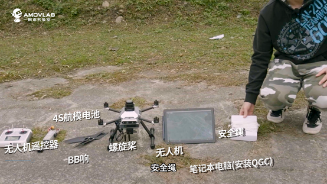
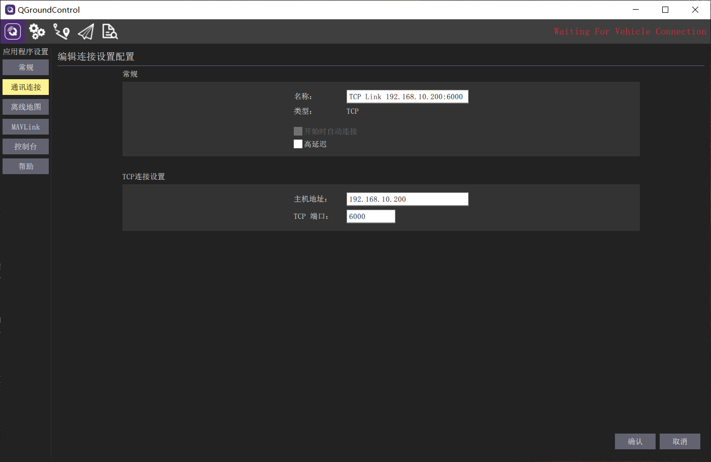
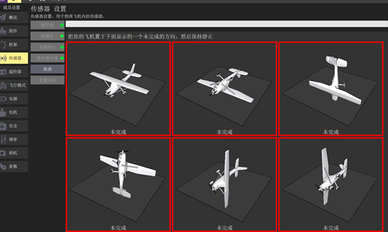
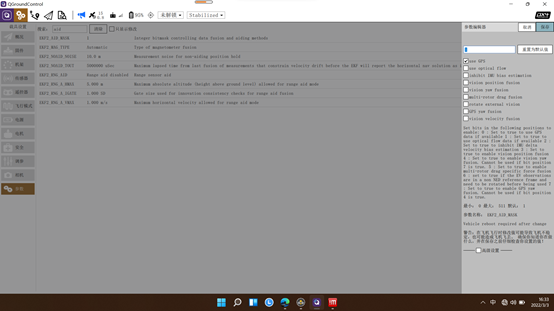
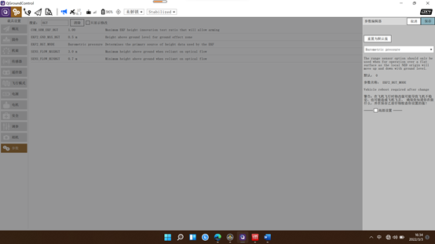
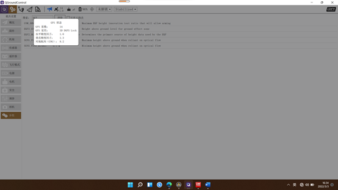

首次飞行(室外)
==============

本节主要讲解GPS配置下无人机室外的首次飞行。

环境介绍
------------------

.. attention::
         在室外飞行时，我们尽量选择空旷、无遮挡且无强电磁干扰的环境，这样才能保证无人机的GPS定位数据精准。

工具准备
------------------

.. attention::
      在外出测试前我们需要检测无人机的相关配件是否携带齐全，防止因配件遗漏导致无法测试，下图即是我们室外测试需要用到的工具。 

除图上的工具外，我们还需要携带一根USB数据线用于无人机的传感器校验，和折叠座凳用于放置电脑。

我们在室外飞行给无人机使用的电源是4S的航母电池，这种航母电池一个电芯的安全使用电压是3.6~4.2V，若电压高于4.2则
电池处于过充状态，电压低于3.6电池处于过放状态，过充过放都会影响电池的使用寿命，更严重者甚至会导致电池自燃或爆
炸。所以我们在进行室外飞行时，需要将测电计插上电池监控电池电压。

使用测电器（BB响），首先我们将电池的排线插头无凸起的一面向上，然后将插头从测电器的第一根插针插入，听到测电器BB的响声就表
示插入正常。我们就可以通过测电器观察电池电量，最先显示的是电池的总电压，然后会分别显示每块电芯的电压。

.. image:: ../../images/p450/first_fly_outdoor/first_fly_outdoor8.png
   

.. image:: ../../images/p450/first_fly_outdoor/first_fly_outdoor9.png
   

.. attention::
   电池不用时，需保存在电池柜。保存电压需维持在总电压的2/3,这里我们用的4S就需要维持在11.2V左右。

QGC远程连接到飞机
-----------------

将无人机上电启动，并将遥控器开机，遥控器开机时所有挡杆拨到最上方。上电完成后，我们通过笔记本电脑去连接无人机的飞控，需要
先连接到无人机的wifi进入局域网。无人机的wifi名为amov-uavXXXXX，可以通过无人机上的标签获取到。然后，我们打开QGC软件创建
一个TCP连接，连接的IP同样可以在无人机标签上获取，一般为192.168.10.xxx，端口号为6000。

   

连上飞机后，通常需要校准来消除传感器因颠簸和环境因素产生的误差。我们点击地面站的传感器一栏，分别对各个传感器进行校准，
校准的步骤根据地面站的操作，校准完飞控需要重启才能生效。

同时我们需要将飞控的定位来源更改，点击参数，在搜索栏输入aid，选择EKF2_AID_MASK这个参数，设置为use GPS并保存。

再输入hgt，点击EKF2_HGT_MODE这个参数，修改为Barometric Pressure，然后再重启飞控。

飞控重启并连接后，我们点击卫星的标志查看GPS的状态，当GPS卫星数达到12颗星及以上并进入3D GPS Lock状态，代表飞机的定位数据良好，
然后我们试着将遥控器的SWC摇杆拨到中间将无人机切入POSITION模式，并在地面站观察无人机是否进入PISITION，若正常进入即可解锁起飞。

视频演示
-------------------------

.. raw:: html

    <iframe width="696" height="422" src="//player.bilibili.com/player.html?aid=723895958&bvid=BV1AS4y1C7Me&cid=505591195&page=1" scrolling="no" border="0" frameborder="no" framespacing="0" allowfullscreen="true"> </iframe>

