nomachine远程连接
========================

1. 板载计算机连接p450飞机数传wifi

如下图所示，选择wifi名称，输入密码。密码连接可参考“qgc远程连接到飞机”

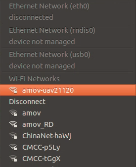

    2. 查看板载计算机ip

查看板载计算机ip有两种方法，第一种方法是点击右上角“wifi信号”，选择“Connection Information”，
在IPv4-IP Address下，用“红框”标记的就是板载计算机的ip地址。

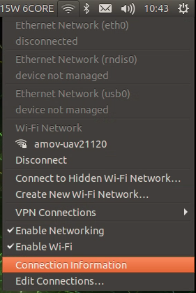

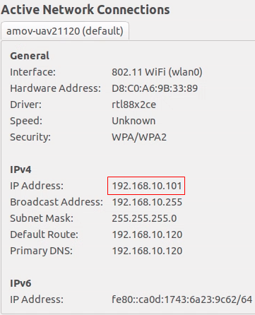

第二种方法是点击右键，选择“Open Terminal”,输入“ifconfig”,在最下面wlan0下用“红框”标记的就是板载计算机的ip地址。

.. image:: ../../images/p450/first_fly/4-boardip3.png

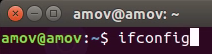

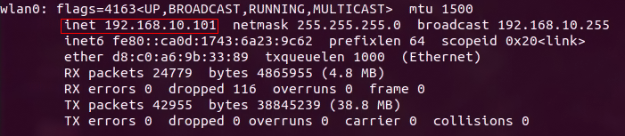

3.nomachine远程连接板载计算机

点击New

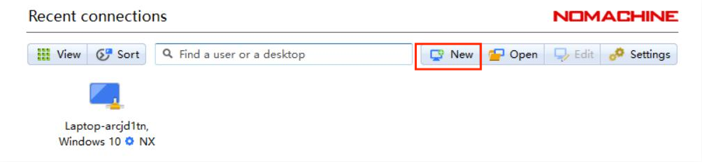

在Protocol下选择NX，点击Continue。

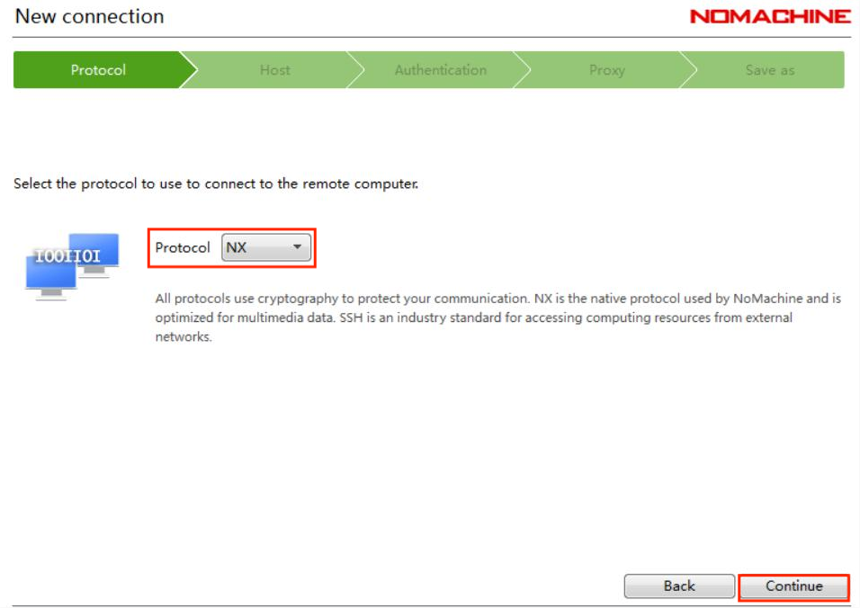

在“Host”下填写板载计算机的ip地址，板载计算机地址参考步骤2，“Port”下默认4000。

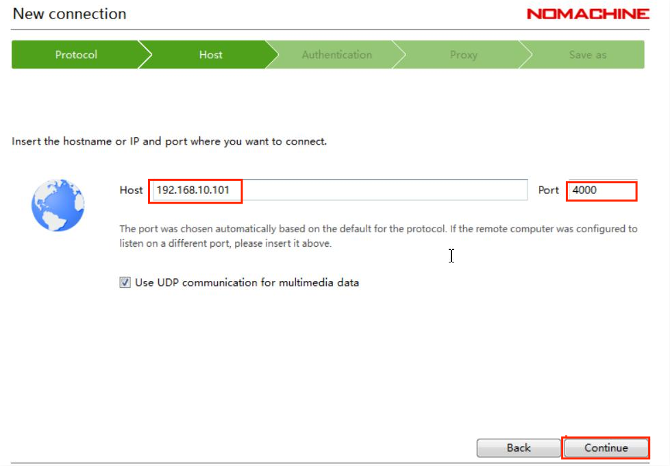

在Authentication下默认是Password，点击“Continue”。

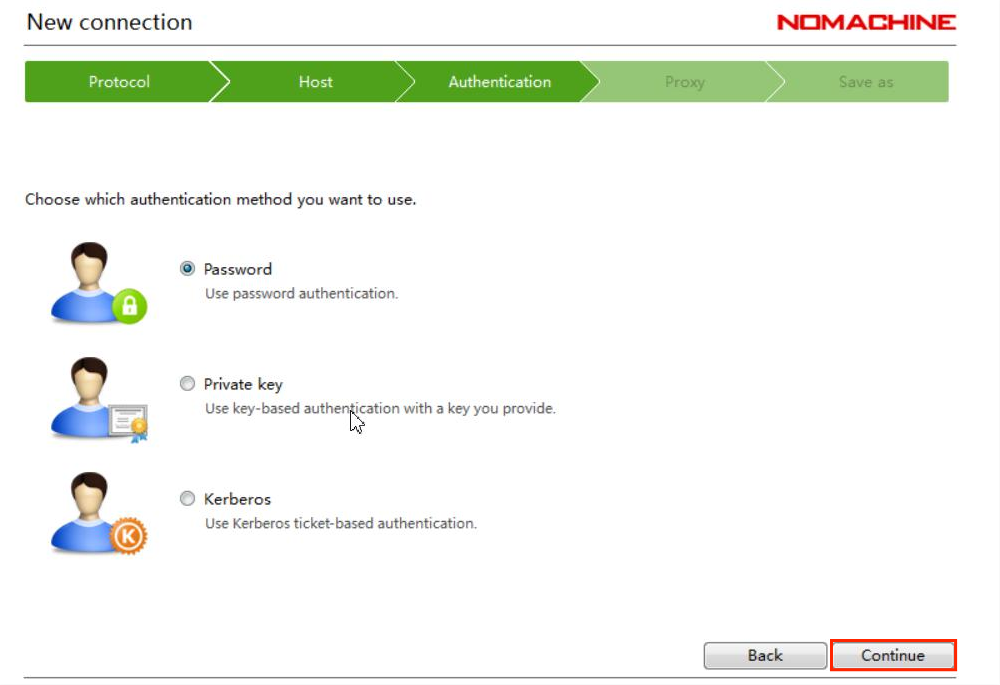

在Proxy下默认是“Don’t use a proxy”，点击“Continue”。

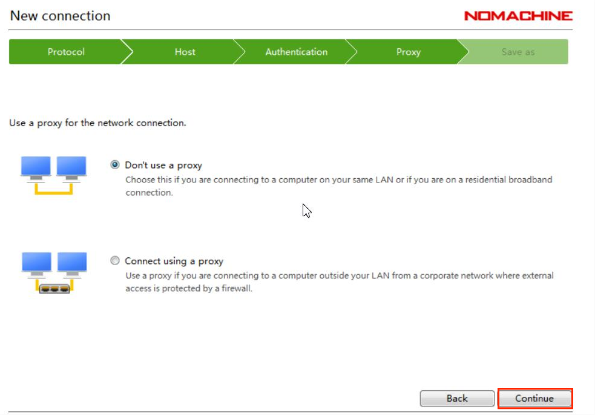

在Save as下会生成默认的name，可以不做更改，点击“Done”。

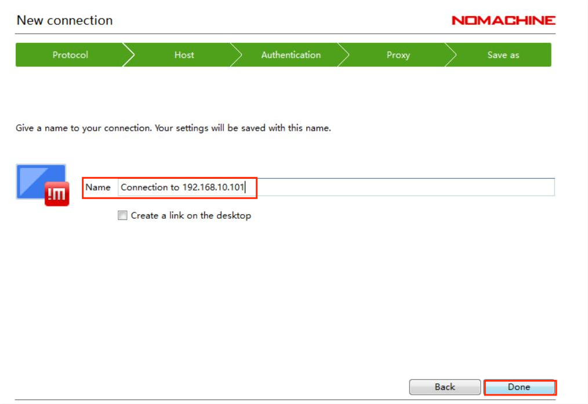

按照上述步骤操作，会自动生成如下图所示用红框标起的链接，点击“Connect”。

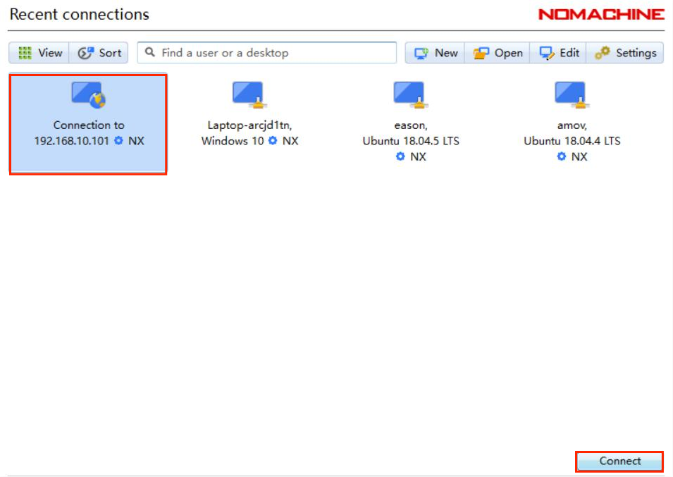

在“Username”和“Password”下输入“amov”

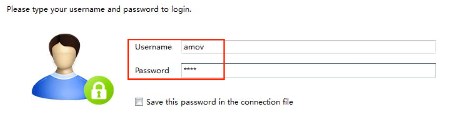

Nomachine成功连接板载计算机后会显示如下界面

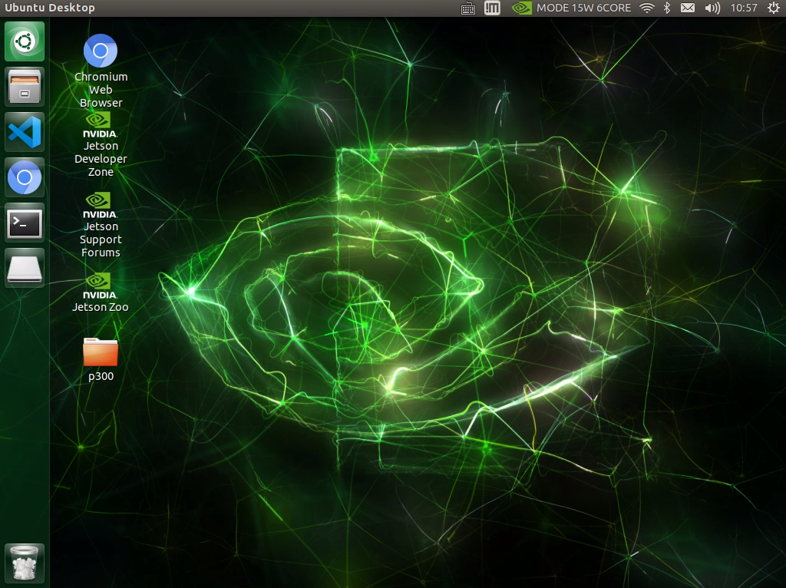

此时可同时连接qgc与板载计算机，方便后续实验操作。

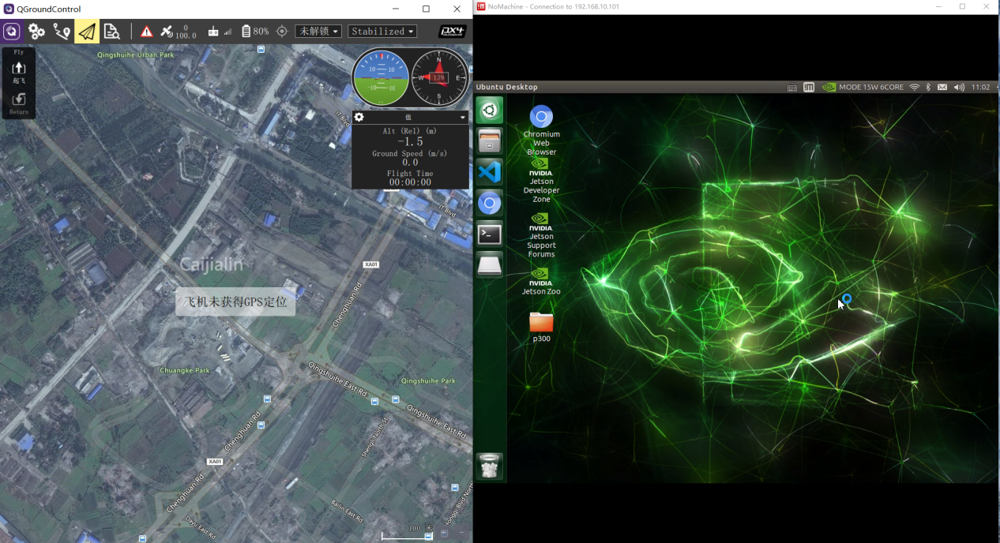

