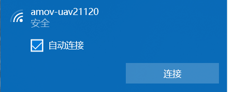
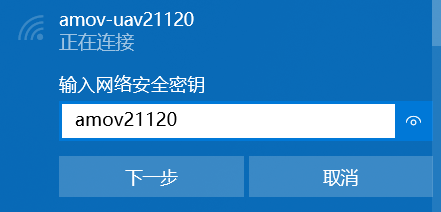
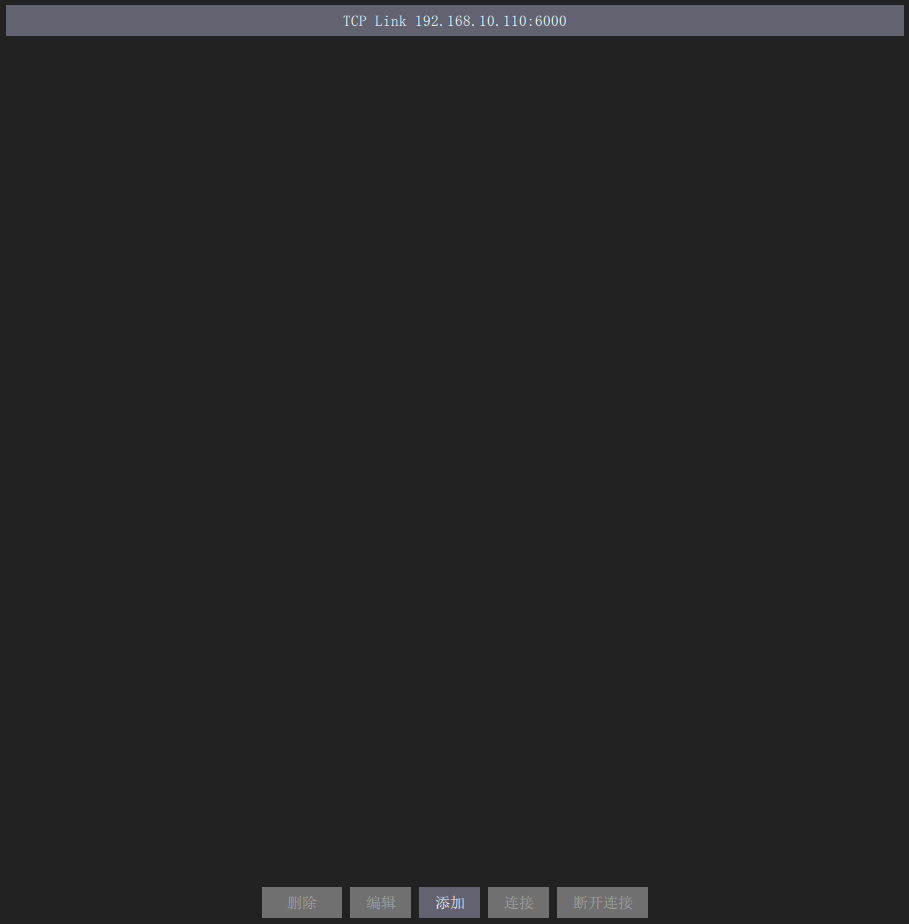
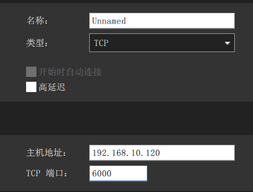

qgc远程连接到飞机
======================

首先连接到飞机的数传wifi，命名为amov-uav#####,“#####”代表出厂序列号。

密码为wifi名字去掉“-uav”。例如wifi名字是“amov-uav21120”,那么wifi密码就是“amov21120”

在通讯连接下面选择“添加”

类型选择“	TCP”，主机地址为“192.168.1.###”，“###”为wifi名字的后三位数字。端口号为“6000”。

然后点击“连接”，连接成功后如下图所示

.. image:: ../../images/p450/first_fly/3-connectsuccess.png

