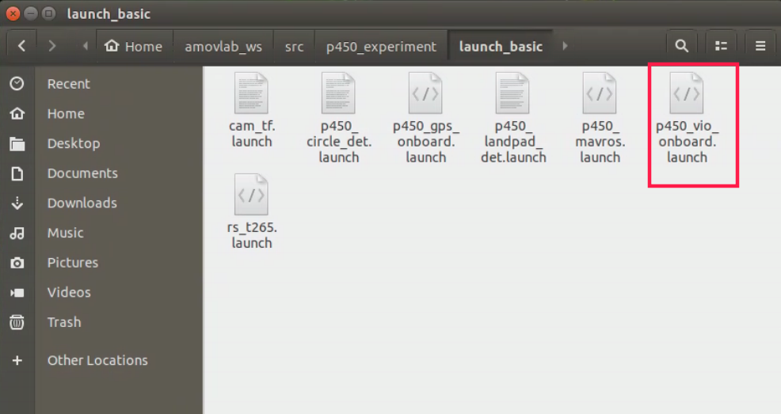

启动脚本
==========

首先在终端输入“rs-sensor-control”,查看有没有传感器连接，正常情况下如
下图所示，会显示传感器的序列号。

.. image:: ../../images/p450/first_fly/5-sensor-control.png

启动脚本在下图所示的目录下面

在终端输入如下命令，启动脚本

.. image:: ../../images/p450/first_fly/5-roslaunch.png

启动脚本后如下图所示

.. image:: ../../images/p450/first_fly/5-run-script.png

