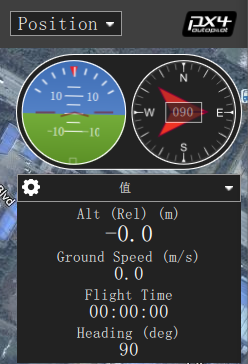
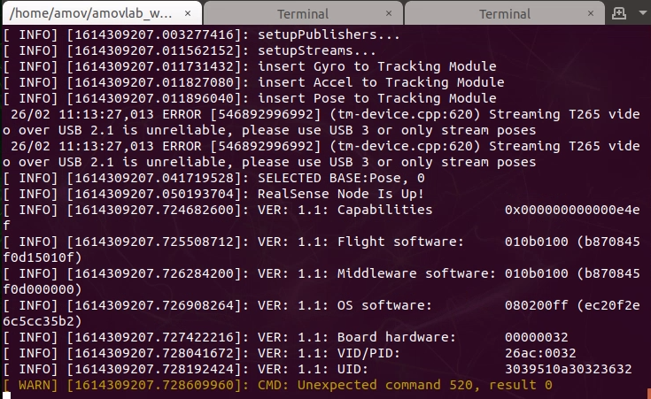

检查各项数据是否正常
====================

在启动脚本后，首先查看地面站，地面站上会显示飞机的航向为正东，就是“E”。

第一个终端正常情况下如下图所示，各项数据均正常

第二个终端如下图所示，查看飞机的位置、速度、角度与角速度信息是否正常，主
要移动飞机查看飞机的位置信息是否正常，飞机向前为X轴正方向，向左为Y轴正方
向，向上为Z轴正方向。下图例子为将飞机向后向上移动大概1m，数据显示正常。

 .. image:: ../../images/p450/first_fly/6-twice.png

 第三个终端如下图所示，显示“Program is running”即表示脚本正常运行。

  .. image:: ../../images/p450/first_fly/6-third.png

  