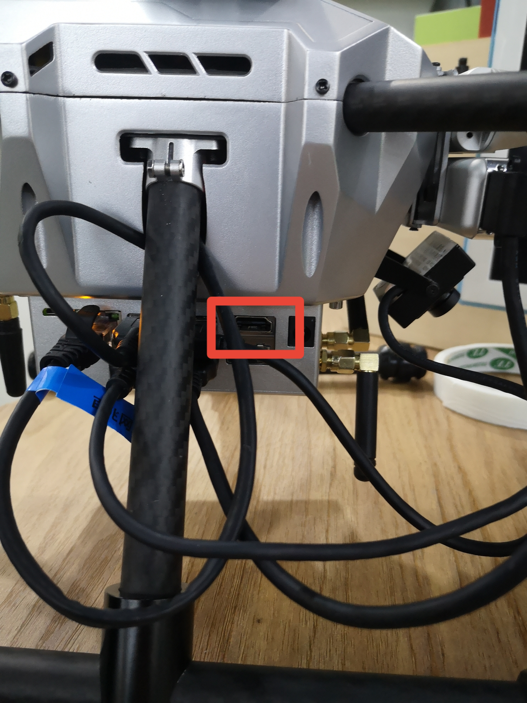
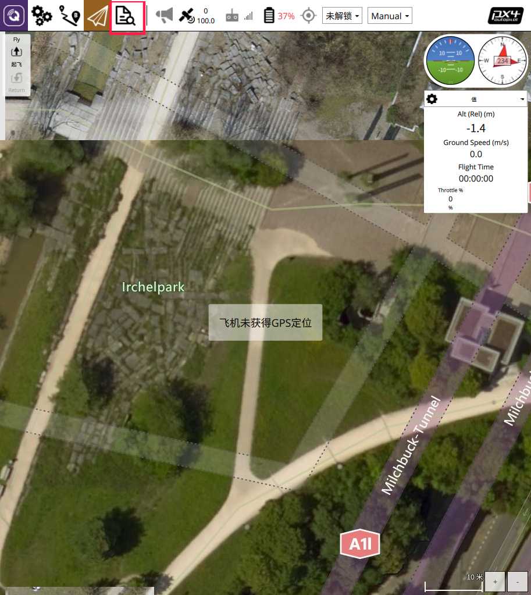
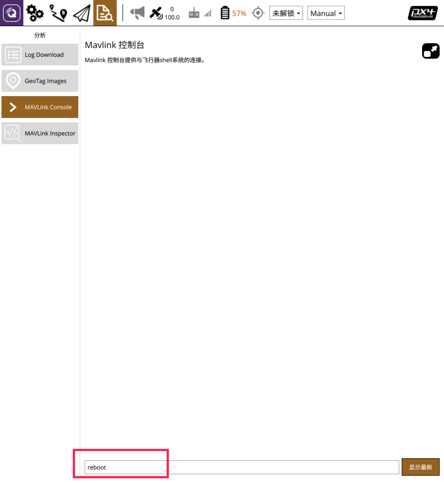
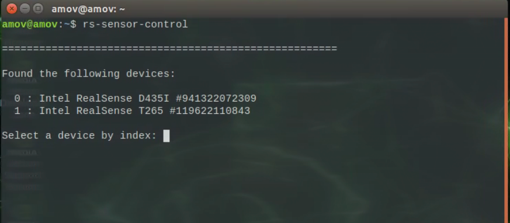
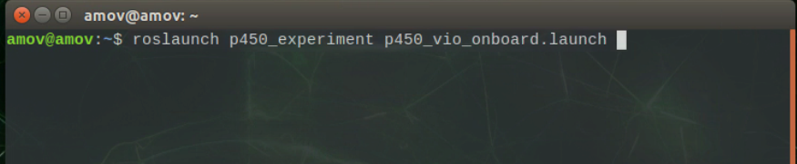
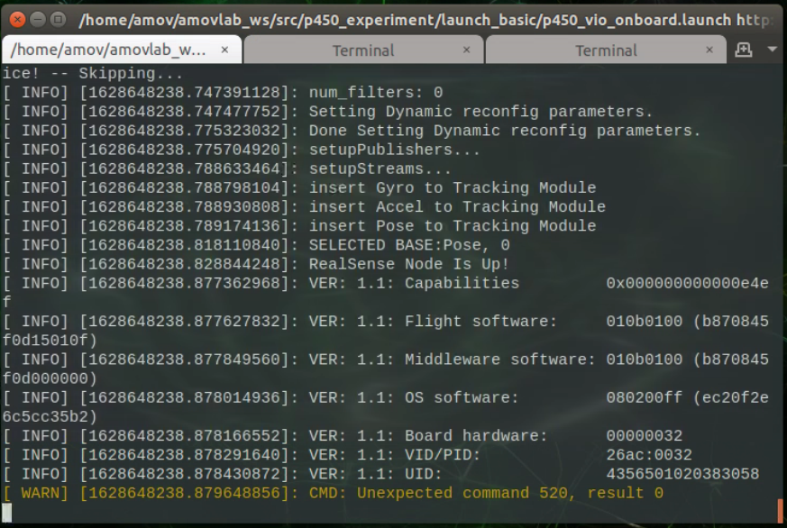

首次飞行
==============

本节主要讲解T265相机配置下无人机的首次飞行。

.. attention::
   在执行飞行操作前，请保证已经熟悉wiki基本操作流程。

飞行环境
-----------------------------
我们的飞行环境如下图所示

.. attention::

   飞机室内使用要求视觉特征点明显！要求用户把赠送的25张二维码，9张均匀贴在测试场地地上，16张均匀贴在测试场地四周；飞机室外使用要求上方空旷无卫星信号遮挡，远离强电等电磁干扰。

.. image:: ../../images/p450/first_fly/飞行环境.jpg

电脑软件准备工作
------------------

准备一台笔记本电脑，电脑系统不做要求，可以是Windows7，Windows10或者是Ubuntu系统。需要安装QGroundControl(以下简称QGC)和nomachine。
QGC的作用是连接到飞机，监控飞机本身的状态（传感器是否正常，参数配置是否正常）；nomachine用作远程连接到板载计算机。

.. hint::

    软件安装包请在百度网盘自主下载
    `网盘链接 <https://pan.baidu.com/share/init?surl=M2ucIqRqnKoFI8ylLpgquQ>`_
    
    提取码: **amov**

.. note::
   若出现网盘提取错误，请右键链接在新标签页打开。

.. image:: ../../images/p450/first_fly/package.png

从图中可以看到，有不同操作系统下的安装包，根据自己笔记本电脑系统安装相应的QGC和nomachine。

安装QGC地面站
^^^^^^^^^^^^^^^^^^^^^^^

正确安装上面安装包之后，打开QGC地面站：

.. image:: ../../images/p450/first_fly/1-qgc.png

.. attention::

    最下方的版本是V4.0.8

.. image:: ../../images/p450/first_fly/1-qgc-vision.png

安装nomachine
^^^^^^^^^^^^^^^^^^^^^^^

正常安装按完成之后，打开nomachine：

.. image:: ../../images/p450/first_fly/1-nomachine.png

硬件准备工作
------------------

p450无人机+富斯i6s遥控器

.. image:: ../../images/p450/first_fly/2-p450vehicle-logo.jpg

5300mah/4000mah航模锂电池

.. image:: ../../images/p450/first_fly/2-5300mah.png
   :height: 800px
   :width: 800px
   :scale: 50%
   :alt: None
   :align: center

.. image:: ../../images/p450/first_fly/2-4000mah.png
   :height: 800px
   :width: 800px
   :scale: 50%
   :alt: None
   :align: center

.. attention::
   电池单片电压不能低于3.6V，防止电池过放造成损坏。

遥控器电池

.. image:: ../../images/p450/first_fly/2-rcbattery.png
   :height: 912px
   :width: 807px
   :scale: 40%
   :alt: None
   :align: center

安全绳

.. image:: ../../images/p450/first_fly/2-safestring.png
   :height: 434px
   :width: 769px
   :scale: 60%
   :alt: None
   :align: center

桨叶安装

.. image:: ../../images/p450/first_fly/8-桨叶和电机关系.png
   :height: 434px
   :width: 769px
   :scale: 60%
   :alt: None
   :align: center

.. image:: ../../images/p450/first_fly/8-桨叶和电机关系2.png
   :height: 434px
   :width: 769px
   :scale: 60%
   :alt: None
   :align: center
电机要和桨叶对应，有白色的点桨叶对应有白色点的电机，黑色电机对黑色电机。

qgc远程连接到飞机
-----------------

首先连接到飞机的数传wifi，命名为amov-uav#####,“#####”代表出厂序列号，或者名为amov-uav2100x 

.. image:: ../../images/p450/first_fly/3-connectwifi.png
   :height: 184px
   :width: 453px
   :scale: 80%
   :alt: None
   :align: center

密码为12345678

电脑连上飞机的数传wifi后，打开QGC地面站，在通讯连接下面选择“添加”

.. image:: ../../images/p450/first_fly/3-addwifi.png

类型选择“	TCP”，主机地址为“192.168.10.###”，“###”为wifi名字的后三位数字。端口号为“6000”。

.. image:: ../../images/p450/first_fly/3-tcp-ip.png
   :height: 317px
   :width: 417px
   :scale: 90%
   :alt: None
   :align: center

然后点击“连接”，连接成功后如下图所示

.. image:: ../../images/p450/first_fly/3-connectsuccess.png
 

.. attention::
    如果做无人机室内测试，需要在地面站修改参数EKF2_AID_MASK，EKF2_HGT_MODE，详细操作如下：

    首先点击参数（Parameters）按钮，进入参数修改界面，如下。

    .. image:: ../../images/p450/first_fly/3-parameters.png

    在search栏输入aid，选择EKF2_AID_MASK参数

    .. image:: ../../images/p450/first_fly/3-aid1.png

    在窗口右上侧会弹出子页面,如下图所示。

    .. image:: ../../images/p450/first_fly/3-aid2.png

    一般默认选择第一项use GPS,由于我们室内飞行使用的是T265作为位置定位源，所以需将此参数改为4、5项，修改后保存。

    在search栏输入hgt,选择EKF2_HGT_MODE参数栏

    .. image:: ../../images/p450/first_fly/3-hgt1.png

    在窗口右上弹出的子页面上，点击下拉菜单，选择vision，如下图所示

    .. image:: ../../images/p450/first_fly/3-hgt2.png

    最后保存退出。

nomachine远程连接
--------------------

板载计算机连接p450飞机数传wifi
^^^^^^^^^^^^^^^^^^^^^^^^^^^^^^^^^^^^^^^

如下图所示，选择wifi名称，输入密码。密码连接可参考“qgc远程连接到飞机”

.. image:: ../../images/p450/first_fly/4-boardwifi.png
   :height: 337px
   :width: 275px
   :scale: 100%
   :alt: None
   :align: center

查看板载计算机ip
^^^^^^^^^^^^^^^^^^^^^^^^^^^^^

查看板载计算机ip，首先需要将板载计算机连接显示屏，下图是板载的HDMI接口

查看板载计算机ip有三种方法，第一种方法是直接用板载计算机连接显示器，点击右上角“wifi信号”，选择“Connection Information”，

在IPv4-IP Address下，用“红框”标记的就是板载计算机的ip地址。

.. image:: ../../images/p450/first_fly/4-boardip1.png
   :height: 419px
   :width: 281px
   :scale: 100%
   :alt: None
   :align: center

.. image:: ../../images/p450/first_fly/4-boardip2.png
   :height: 446px
   :width: 361px
   :scale: 100%
   :alt: None
   :align: center

第二种方法是点击右键，选择“Open Terminal”,输入“ifconfig”,在最下面wlan0下用“红框”标记的就是板载计算机的ip地址。

.. image:: ../../images/p450/first_fly/4-boardip3.png
   :height: 181px
   :width: 312px
   :scale: 100%
   :alt: None
   :align: center

.. image:: ../../images/p450/first_fly/4-boardip4.png
   :height: 54px
   :width: 212px
   :scale: 100%
   :alt: None
   :align: center

.. image:: ../../images/p450/first_fly/4-boardip5.png
   :height: 153px
   :width: 701px
   :scale: 100%
   :alt: None
   :align: center

第三种方法使用arp报文,打卡windows的控制台输入
'arp -a'
可能会出现很多行，找到192.168.10.xx这个网段开头的网络,里面有192.168.10.1 ,还有一个192.168.10.10x就是板载计算机的ip

.. image:: ../../images/p450/first_fly/9-NoMip的搜索.png
   :height: 153px
   :width: 701px
   :scale: 100%
   :alt: None
   :align: center

nomachine远程连接板载计算机
^^^^^^^^^^^^^^^^^^^^^^^^^^^^^^^

点击New

.. image:: ../../images/p450/first_fly/4-nom-1.png
   :height: 232px
   :width: 1004px
   :scale: 50%
   :alt: None
   :align: center

在Protocol下选择NX，点击Continue。

.. image:: ../../images/p450/first_fly/4-nom-2.png
   :height: 676px
   :width: 956px
   :scale: 70%
   :alt: None
   :align: center

在“Host”下填写板载计算机的ip地址，板载计算机地址参考步骤2，“Port”下默认4000。

.. image:: ../../images/p450/first_fly/4-nom-3.png
   :height: 680px
   :width: 978px
   :scale: 70%
   :alt: None
   :align: center

在Authentication下默认是Password，点击“Continue”。

.. image:: ../../images/p450/first_fly/4-nom-4.png
   :height: 685px
   :width: 1000px
   :scale: 70%
   :alt: None
   :align: center

在Proxy下默认是“Don’t use a proxy”，点击“Continue”。

.. image:: ../../images/p450/first_fly/4-nom-5.png
   :height: 687px
   :width: 983px
   :scale: 70%
   :alt: None
   :align: center

在Save as下会生成默认的name，可以不做更改，点击“Done”。

.. image:: ../../images/p450/first_fly/4-nom-6.png
   :height: 698px
   :width: 1014px
   :scale: 70%
   :alt: None
   :align: center

按照上述步骤操作，会自动生成如下图所示用红框标起的链接，点击“Connect”。

.. image:: ../../images/p450/first_fly/4-nom-7.png
   :height: 677px
   :width: 955px
   :scale: 70%
   :alt: None
   :align: centerf

在“Username”和“Password”下输入“amov”

.. image:: ../../images/p450/first_fly/4-nom-8.png

Nomachine成功连接板载计算机后会显示如下界面

.. image:: ../../images/p450/first_fly/4-nom-9.png

此时可同时连接qgc与板载计算机，方便后续实验操作。

.. image:: ../../images/p450/first_fly/4-nom-10.png

启动脚本
-------------------

在启动脚本前，我们需要在QGC中先将飞控重启一下，操作如下，

点击红框所圈出的图标，进入如下界面

.. image:: ../../images/p450/first_fly/重启飞控2.png

选择MAVLink Console，进入MAVLink控制终端，输入reboot,回车，听到飞控重启的提示音，即重启飞控成功。

然后进入nomachine,在板载终端输入“rs-sensor-control”,查看有没有传感器连接，正常情况下如
下图所示，会显示传感器的序列号。

启动脚本在下图所示的目录下面

.. image:: ../../images/p450/first_fly/5-vio-onboard.png

在终端输入如下命令，启动脚本

启动脚本后如下图所示

检查各项数据是否正常
---------------------

在启动脚本后，首先查看地面站，地面站上会显示飞机的航向为正东，就是“E”。

.. image:: ../../images/p450/first_fly/6-qgc-e.png
   :height: 364px
   :width: 248px
   :scale: 100%
   :alt: None
   :align: center

第一个终端正常情况下如下图所示，各项数据均正常

第二个终端如下图所示，查看飞机的位置、速度、角度与角速度信息是否正常,移动飞机,查看飞机的位置信息是否正常，飞机向前为X轴正方向，向左为Y轴正方
向，向上为Z轴正方向。

 .. image:: ../../images/p450/first_fly/twice.png

 第三个终端如下图所示，显示“Program is running”即表示脚本正常运行。

  .. image:: ../../images/p450/first_fly/third.png

遥控器定点模式飞行
-------------------------------------

如下图所示，将“SWC”开关拨到中间一档， 切到“定点模式”

.. image:: ../../images/p450/first_fly/7-pos.png
   :height: 745px
   :width: 998px
   :scale: 60%
   :alt: None
   :align: center

然后左手“右下”解锁飞机，如下图所示。

.. image:: ../../images/p450/first_fly/7-arm.png

起飞后如下图所示，进行定点模式飞行。

.. image:: ../../images/p450/first_fly/7-viofly.png
   :height: 779px
   :width: 821px
   :scale: 80%
   :alt: None
   :align: center

视频演示
-------------------------

.. note::
   视频若需全屏播放，可跳转至哔哩哔哩观看。

.. raw:: html

   <iframe width="696" height="422" src="//player.bilibili.com/player.html?aid=720686559&bvid=BV1YQ4y1z71b&cid=414695439&page=3" scrolling="no" border="0" frameborder="no" framespacing="0" allowfullscreen="true"> </iframe>

