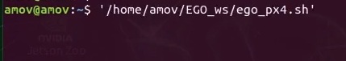
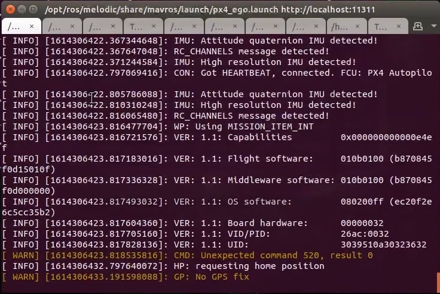
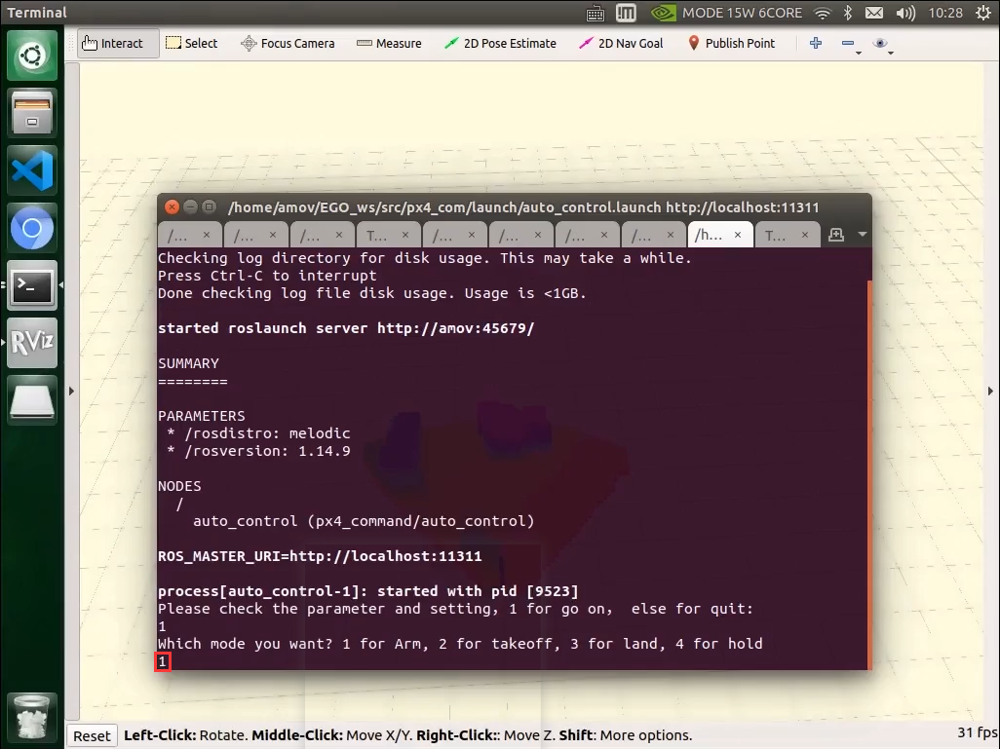
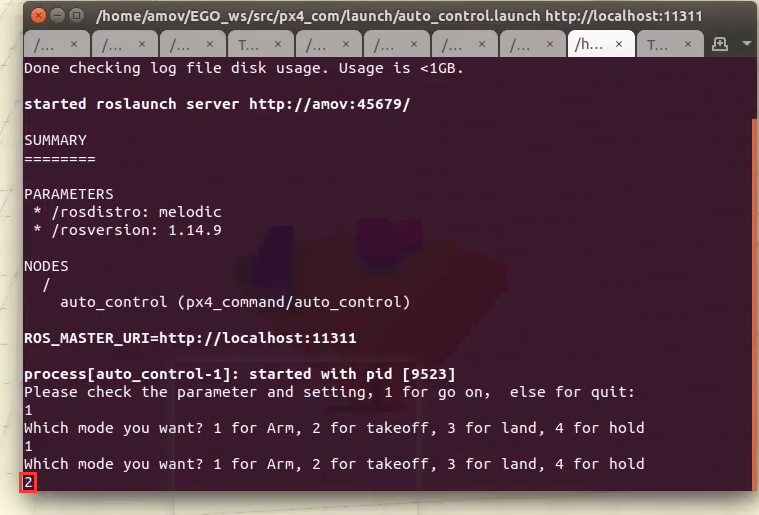
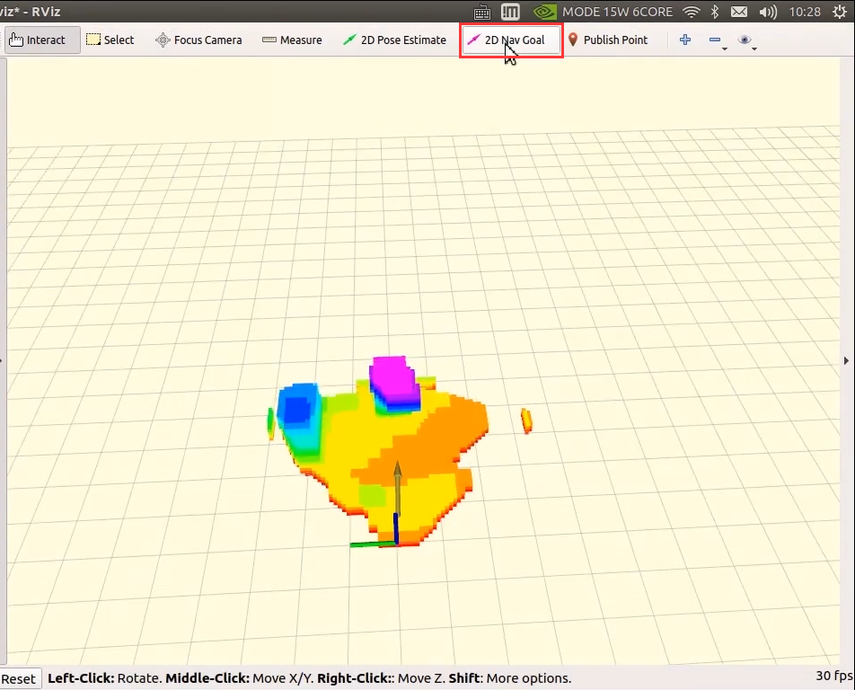
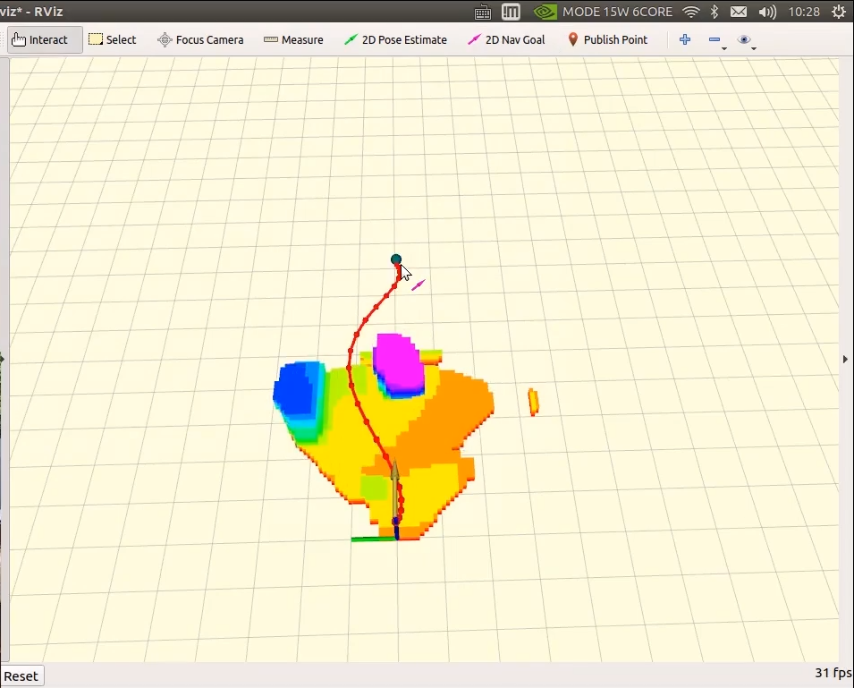

5-进阶功能-FastPlanner
================================

本节主要讲解P450系列无人机的FastPlanner飞行演示。视频紧接上节内容 **首次飞行**  ，默认已经通过WiFi数传连接到QGC地面站和nomachine远程连接到板载计算机，
主要分为一下几点进行讲解：传感器检查，操作，降落，以及最后的视频演示。

.. attention::

    受限于开源飞控硬件性能，飞机在长时间不用后会出现位姿漂移，要求每次飞行前电池重新上电以重启飞控和板载计算机，并严格按照wiki规范操作，避免炸机风险。

传感器检查
----------------
首先在终端输入下面命令，查看是否T265和D435i都已经被系统识别到

`rs-sensor-control`

.. image:: ../../images/p450/fastplanner/传感器检查.png
   :height: 270px
   :width: 593px
   :scale: 100%
   :alt: None
   :align: center

操作
-------------

在终端输入下面命令启动

`/home/amov/EGO_ws/ego_px4.sh`

依次查看每个终端是否有报错

会自动弹出rviz界面，并可以看到建图效果，里面可以看到障碍物

.. image:: ../../images/p450/fastplanner/rviz界面.png
   :height: 730px
   :width: 1027px
   :scale: 70%
   :alt: None
   :align: center

确认参数和设置没有问题后，在此终端输入1并敲回车

.. image:: ../../images/p450/fastplanner/确认参数.png
   :height: 730px
   :width: 1025px
   :scale: 70%
   :alt: None
   :align: center

然后遥控器先切到定点模式，在此终端继续输入1并敲回车，解锁无人机

在此终端继续输入2并敲回车，代表给无人机发送起飞指令，但是此时无人机还没有切入offboard模式，所以不会立马执行起飞，此时用遥控器切入offboard模式后，无人机会立马起飞

等到无人机起飞到一个稳定高度，也即是我们设定的起飞高度后，回到rviz界面，点击选择2D Nav Goal

在rviz上点击一个点作为目标点，会自动生成一个绕开障碍物的路径

此时无人机会沿着这个生成的路径飞，绕开障碍物，且高度会保持不变。

降落
-------------

无人机飞到目标点后，可以遥控器拨动offboard飞行模式开关切出offboard模式，并缓慢手动降落。

视频演示
---------------

无人机FastPlanner功能演示视频如下：

.. raw:: html
 
    <iframe width="696" height="422" src="//player.bilibili.com/player.html?aid=289495747&bvid=BV1sf4y1478z&cid=311396527&page=17" scrolling="no" border="0" frameborder="no" framespacing="0" allowfullscreen="true"> </iframe>