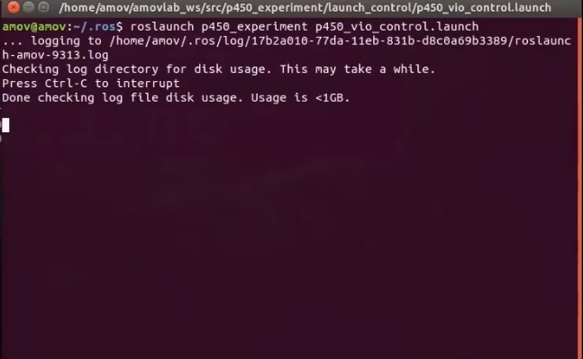
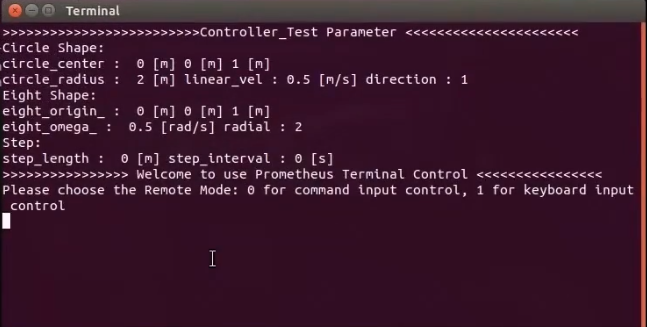
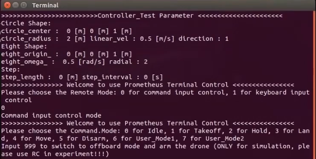
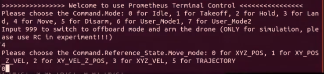
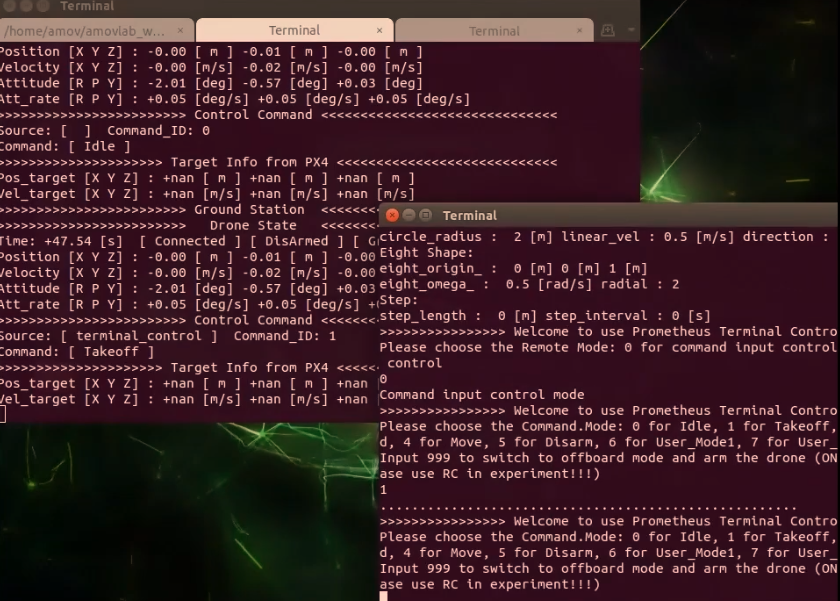
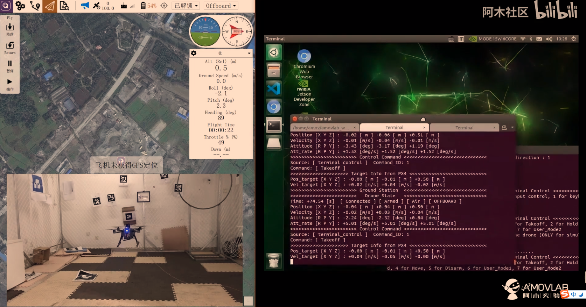
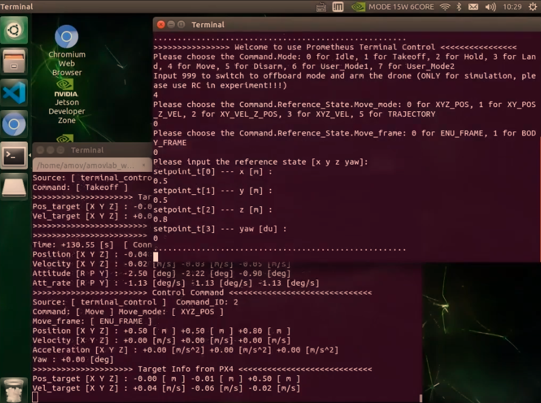
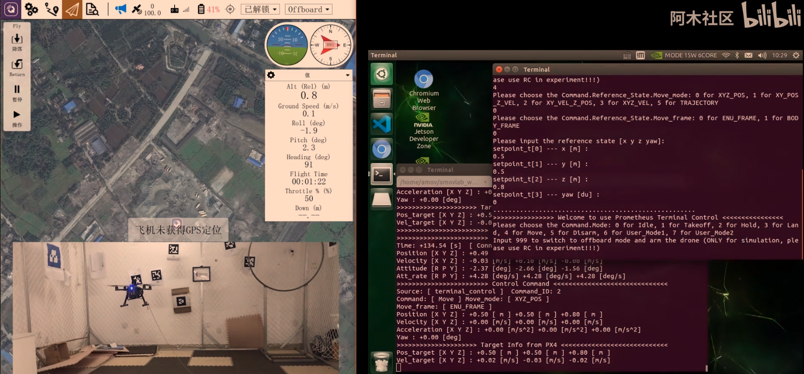

5-进阶功能-室内指点飞行
================================

本节主要讲解P450系列无人机在室内的指点飞行演示。视频紧接上节内容 **首次飞行**  ，默认已经通过WiFi数传连接到QGC地面站和nomachine远程连接到板载计算机，
主要分为一下几点进行讲解：启动指令，命令行控制终端详解，起飞，指点飞，以及最后的视频演示。

.. attention::

    受限于开源飞控硬件性能，飞机在长时间不用后会出现位姿漂移，要求每次飞行前电池重新上电以重启飞控和板载计算机，并严格按照wiki规范操作，避免炸机风险。

启动指令
------------

.. attention::
      在室内操作时，注意在QGC地面中查看自己的位置源是否更改，参数EKF2_AID_MASK设定如下图，EKF2_HGT_MODE设定为Vision。
        .. image:: ../../images/p450/first_fly/3-aid2.png

首先启动基本vio脚本 

`roslaunch p450_experiment p450_vio_onboard.launch`

.. image:: ../../images/p450/室内指点/启动指令onboard.png
   :height: 411px
   :width: 650 px
   :scale: 80 %
   :alt: None
   :align: center

然后再启动控制脚本

`roslaunch p450_experiment p450_vio_control.launch`

之后会出现终端控制界面，提示有两种控制的输入方式，第一种是通过命令输入控制方式，另外一种是通过键盘按键控制方式。

两种方式都可以控制无人机，一般在做实机实验过程中选择第一种通过命令输入控制方式；第二种键盘控制不太安全。接下来会详细讲解如何使用第一种命令输入控制方式实现指点飞行。

命令行控制终端详解
---------------------------

其中 0 表示的是 怠速；意思就是飞机会进入offboard模式，但是在该模式下，没有对飞机进行任何指令的发送。飞机也不会有任何动作。这个指令一般也可以不用。

1 表示的是 起飞；起飞点为当前点，起飞高度通过 yaml参数文档设置，单位是米，默认起飞高度是0.5m

2 表示的是 悬停；飞机正在飞行过程中如何接受到 2 指令，会在当前时刻进入悬停状态。

3 表示的是 降落；降落速度通过 yaml参数文档设置，单位是m/s ，默认降落速度为0.2m/s 。还有一个上锁高度，到达上锁高度之后飞机会进入飞控的本身降落模式进而缓缓着地，
上锁高度通过 yaml 参数文档进行设置，单位是米，默认是 0.18m，即认为离地不到20cm的时候进入飞控本身的降落飞行模式。

4 表示的是 move模式；该模式就包含我们所称的指点飞行功能，在此模式下，又有5种子模式：
0对应XYZ_POS,空间位置控制；
1对应XY_POS_Z_VEL,水平面位置控制，高度速度控制；
2对应XY_VEL_Z_POS,水平面速度控制，高度定高控制；
3对应XYZ_VEL,空间速度控制；
5对应TRAJECTORY，轨迹跟踪控制。

常用的模式为0空间位置控制（指点飞行），接下来会讲讲实机过程中起飞的具体实现。

起飞
--------------

通过控制终端发送1起飞指令，这时候飞机通过板载计算机已经给飞机一直发送起飞指令，但是目前飞机还没有进入offboard模式和解锁，所以飞机是没有响应的。

发送完起飞指令之后，遥控器切换到position模式，然后遥控器操作“内八”进行解锁，最后拨动offboard飞行模式开关。飞机就会慢慢起飞起来，保持在0.5m的高度。

可以看到飞机起飞已经完成，保持在0.5m高度，接下来进行指点操作，这时候就不需要遥控器操作了，只需要看好遥控器，防止意外事情发生；进入指点飞行过程。

指点飞
-------------

选择 4 move飞行模式，然后选择 0 空间位置控制，然后选择 0 ENU_FRAME惯性坐标系，最后输入期望的状态，空间位置xyz和航向角yaw。

这里我们发送的指令是x为0.5，y为0.5，z为0.8，yaw为0.让飞机往前x轴飞行0.5m，往左y轴飞行0.5m，往上z轴飞行到0.8m，航向角保持不变发送为0.

飞机开始移动到我们设定空间位置

上图可看飞机已经到达并且稳定到我们设定的空间位置。

视频演示
-------------------

拍摄两段测试视频，预祝复现室内指点飞行成功。

.. raw:: html

    <iframe width="696" height="422" src="//player.bilibili.com/player.html?aid=289495747&bvid=BV1sf4y1478z&cid=311390318&page=4" scrolling="no" border="0" frameborder="no" framespacing="0" allowfullscreen="true"> </iframe>
.. raw:: html

    <iframe width="696" height="422" src="//player.bilibili.com/player.html?aid=289495747&bvid=BV1sf4y1478z&cid=311391022&page=5" scrolling="no" border="0" frameborder="no" framespacing="0" allowfullscreen="true"> </iframe>
