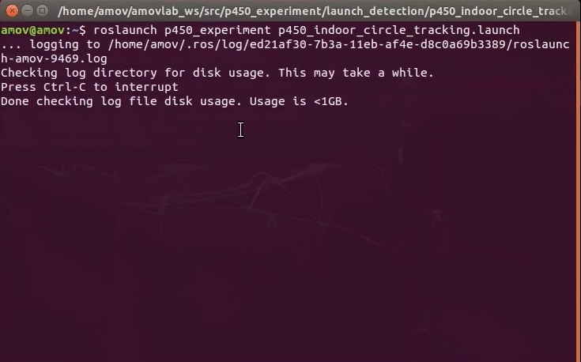
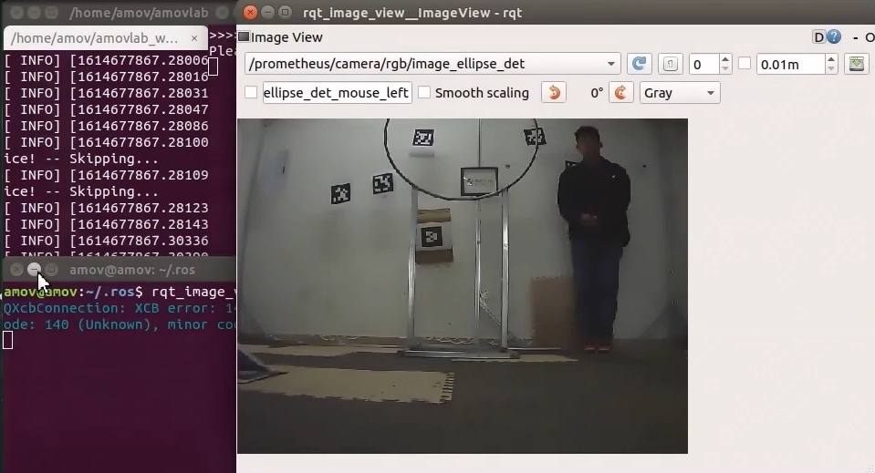
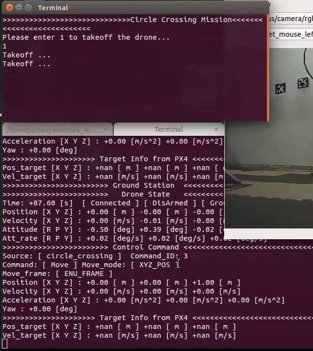
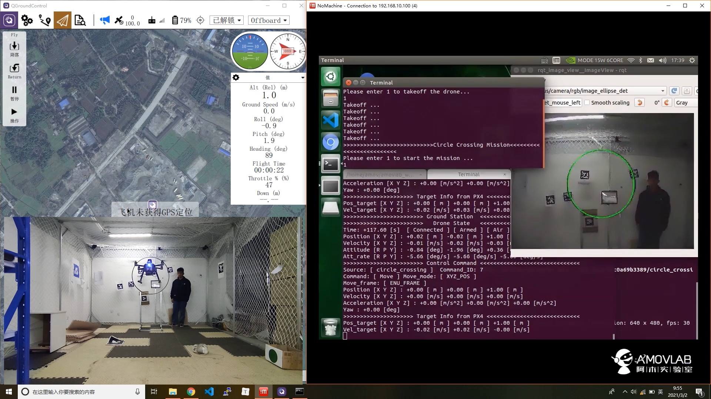
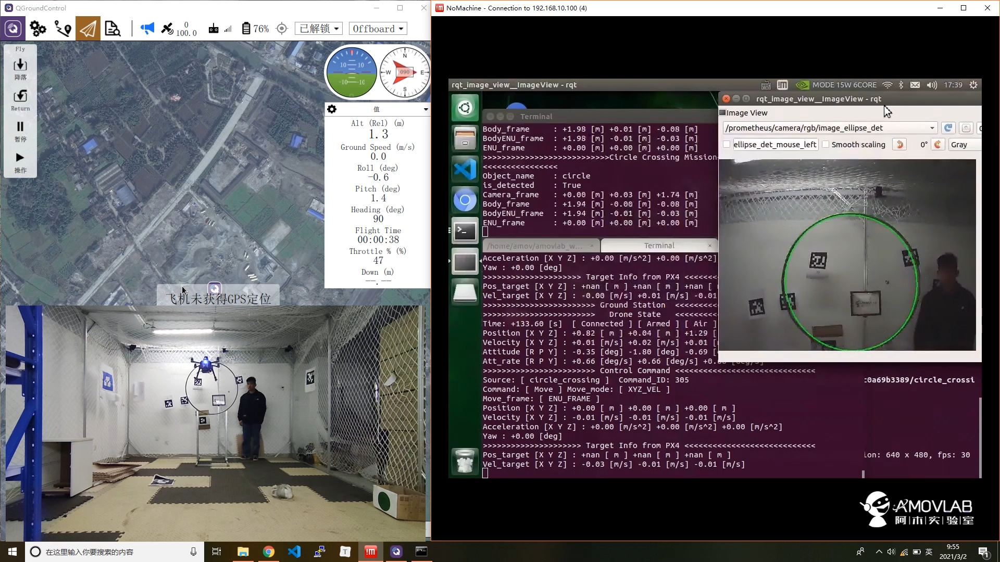
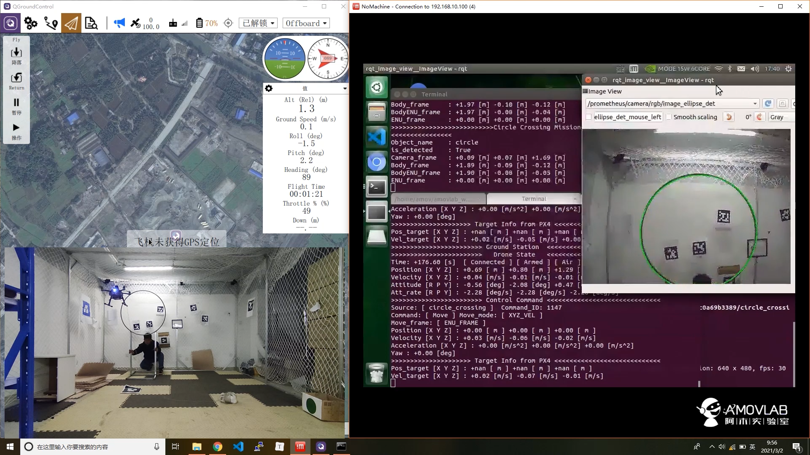
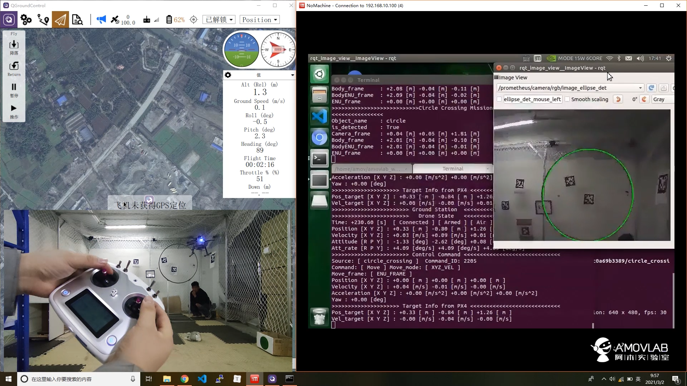

5-进阶功能-室内自主跟踪
================================

本节主要讲解P450系列无人机在室内的自主跟踪。视频紧接上节内容 **首次飞行**  ，默认已经通过WiFi数传连接到QGC地面站和nomachine远程连接到板载计算机，
主要分为一下几点进行讲解：启动指令，命令行控制终端详解，起飞，指点飞，以及最后的视频演示。

.. attention::

    受限于开源飞控硬件性能，飞机在长时间不用后会出现位姿漂移，要求每次飞行前电池重新上电以重启飞控和板载计算机，并严格按照wiki规范操作，避免炸机风险。

启动指令
------------
.. attention::
      在室内操作时，注意在QGC地面中查看自己的位置源是否更改，参数EKF2_AID_MASK设定如下图，EKF2_HGT_MODE设定为Vision。
        .. image:: ../../images/p450/first_fly/3-aid2.png

首先启动基本vio脚本 

`roslaunch p450_experiment p450_vio_onboard.launch`

.. image:: ../../images/p450/室内指点/启动指令onboard.png
   :height: 411px
   :width: 650 px
   :scale: 80 %
   :alt: None
   :align: center

然后再启动跟踪脚本

`roslaunch p450_experiment p450_indoor_circle_tracking.launch`

.. attention::

    若终端出现以下警告，需重新插拔单目摄像头。

.. image:: ../../images/p450/室内跟踪/单目未识别.png
   :height: 53px
   :width: 500 px
   :scale: 100 %
   :alt: None
   :align: center

打开一个新的终端，将图像检测显示出来

`rqt_image_view`

稍微调整一下窗口显示位置，接下来就开始飞机起飞操作。

起飞
--------------

先将遥控器切换到position模式

然后通过控制终端发送1起飞指令，这时候飞机通过板载计算机已经给飞机一直发送起飞指令，但是目前飞机还没有进入offboard模式和解锁，所以飞机是没有响应的。

发送完起飞指令之后，接着遥控器操作“内八”进行解锁，最后拨动offboard飞行模式开关。飞机就会慢慢起飞起来，保持在1m高度。（我们在自主跟踪代码中设定的起飞高度为1m）

跟踪
-------------

等待飞机起飞完成之后，保持在1m左右之后，且视野内识别到目标圆，再进行输入 1 ，进行跟踪保持

与目标圆保持一定距离

此时可以移动目标圆，进而飞机进行相应的移动

结束实验
------------

在想要结束室内自主跟踪实验时候，记得遥控器先退出offboard模式，

然后慢慢降低油门，直至飞机安全着地，进入怠速，自动上锁。

关闭所有终端，结束实验。

视频演示
----------------

该功能演示也拍摄了两段视频，预祝复现室内自主跟踪实验成功完美。

.. raw:: html

    <iframe width="696" height="422" src="//player.bilibili.com/player.html?aid=289495747&bvid=BV1sf4y1478z&cid=311392612&page=6" scrolling="no" border="0" frameborder="no" framespacing="0" allowfullscreen="true"> </iframe>

.. raw:: html

    <iframe width="696" height="422" src="//player.bilibili.com/player.html?aid=289495747&bvid=BV1sf4y1478z&cid=311393642&page=7" scrolling="no" border="0" frameborder="no" framespacing="0" allowfullscreen="true"> </iframe>