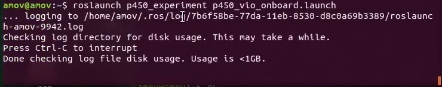
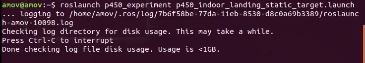
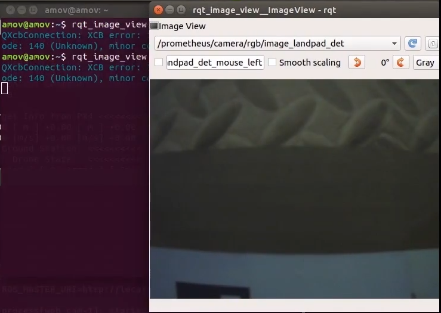
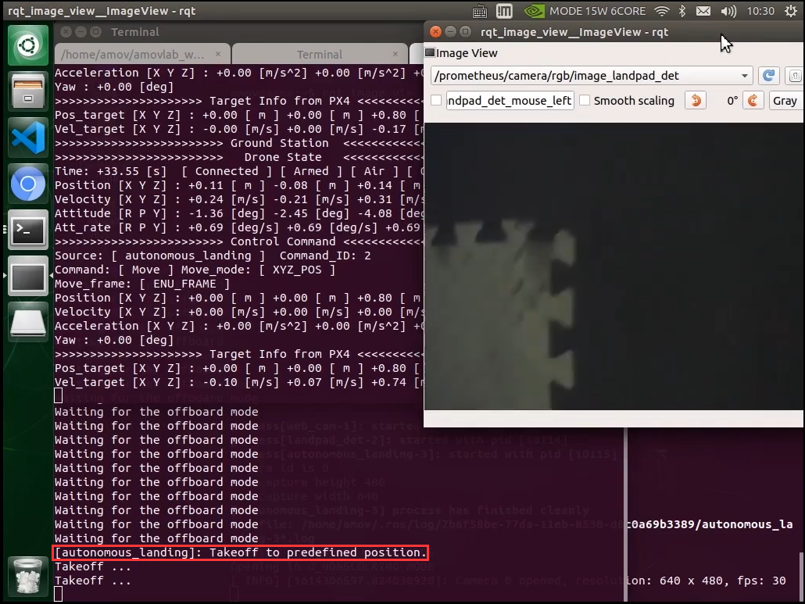
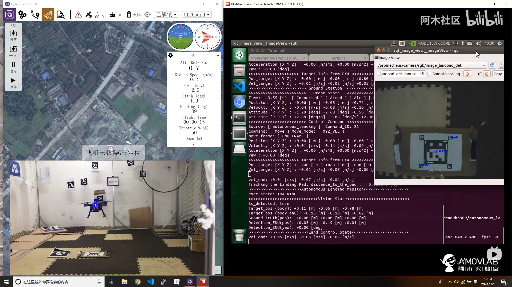
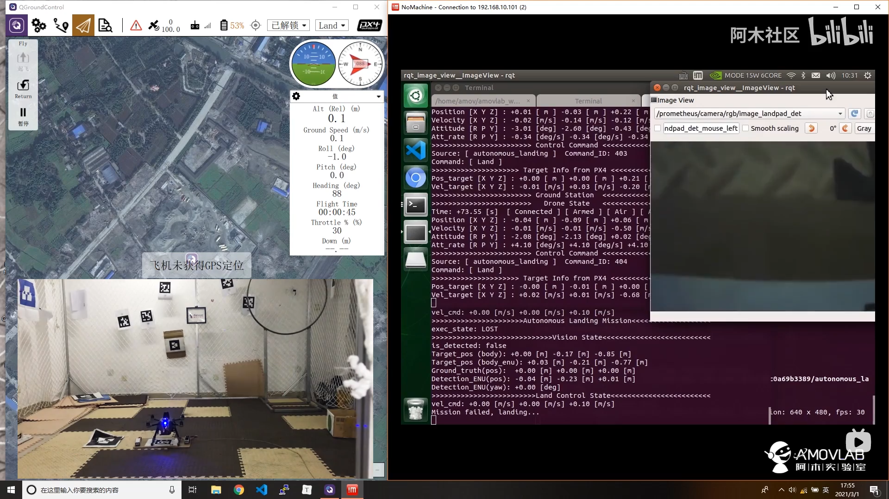

5-进阶功能-室内自主降落
================================

本节主要讲解P450系列无人机在室内的自主降落演示。视频紧接上节内容 **首次飞行**  ，默认已经通过WiFi数传连接到QGC地面站和nomachine远程连接到板载计算机，
主要分为一下几点进行讲解：启动指令，起飞，降落，以及最后的视频演示。

启动指令
------------

首先启动基本vio脚本 

`roslaunch p450_experiment p450_vio_onboard.launch`

然后再启动自主降落脚本

`roslaunch p450_experiment p450_indoor_landing_static_target.launch`

打开一个新的终端，将图像检测显示出来

`rqt_image_view`

稍微调整一下窗口显示位置，接下来就开始飞机起飞操作。

起飞
--------------
先将无人机摆放在二维码附近，可放在二维码的前后左右上等位置，注意不要距离太远，否则起飞后摄像头无法检测到二维码。且机头方向注意要和二维码正方向一致，二维码正方向如下图所示。
说明一下，由于摄像头固定在无人机前方，所以无人机放在二维码前方的位置起飞效果会比较差，因为此时摄像头距离二维码距离较远，容易丢失二维码。

.. image:: ../../images/p450/室内降落/二维码方向.png
   :height: 927px
   :width: 1245px
   :scale: 65%
   :alt: None
   :align: center

先将遥控器切换到position模式，在运行自主降落脚本后板载计算机就一直在给飞机发送起飞指令，但是目前飞机还没有进入offboard模式和解锁，所以飞机是没有响应的。接着遥控器操作“内八”进行解锁，最后拨动offboard飞行模式开关切入offboard模式，此时无人机会先起飞到起飞点上方0.8米高度（我们在自主降落代码中设定的高度为0.8m）

降落
-------------

飞到指定高度0.8米后，如果摄像头检测到二维码，无人机便会开始自主降落

降落完成后会无人机自动上锁

视频演示
-------------------

室内自主降落功能演示视频如下：

无人机在二维码上面起飞

.. raw:: html

    <iframe width="696" height="422" src="//player.bilibili.com/player.html?aid=801956085&bvid=BV1Hy4y177bC&cid=305784278&page=5" scrolling="no" border="0" frameborder="no" framespacing="0" allowfullscreen="true"> </iframe>

无人机在二维码左边起飞

.. raw:: html

    <iframe width="696" height="422" src="//player.bilibili.com/player.html?aid=801956085&bvid=BV1Hy4y177bC&cid=305785411&page=6" scrolling="no" border="0" frameborder="no" framespacing="0" allowfullscreen="true"> </iframe>

无人机在二维码右边起飞

.. raw:: html

    <iframe width="696" height="422" src="//player.bilibili.com/player.html?aid=801956085&bvid=BV1Hy4y177bC&cid=305785229&page=7" scrolling="no" border="0" frameborder="no" framespacing="0" allowfullscreen="true"> </iframe>

无人机在二维码前面起飞

.. raw:: html

    <iframe width="696" height="422" src="//player.bilibili.com/player.html?aid=801956085&bvid=BV1Hy4y177bC&cid=305786053&page=8" scrolling="no" border="0" frameborder="no" framespacing="0" allowfullscreen="true"> </iframe>