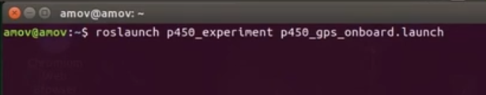
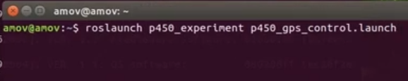
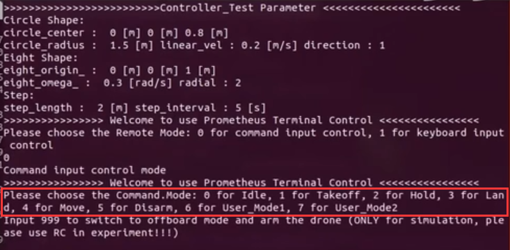
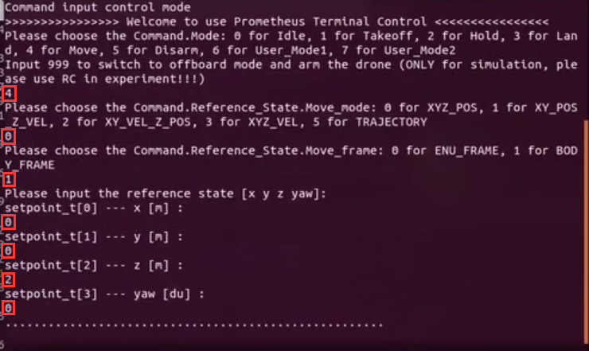
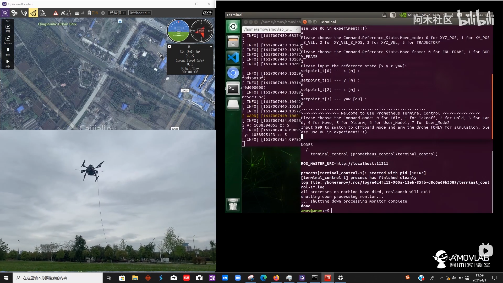
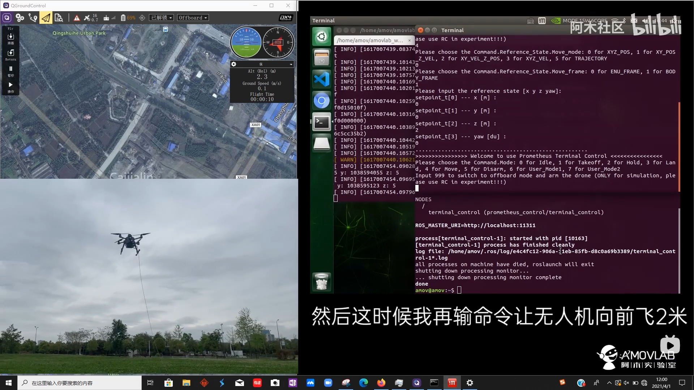

5-进阶功能-室外指点飞行
================================

本节主要讲解P450系列无人机在室外的指点飞行演示。视频紧接上节内容 **首次飞行**  ，默认已经通过WiFi数传连接到QGC地面站和nomachine远程连接到板载计算机，
主要分为一下几点进行讲解：摄像头标定，二维码检测确认，坐标系确认，启动指令，起飞，降落，以及最后的视频演示。

.. attention::

    受限于开源飞控硬件性能，飞机在长时间不用后会出现位姿漂移，要求每次飞行前电池重新上电以重启飞控和板载计算机，并严格按照wiki规范操作，避免炸机风险。

启动指令
------------
.. attention::
      在室外操作时，注意在QGC地面中查看自己的位置源是否更改，参数EKF2_AID_MASK设定为use gps，EKF2_HGT_MODE设定为Barometric pressure。

      

首先启动基本gps脚本 

`roslaunch p450_experiment p450_gps_onboard.launch`

然后再启动控制脚本

`roslaunch p450_experiment p450_gps_control.launch`

之后会出现终端控制界面，提示有两种控制的输入方式，第一种是通过命令输入控制方式，另外一种是通过键盘按键控制方式。

两种方式都可以控制无人机，一般在做实机实验过程中选择第一种通过命令输入控制方式；第二种键盘控制不太安全。接下来会详细讲解如何使用第一种命令输入控制方式实现指点飞行。

命令行控制终端详解
---------------------------

其中 0 表示的是 怠速；意思就是飞机会进入offboard模式，但是在该模式下，没有对飞机进行任何指令的发送。飞机也不会有任何动作。这个指令一般也可以不用。

1 表示的是 起飞；起飞点为当前点，起飞高度通过 yaml参数设置，单位是米，默认起飞高度是0.5m

2 表示的是 悬停；飞机正在飞行过程中如何接受到 2 指令，会在当前时刻进入悬停状态。

3 表示的是 降落；降落速度通过 yaml参数设置，单位是m/s ，默认降落速度为0.2m/s 。还有一个 上锁高度 到达上锁高度之后飞机会进入飞控的本身降落模式进而缓缓着地，
上锁高度通过 yaml 参数进行设置，单位是米，默认是 0.18m，即认为离地不到20cm的时候进入飞控本身的降落飞行模式。

4 表示的是 move模式；该模式就包含我们所称的指点飞行功能，在此模式下，又有5种子模式：
0对应XYZ_POS,空间位置控制；
1对应XY_POS_Z_VEL,水平面位置控制，高度速度控制；
2对应XY_VEL_Z_POS,水平面速度控制，高度定高控制；
3对应XYZ_VEL,空间速度控制；
5对应TRAJECTORY，轨迹跟踪控制。

常用的模式为0空间位置控制（指点飞行），接下来会讲讲实机过程中起飞的具体实现。

指点飞
-------------

然后我们在此命令行控制终端，根据终端提示，首先输入4并敲回车 ，表示选择move模式；然后输入 0 并敲回车，表示选择空间位置控制；然后输入 0 并敲回车，表示选择ENU_FRAME惯性坐标系；然后依次输入期望的位置坐标值（即ENU_FRAME惯性坐标系下的坐标，单位为米）x，y，z和航向角yaw（一般为0）。

对坐标系做下说明：

ENU_FRAME惯性坐标系始终以无人机初始上电点为原点，且x轴指向无人机机头方向，y轴指向无人机正左方，z轴指向无人机正上方，单位为米。给无人机发送绝对期望位置选择这个坐标系。

BODY_FRAME机体坐标系始终以无人机本身为原点，无论无人机飞到哪里都是以无人机当前位置为原点，且x轴指向无人机机头方向，y轴指向无人机正左方，z轴指向无人机正上方，单位为米。给无人机发送相对期望位置选择这个坐标系。

这里我们发送的期望位置是BODY_FRAME机体坐标系下x为0，y为0，z为2的坐标点，偏航yaw为0，表示让无人机飞到相对于当前点往前（x轴）0m，往左（y轴）0m，往上（z轴）2m的期望位置，航向角保持不变。

在输完期望航向角并敲回车后，我们再遥控器定点模式（SWC拨杆切到中档）下解锁并切到offboard模式（SWD拨杆切到下档），无人机会自动起飞到发送给PX4飞控的期望位置点。

  

无人机飞到期望位置点之后，我们还可以继续在终端进行指点飞行操作，让无人机飞往下一个期望位置点。

需要降落时我们可以将遥控器SWD拨杆切至上档退出offboard模式，飞控会自动进入position模式（注意SWC拨杆是一直保持在中档，不需要动），然后我们可以手动操控无人机降落。

视频演示
-----------------------

.. raw:: html

   <iframe  width="696" height="422" src="//player.bilibili.com/player.html?aid=289495747&bvid=BV1sf4y1478z&cid=318715792&page=13" scrolling="no" border="0" frameborder="no" framespacing="0" allowfullscreen="true"> </iframe>
