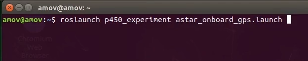
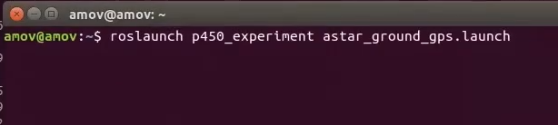
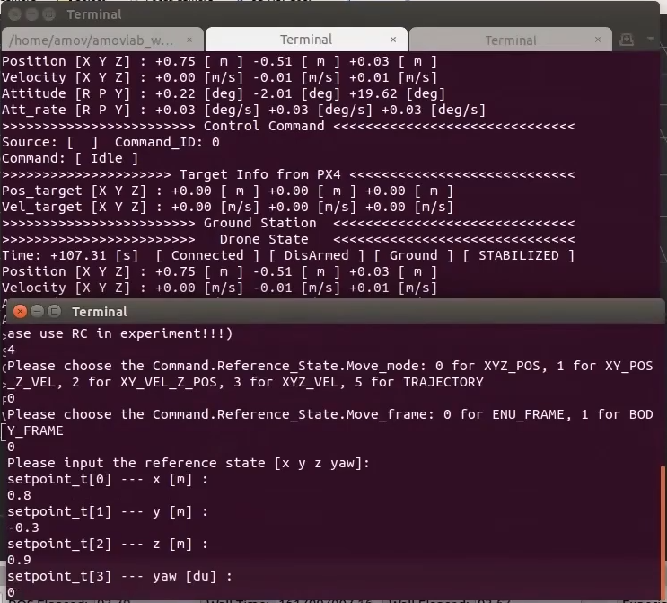
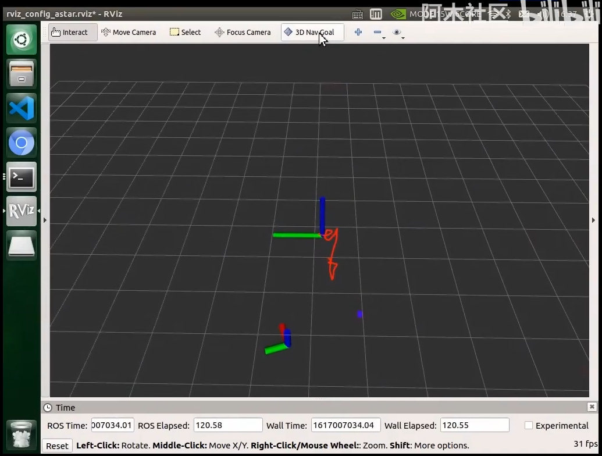
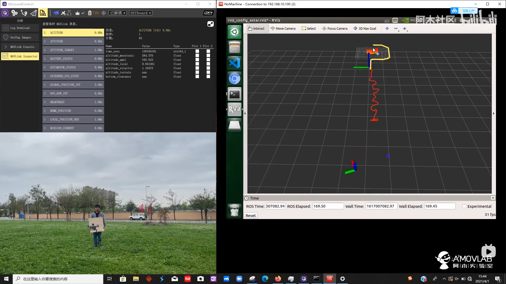
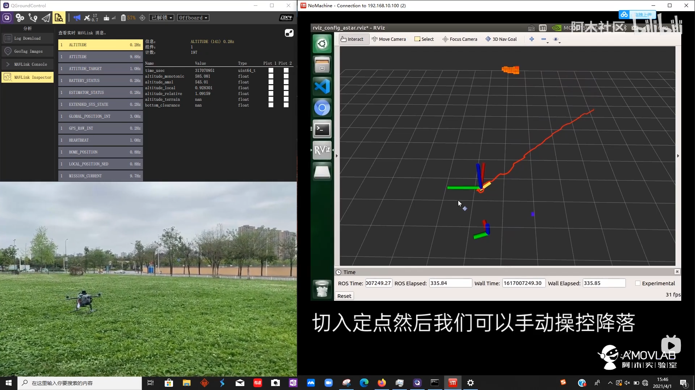

5-进阶功能-室外自主避障
================================

本节主要讲解P450系列无人机在室外的自主避障演示。视频紧接上节内容 **首次飞行**  ，默认已经通过WiFi数传连接到QGC地面站和nomachine远程连接到板载计算机，
主要分为一下几点进行讲解：启动指令，起飞，降落，以及最后的视频演示。

.. attention::

    受限于开源飞控硬件性能，飞机在长时间不用后会出现位姿漂移，要求每次飞行前电池重新上电以重启飞控和板载计算机，并严格按照wiki规范操作，避免炸机风险。

无人机机头需朝正东方向摆放

启动指令
-----------------

.. attention::
      在室外操作时，注意在QGC地面中查看自己的位置源是否更改，参数EKF2_AID_MASK设定为use gps，EKF2_HGT_MODE设定为Barometric pressure。

先启动第一个指令

`roslaunch p450_experiment astar_onboard_gps.launch`

再启动第二个指令

`roslaunch p450_experiment astar_ground_gps.launch`

起飞
------------------

先输入起飞指令

在此终端先输入0选择命令输入控制

根据终端提示，再依次输入4 move 、 0 XYZ_POS  、0 ENU_FRAME 、 x的坐标(需要和无人机当前本地x坐标一致，差不多即可)  、y的坐标(需要和无人机当前本地y坐标一致，差不多即可) 、  z的坐标为0.9，这个不需要根据当前无人机本地位置坐标来写

输完以上指令后，遥控器切定点解锁然后切offboard，无人机会自动起飞，等到无人机起飞到一个稳定高度，也即是我们设定的起飞高度后，回到rviz界面，点击选择3D Nav Goal

在rviz上点击一个点作为目标点，会自动生成一个绕开障碍物的路径

此时无人机会沿着这个生成的路径飞，绕开障碍物，且高度会保持不变。

.. attention::

    如果中途无人机飞行不符合预期，及时通过遥控器切出offboard模式，转为position模式手动控制。

降落
-------------

无人机飞到目标点后，可以遥控器拨动offboard飞行模式开关切出offboard模式，并缓慢手动降落。

视频演示
---------------

.. raw:: html

    <iframe  width="696" height="422" src="//player.bilibili.com/player.html?aid=289495747&bvid=BV1sf4y1478z&cid=318713470&page=16" scrolling="no" border="0" frameborder="no" framespacing="0" allowfullscreen="true"> </iframe>