5-进阶功能-室外自主降落
================================

本节主要讲解P450系列无人机在室外的自主降落演示。视频紧接上节内容 **首次飞行**  ，默认已经通过WiFi数传连接到QGC地面站和nomachine远程连接到板载计算机，
主要分为一下几点进行讲解：摄像头标定，二维码检测确认，坐标系确认，启动指令，起飞，降落，以及最后的视频演示。

.. attention::

    受限于开源飞控硬件性能，飞机在长时间不用后会出现位姿漂移，要求每次飞行前电池重新上电以重启飞控和板载计算机，并严格按照wiki规范操作，避免炸机风险。

摄像头标定
-------------
具体步骤见常见问题处理中的摄像头标定

二维码检测确认
--------------

这里我们需要来确认摄像头对二维码的位置检测是否正确 我们所使用的二维码如下

 

运行检测节点

`roslaunch p450_experiment p450_landpad_det.launch`

查看检测效果（可视化）

rqt_image_view

弹出图形界面后，选择对应要显示的图像消息，选择下面红框内的这个消息可以既显示出图像又显示出二维码检测结果。

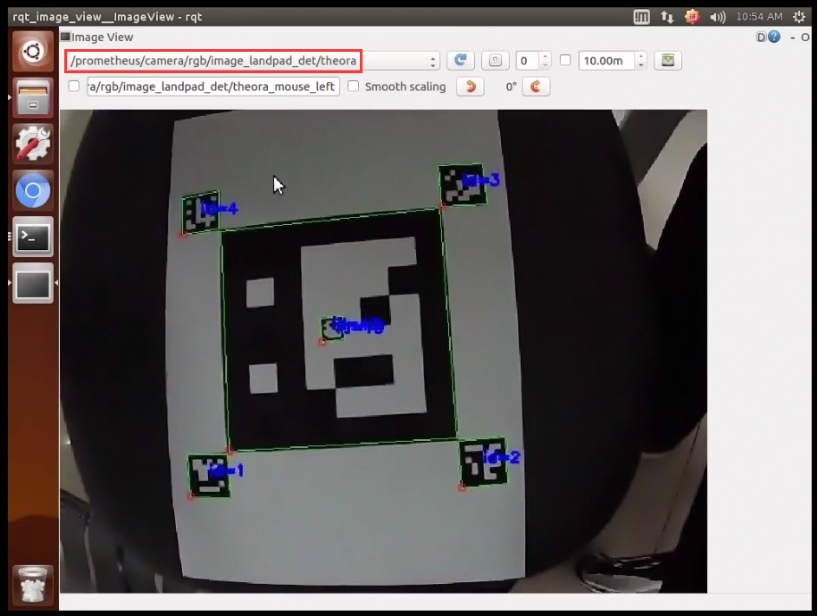

点击后在显示的消息列表里选择相应的图像消息。

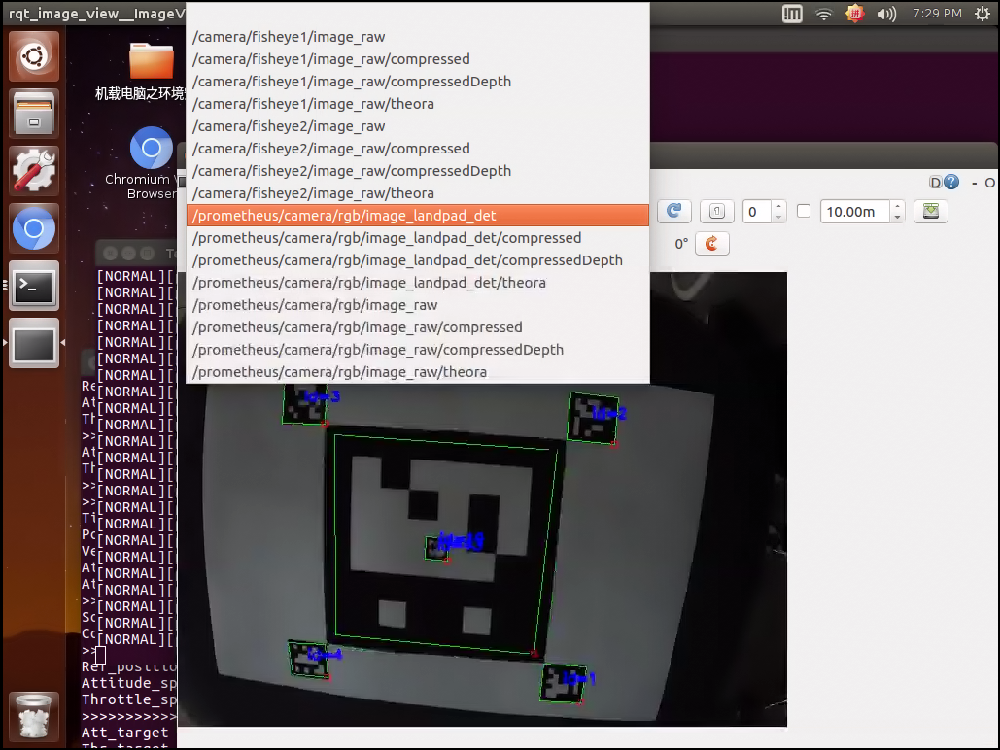

打印二维码实时检测结果

`rostopic echo /prometheus/object_detection/landpad_det`

终端上打印出的消息如下图所示： position后面三个值分别代表摄像头检测到的二维码在摄像头坐标系下的坐标的X,Y,Z的值。我们可以移动二维码看所显示的位置值是否显示出真实实际二维码相对于摄像头的位置，如果有较大差距，需要更改摄像头配置参数文件里的参数。 yaw_error显示的是偏航，所以是可以检测出这个二维码的 X Y Z 以及偏航也就是转的角度。

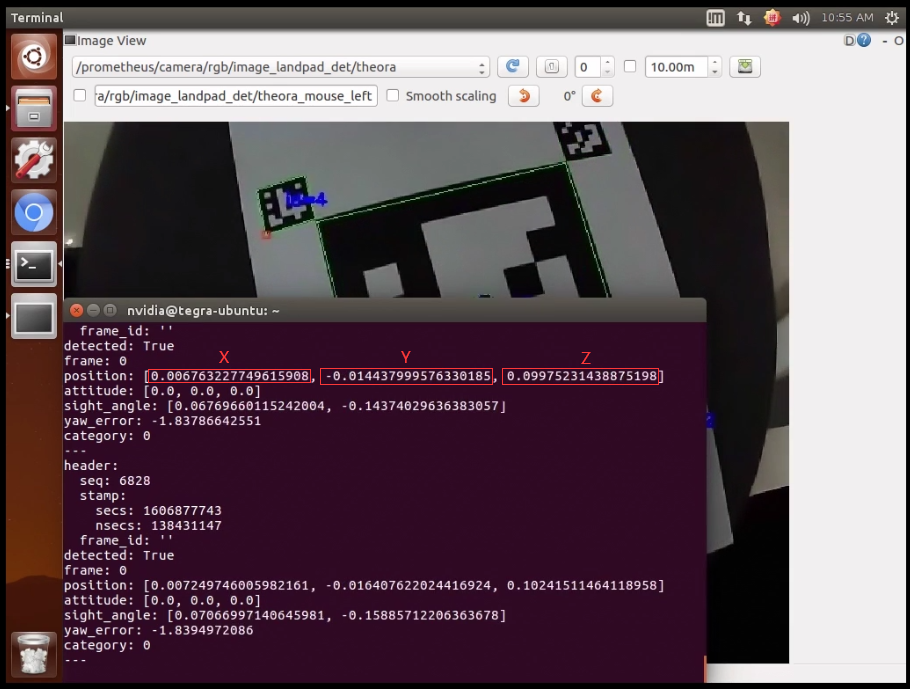

如果有较大大差距

一，重新标定，修改相机参数和畸变参数；

二，确认参数文件中二维码边长为降落板边长的真实值（这个非常重要），如果不是，修改为真实值，否则直接影响到二维码位置估计。

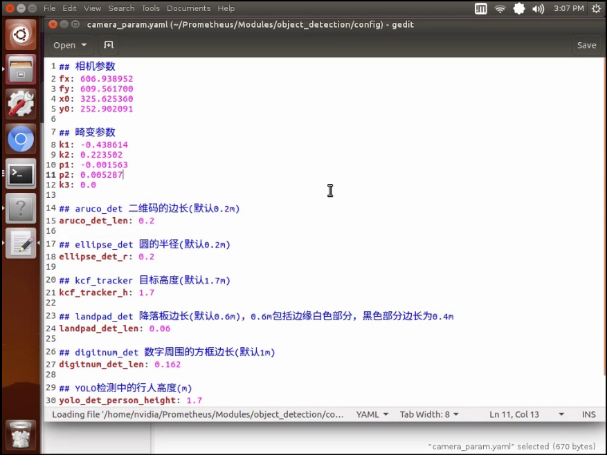

坐标系确认
-----------------

关于坐标系转换的说明：
识别算法发布的目标位置位于相机坐标系（从相机往前看，物体在相机右方x为正，下方y为正，前方z为正）
首先，从相机坐标系转换至机体坐标系（从机体往前看，物体在相机前方x为正，左方y为正，上方z为正）：由于此demo相机朝下安装，且xy方向无偏移量

`pos_body_frame[0] = - Detection_raw.position[1]; pos_body_frame[1] = - Detection_raw.position[0]; pos_body_frame[2] = - Detection_raw.position[2];`

从机体坐标系转换至与机体固连的ENU系（原点位于质心，x轴指向yaw=0的方向，y轴指向yaw=90的方向，z轴指向上的坐标系）：直接乘上机体系到惯性系的旋转矩阵即可

`R_Body_to_ENU = get_rotation_matrix(_DroneState.attitude[0], _DroneState.attitude[1], _DroneState.attitude[2]); pos_body_enu_frame = R_Body_to_ENU * pos_body_frame;`

从与机体固连的ENU系转换至ENU系（原点位于起飞点，x轴指向yaw=0的方向，y轴指向yaw=90的方向，z轴指向上的坐标系）

`Detection_ENU.position[0] = drone_pos[0] + pos_body_enu_frame[0]; Detection_ENU.position[1] = drone_pos[1] + pos_body_enu_frame[1]; Detection_ENU.position[2] = drone_pos[2] + pos_body_enu_frame[2];`

当二维码中心点位于摄像头图像右上方时，也就是处于第一象限时，终端打印的x坐标为正，y坐标为负，z坐标为正，代表相机坐标系正确。

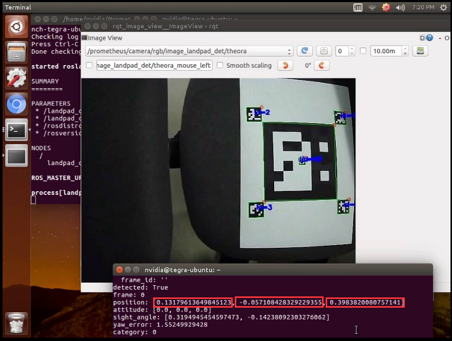

安装相机到无人机机身上是，相机镜头朝向正下方，并且让相机图像上方方向（对着图像显示看，可以判断出相机哪个方向为上方）严格朝向机头方向。此时可以保证整个坐标系是正确的。 在确认摄像头坐标系正确的情况下将摄像头固定到机身上。

启动指令
------------

.. attention::
      在室外操作时，注意在QGC地面中查看自己的位置源是否更改，参数EKF2_AID_MASK设定为use gps，EKF2_HGT_MODE设定为Barometric pressure。

      
首先启动基本gps脚本 

`roslaunch p450_experiment p450_gps_onboard.launch`

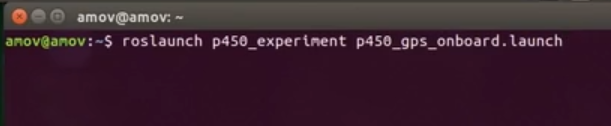

然后再启动自主降落脚本

`roslaunch p450_experiment p450_outdoor_landing_static_target.launch`

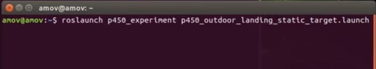

.. attention::

    若终端出现以下警告，需重新插拔单目摄像头。

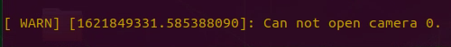

打开一个新的终端，将图像检测显示出来

`rqt_image_view`

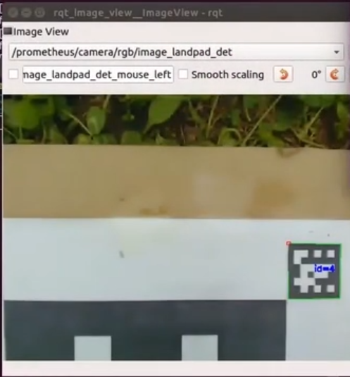

稍微调整一下窗口显示位置，接下来就开始飞机起飞操作。

起飞
--------------
室外无人机和二维码需要朝正东方向摆放。
先将无人机摆放在二维码附近，可放在二维码的前后左右上等位置，注意不要距离太远，否则起飞后摄像头无法检测到二维码。且机头方向注意要和二维码正方向一致，二维码正方向如下图所示。
说明一下，由于摄像头固定在无人机前方，所以无人机放在二维码前方的位置起飞效果会比较差，因为此时摄像头距离二维码距离较远，容易丢失二维码。

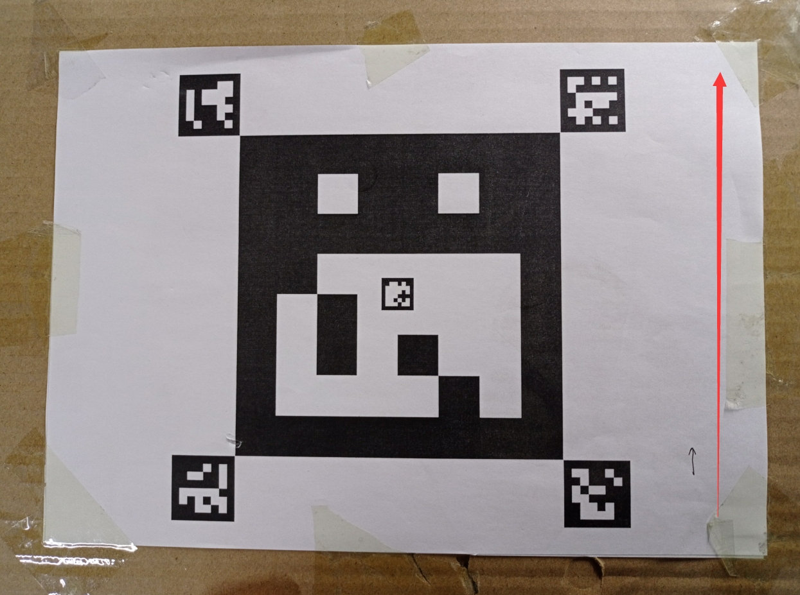

先将遥控器切换到position模式，在运行自主降落脚本后板载计算机就一直在给飞机发送起飞指令，但是目前飞机还没有进入offboard模式和解锁，所以飞机是没有响应的。接着遥控器操作“内八”进行解锁，然后在终端输入1并敲回车，最后拨动offboard飞行模式开关切入offboard模式，此时无人机会先起飞到起飞点上方0.8米高度（我们在自主降落代码中设定的高度为0.8m）

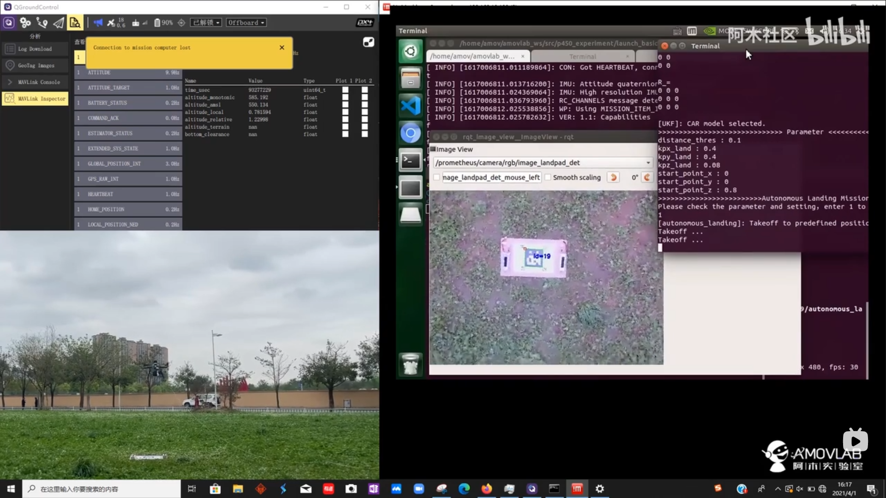

降落
-------------

飞到指定高度0.8米后，如果摄像头检测到二维码，无人机便会开始自主降落

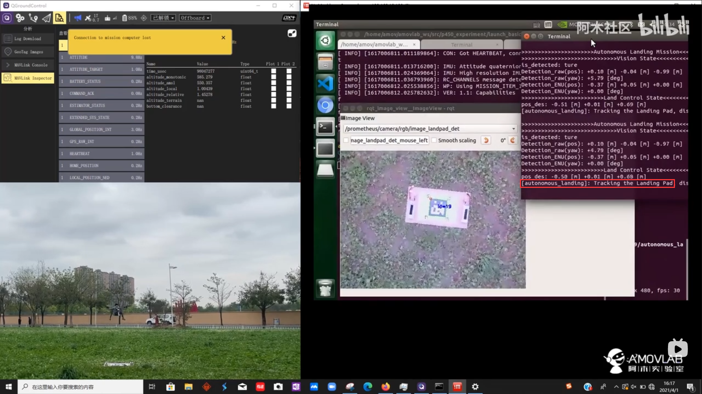

降落完成后会无人机自动上锁

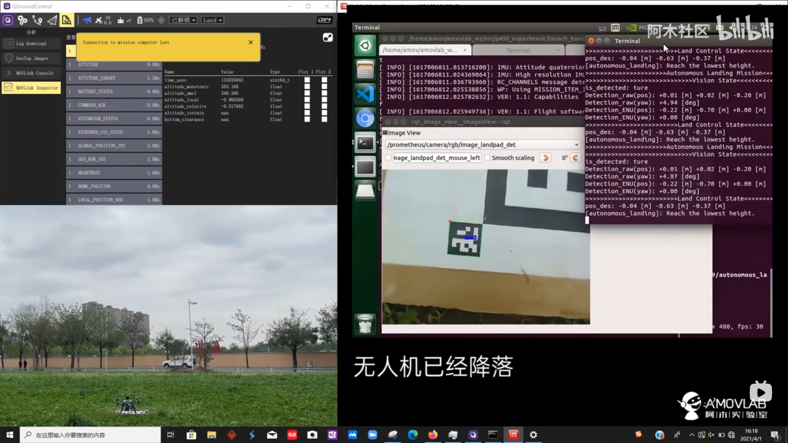

视频演示
-------------------

室外自主降落功能演示视频如下：

.. raw:: html

    <iframe width="696" height="422"  src="//player.bilibili.com/player.html?aid=289495747&bvid=BV1sf4y1478z&cid=318716278&page=14" scrolling="no" border="0" frameborder="no" framespacing="0" allowfullscreen="true"> </iframe>