硬件介绍
=================

**简介：** Prometheus600（简称P600）是一款中等大小的无人机开发平台，具有大载重、长续航、可扩展的特性。
可搭载激光雷达、NX板载计算机、三轴光电吊舱（10倍光学变焦）、RTK等智能化设备。
实现吊舱框选跟踪，激光雷达避障，无人机位置速度指点飞行。本开发平台基于Prometheus开源项目，提供丰富的demo例程，
涵盖控制模块，slam模块，规划模块以及目标检测模块等多个无人机及机器视觉相关研究方向，为无人机科研开发助力，致力于让研发更加高效。
最高配置为 P450+T265+D435I+S1+单目

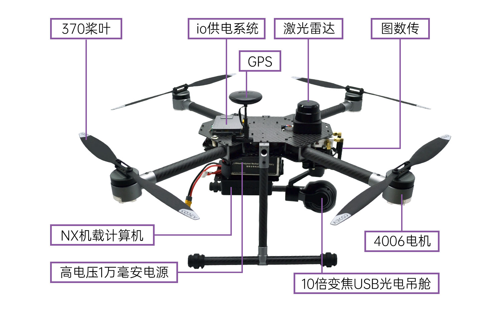

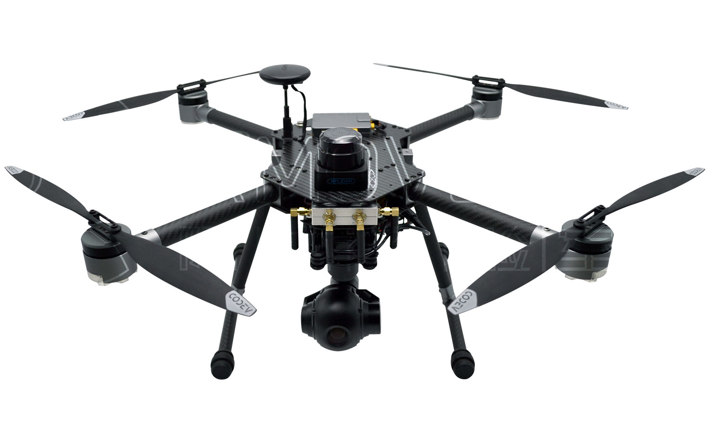
.. note::
   无人机正视图
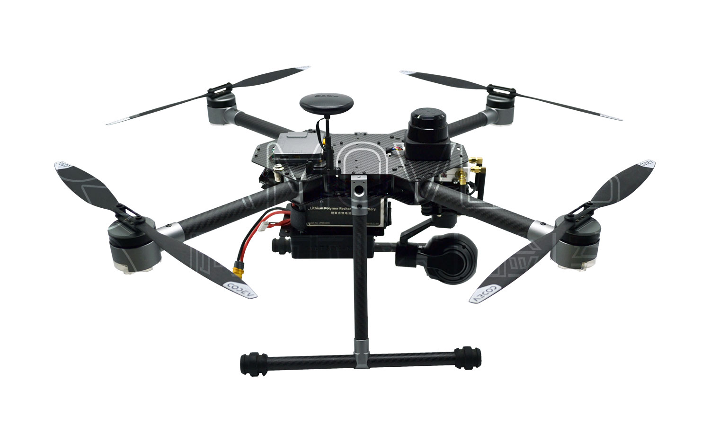
.. note::
   无人机左视图

硬件平台优势及特色
------------------------

平台化设计
>>>>>>>>>>>>>>>>>

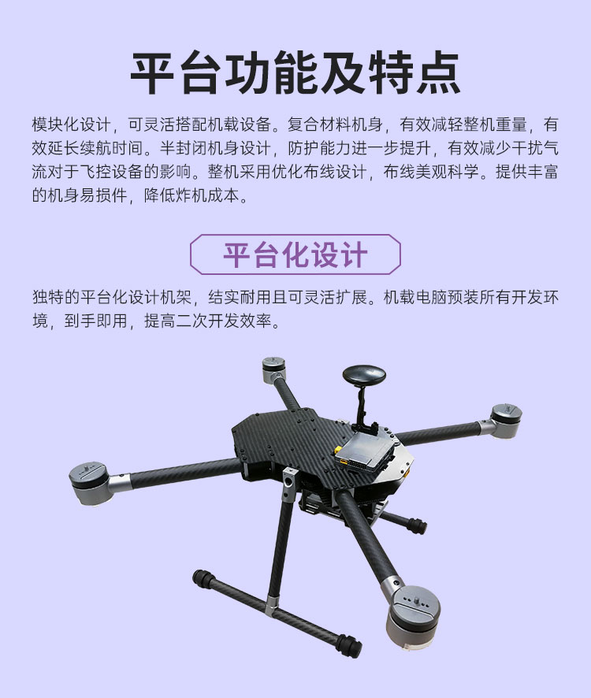

长续航
>>>>>>>>>>>>>>>

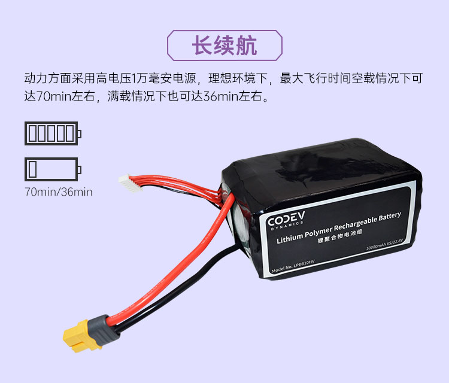

大载重
>>>>>>>>>>>>>

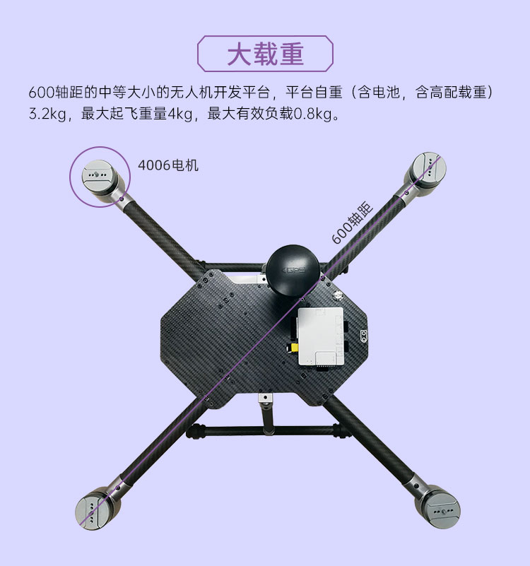

可扩展
>>>>>>>>>>>>>

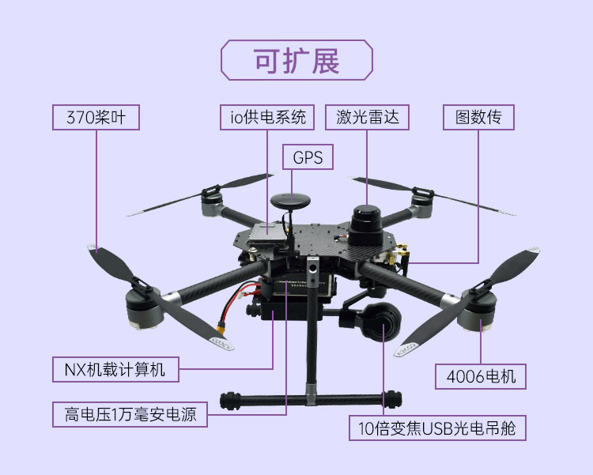

定制版控制SDK
>>>>>>>>>>>>>>>>>

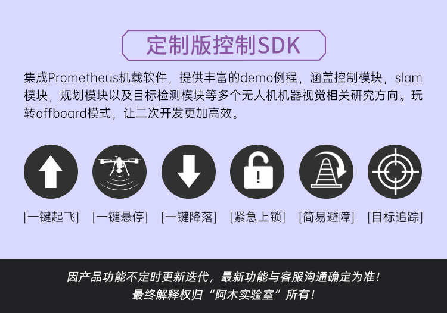

参数指标
------------------

无人机
>>>>>>>>>>>>

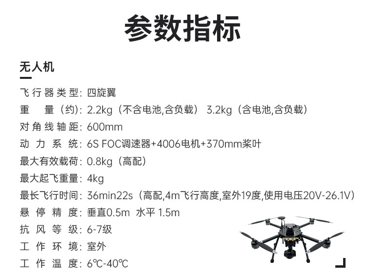

电池
>>>>>>>>>>>>

.. image:: ../../images/p600/硬件介绍/电池.jpg
   :height: 381 px
   :width: 750 px
   :scale: 85 %
   :alt: None
   :align: center
   
遥控器
>>>>>>>>>>>>

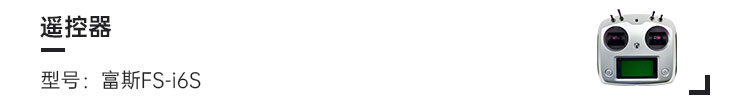
   

板载计算机
>>>>>>>>>>>>

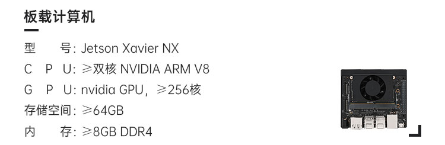
   
激光雷达
>>>>>>>>>>>>

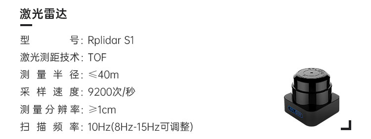
   
图数传一体
>>>>>>>>>>>>

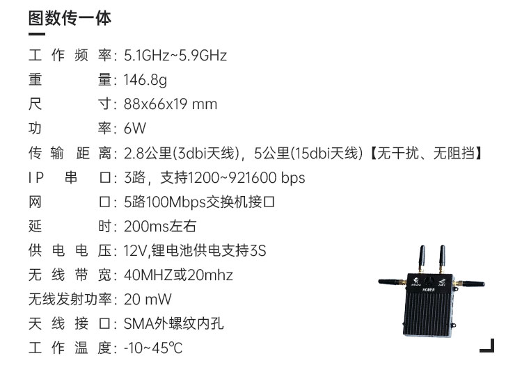
   
光电吊舱
>>>>>>>>>>>>

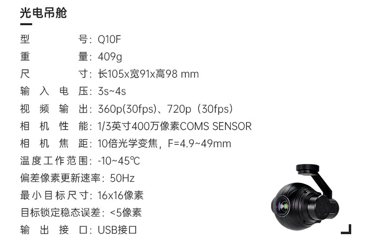
   
软件参数
>>>>>>>>>>>>

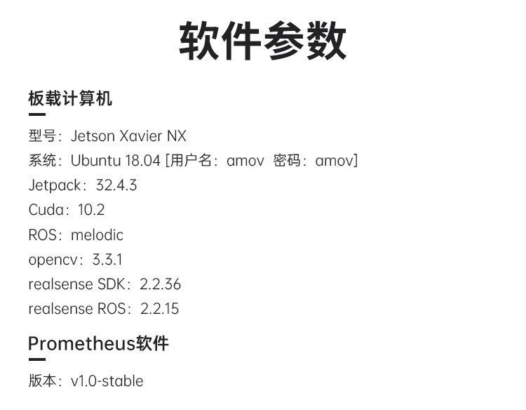
   
发货清单
>>>>>>>>>>>>

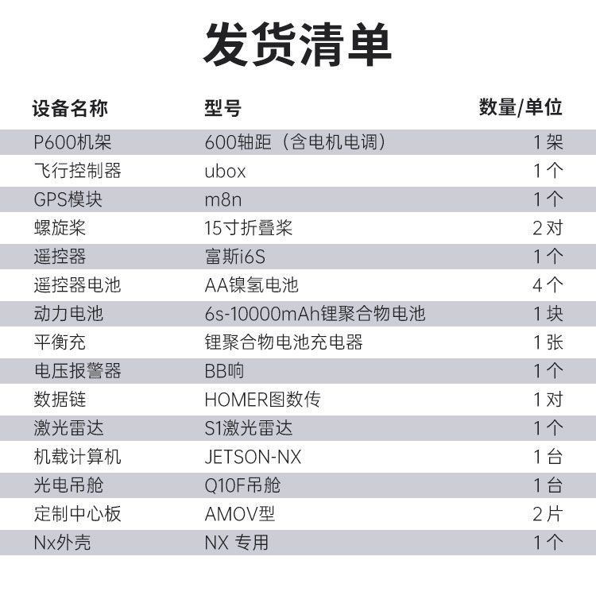
   
开箱讲解
-------------

接下来主要说明飞机到手之后的开箱讲解

1.检查产品外包装
>>>>>>>>>>>>>

.. image:: ../../images/p450/2检查外包装.png
   :height: 1080px
   :width: 1920px
   :scale: 20 %
   :alt: None
   :align: center

.. attention::
   首先先检查产品外包装有无明显的破损以及严重磕碰，如发现上述情况，请联系我们的售后客服进行相应的处理。

2.打开产品外包装
>>>>>>>>>>>>>

.. image:: ../../images/p450/3平放_标语在上.png
   :height: 1080px
   :width: 1920px
   :scale: 20 %
   :alt: None
   :align: center

.. tip::
   打开产品外包装，注意请将产品包装箱平放，印有标语的一面向上，然后打开侧面的箱盖，请注意在此处不宜使用较大的力气，以免损坏包装箱，后期可能影响产品相关的售后服务，打开包装箱，我们可以看到黑色的内衬，这时您可一只手按住产品外箱，一只手轻轻将内衬抽出。

3.清点产品数量
>>>>>>>>>>>>>

.. image:: ../../images/p450/4检查飞机和配件.png
   :height: 1080px
   :width: 1920px
   :scale: 20 %
   :alt: None
   :align: center

.. attention::
   清点产品数量，首先请对照发货清单检查飞机和附件数量，然后检查飞机和随机附件外观是否有破损及异常.

4.安装飞机脚架
>>>>>>>>>>>>>

.. image:: ../../images/p450/5安装机架.png
   :height: 1080px
   :width: 1920px
   :scale: 20 %
   :alt: None
   :align: center

.. important::
   安装飞机脚架，首先将脚架从内衬两侧取出，然后轻轻插入飞机两侧的脚架安装孔位。

.. attention::
   此处请注意印有AMOV字样的面向外!

.. image:: ../../images/p450/6安装机架螺丝.png
   :height: 1080px
   :width: 1920px
   :scale: 20 %
   :alt: None
   :align: center

.. important::
   从箱底取出附带的M1.5X8螺丝，使用随机附赠的螺丝刀将其拧紧，注意此处请适当用力，以免损坏螺丝。

5.开箱视频
>>>>>>>>>>>>

详细可以观看开箱视频：

硬件设备说明及用途
--------------------

P600硬件接线图
>>>>>>>>>>>>>>>>>>>>>>

.. image:: ../../images/p600/硬件介绍/P600线路图.jpg
   :height: 4700 px
   :width: 7077 px
   :scale: 10 %
   :alt: None
   :align: center

