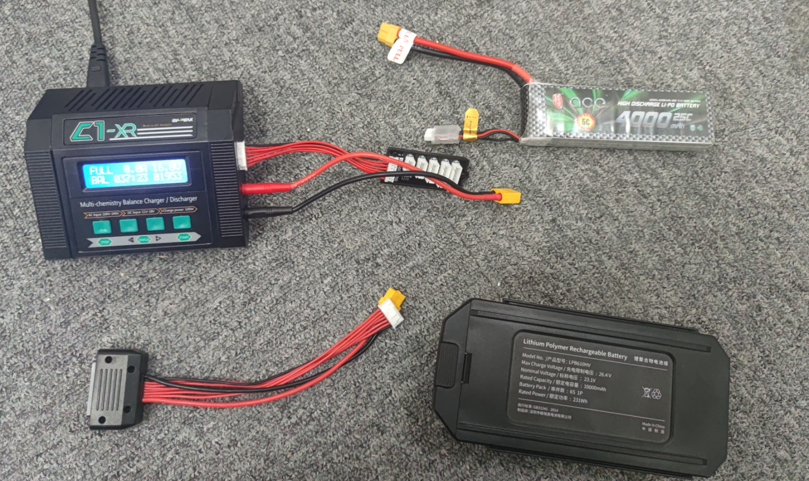

充电
=============

用到的设备
----------

#. 充电线
#. 转接线
#. homer电源 3s
#. 无人机电源 6s

| |arc/Pasted image 20211126173757.png|

视频讲解
--------

.. raw:: html

   <iframe width="696" height="422" src="//player.bilibili.com/player.html?aid=337009877&bvid=BV1ER4y147jz&cid=453585694&page=1" scrolling="no" border="0" frameborder="no" framespacing="0" allowfullscreen="true"> </iframe>

开始充电
--------

#. 连接充电器与电源
#. 根据相应的电池设置充电器.\ **请确保相应电池使用相应的充电设置,否则可能导致电池报废**

   #. 3s homer电源充电设置,如图
      |arc/1637920515965.jpg|
   #. 6s 无人机电源充电设置,如图
      |arc/1637920515971.jpg|

#. 长按最右边start按键启动(长按时听到铃声则表示一开始充电)

.. |arc/1637920515965.jpg| image:: ../../images/p600/充电/1637920515965.jpg
   :class: internal-embed
.. |arc/1637920515971.jpg| image:: ../../images/p600/充电/1637920515971.jpg
   :class: internal-embed
