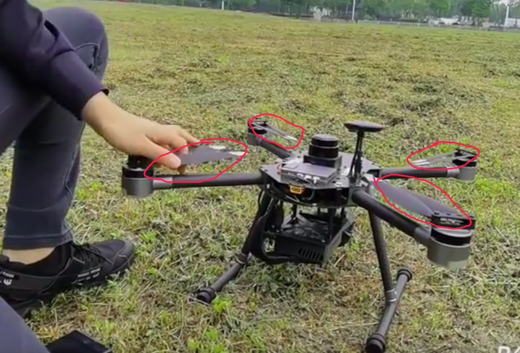
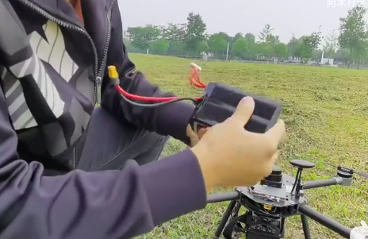
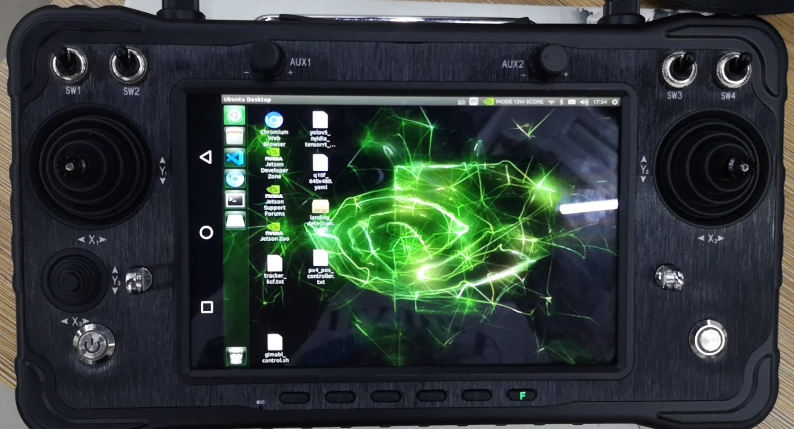
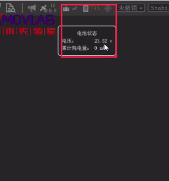
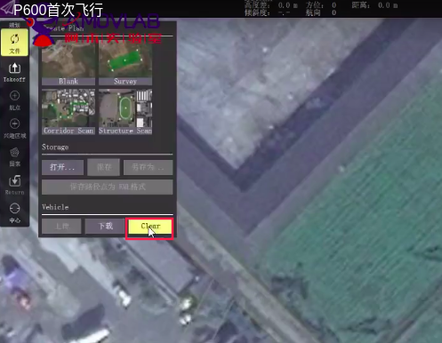
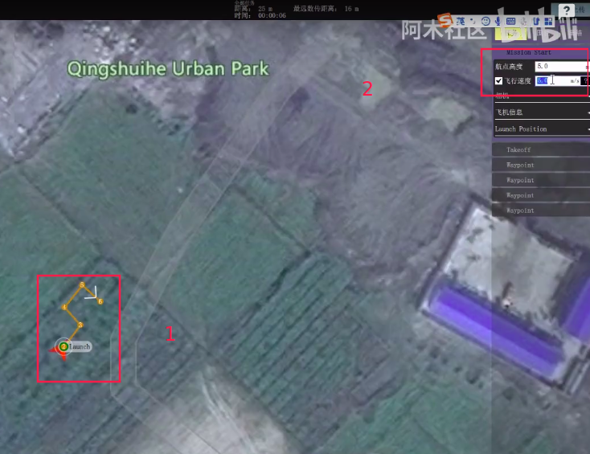
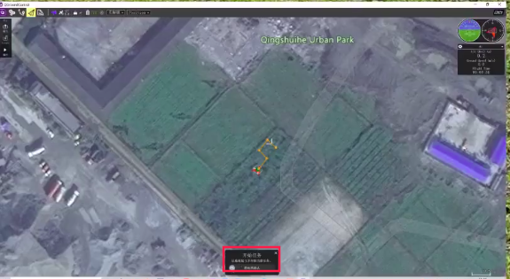

.. 首次飞行:

首次飞行（H16版）
==============

本节主要讲解室外GPS下的P600搭配H16遥控器的首次飞行。

.. attention::

    注意使用室外GPS定位的飞行环境需要在空旷的区域，搜星数量在10颗以上，等待gps尾灯闪烁绿灯的时候即可。

准备工作
------------------
p600无人机，如下图所示

.. image:: ../../images/p600/首次飞行/p600飞机.png

P600电池

.. image:: ../../images/p600/首次飞行/p600电池.png
   :height: 800px
   :width: 800px
   :scale: 50%
   :alt: None
   :align: center

H16遥控器

 

安全绳

.. image:: ../../images/p450/first_fly/2-safestring.png
   :height: 434px
   :width: 769px
   :scale: 60%
   :alt: None
   :align: center

飞行前准备
-----------------
将螺旋桨摆好，同时检查螺旋桨是否有松动，再检查下螺丝是否有松动，以及连接线是否对螺旋桨有影响

如下图所示

.. image:: ../../images/p600/首次飞行/拨正.png

   
接着我们检查下电池是否有破损、漏液等情况

确保电池没问题后，将电池固定在飞机上，确保电池不会松动，放在水平位置

为飞机上电，稍等一两分钟，确保飞机上的遥控器接收机指示灯亮起，如下图所示；

点开遥控器主页面上的H16小助手，如图所示；

进入如下界面，如下图所示，

点击对频，进入如下界面

这是正常连接的状态，H16遥控器已经正常连接，图数传均正常；如果显示未连接，请确保飞机接收端正常启动，指示灯亮起。

连接QGC
-----------------
确认遥控器正常连接后，回到遥控器主页面，点开QGC进入通讯连接，如图所示；

[1]  点击通讯连接
[2]  点击添加

[3]  将类型更改为UDP
[4]  监听端口改为14551
[5]  点击确定进行保存

然后点击“连接”，连接成功后如下图所示；

地面站连接成功后，记得检查GPS搜星数量（至少保证搜星数量在10颗以上，即GPS指示灯变为绿色），如下图所示（图示中搜星17颗）

.. image:: ../../images/p600/首次飞行/卫星搜星数.png
   :height: 800px
   :width: 800px
   :scale: 50%
   :alt: None
   :align: center

使用nomachine连接板载计算机
----------------------------------------------

成功连接QGC后，回到H16主页面，打开主页面上的nomachine,输入板载电脑地址连接即可，H16可通过usb接口外接鼠标和键盘操作，如图所示；

也可以使用外接笔记本登录nomachine,操作如下；
[1]   需要通过Type-C接口，将H16和笔记本相连，连接好后，进入H16的设置,选择更多，如下图；

[2]  进入无线和网络界面，如图所示，选择网络共享与便携式热点；

[3]  进入如下界面，把usb网络共享打开即可；

[4]  设置完成后，我们就可以在外接电脑上打开nomachine，输入设置好的板载ip地址，即可远程操作板载计算机。

正式飞行
----------------------------------------------

首次飞行用到遥控器的两个摇杆和一个拨杆：

左边的摇杆：上下控制无人机的高度，左右控制无人机的偏航；

右边的摇杆：上下控制无人机的前进与后退，左右控制无人机的向左与向右；

拨杆（SWC3）：飞行模式切换开关，上位代表自稳模式，中位代表定点模式，下位代表降落模式。

确保遥控器、飞机上的桨叶与螺丝没有松动的情况下，给无人机上电，并且按下开机按钮

.. image:: ../../images/p600/首次飞行/上电开机.png
 
电机灯亮以后证明开机成功

.. image:: ../../images/p600/首次飞行/电机灯亮后.png

在地面站查看无人机电池电量，降到22.0V时建议充电

   

查看无人机的姿态球，下图1表示姿态球，2、表示无人机的高度，3表示航向角

.. image:: ../../images/p600/首次飞行/姿态球.png

.. attention::

    若姿态球中倾斜的程度过大，则需要重新校准水平仪

校准水平仪的位置

.. image:: ../../images/p600/首次飞行/校准水平仪的位置.png
   :align: center

查看控制模式，操作方式为控制遥控器SWC3通道，分为上、中、下三通道，分别对应不同的模式

.. attention::

    新手的话建议使用position定点模式

.. image:: ../../images/p600/首次飞行/模式.png
  :align: center

也可以查看下安全模式，主要是看低电量保护、地理围栏、以及返航高度（需根据周围环境进行设置），如下图：

.. image:: ../../images/p600/首次飞行/安全模式.png

确认切到定点模式后，内八解锁，然后缓慢往上推

然后缓慢拉低油门，降落下来后，外八上锁，开始测试任务规划，首先我们需要清除上次规划的航点，然后设置起飞点

清除航点

设置起飞点

.. image:: ../../images/p600/首次飞行/起飞点.png

设置航点，途中标记3的位置为航点距飞机的距离

.. image:: ../../images/p600/首次飞行/设置航点.png

可以设置飞机飞航点的高度与距离，设置完成后点击右上角的上传

滑动解锁任务

确认为定点模式，gps信号正常后即可解锁飞航点

.. attention::

    若有异常，比如不按照航线去飞，则通过切到定高模式，再切回定点模式，会取消任务进行手动控制

.. image:: ../../images/p600/首次飞行/执行航点.png

飞完航点后，可进行一键返航，点飞行模式，然后选择return即可

.. image:: ../../images/p600/首次飞行/一键返航.png
  :align: center

之后飞机会回到其实起飞的高度并自动降落

.. image:: ../../images/p600/首次飞行/返航之后并降落.png
  :align: center

降落后外八字上锁

上锁后，长按电源键五秒给无人机断电，电机灯熄灭后证明断电成功，然后拔掉电池，关闭遥控器

.. image:: ../../images/p600/首次飞行/断电.png
  :align: center

视频演示
-------------------------

H16使用教程链接：

https://www.bilibili.com/video/BV17V411j7Em?p=2

视频演示如下：

.. raw:: html

    <iframe width="696" height="422" src="//player.bilibili.com/player.html?aid=418128941&bvid=BV17V411j7Em&cid=395842748&page=2" scrolling="no" border="0" frameborder="no" framespacing="0" allowfullscreen="true"> </iframe>