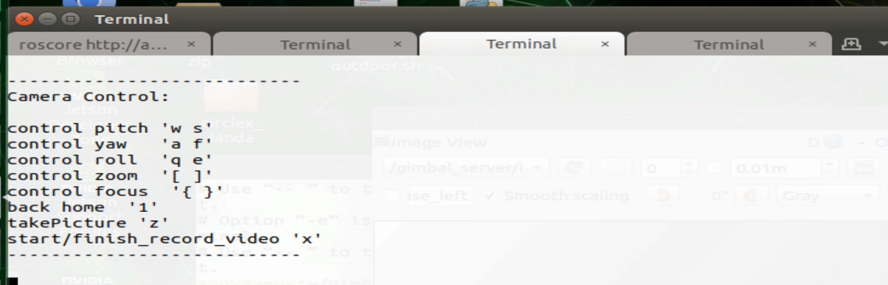
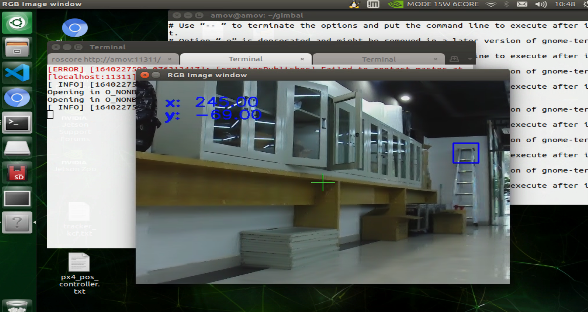
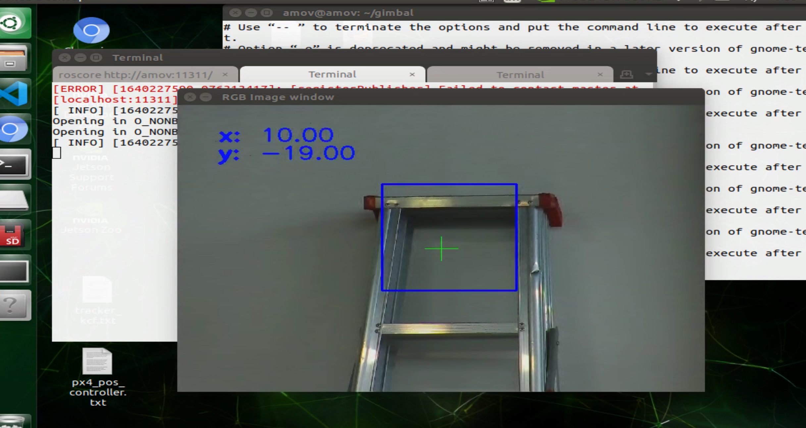
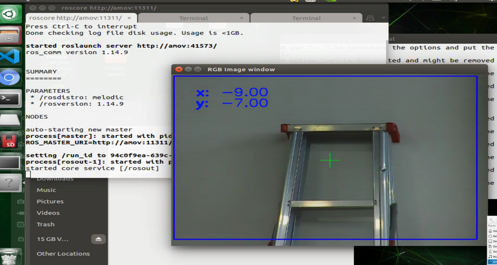
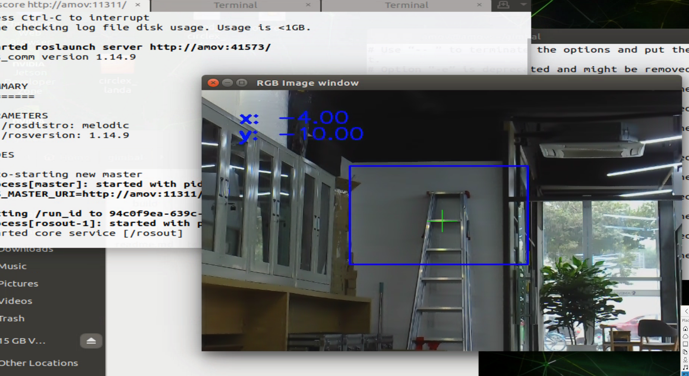

3-吊舱控制
==========

本节介绍吊舱控制包的使用，仅适用于吊舱开发套件(TX板)和P600无人机(NX板)使用. 演示怎么单独运行吊舱的键盘控制和吊舱跟踪.

.. warning::

   如果将激光雷达和吊舱同时插入计算机可能会导致无法进行吊舱控制, 解决方法见文末常见问题一。

键盘控制
------------

3轴控制, 缩放控制，变焦控制，视频拍摄

.. code-block:: console

    cd /home/amov/gimbal_control
    chmod +x *.sh
    chmod +x src/gimbal_control/scripts/control_server.py
    ./test_keyboard_control.sh

吊舱跟踪
------------

跟踪时自动缩放

.. code-block:: console

    cd /home/amov/gimbal_control
    chmod +x *.sh
    chmod +x src/gimbal_control/scripts/control_server.py
    ./test_kcf.sh

框选一个较小的目标

之后,自动放大

框选一个较大的目标

之后,自动缩小

常见问题
------------
1. 无法控制吊舱

打开终端运行 ``ls /dev`` 检查是否存在多个 ``ttyUSB`` 串口，如果存在多个，手动修改 ``test_kcf.sh`` 和 ``./test_keyboard_control.sh`` 文件切换打开的ttyUSB
例如，修改为 ``ttyUSB1`` ：

.. code-block:: console

    ...
    rosrun prometheus_gimbal_control gimbal_server _tty_url:=/dev/ttyUSB1
    ...

.. note::

    吊舱和激光雷达默认读取串口都是 ``ttyUSB0`` ，如果只插入其中一个就会有问题，但当两着同时存在时总有一个会由 ``ttyUSB0`` 变成 ``ttyUSB1`` (**按插入顺序变化**，一般来说两者同时存在时激光雷达时ttyUSB0, 吊舱是ttyUSB1) 而程序还是读取的 ``ttyUSB0``

2. 无法打开摄像头，摄像头不存在, OpenCV Error

重新上电吊舱电源

3. 不想在跟踪中自动缩放

在 ``test_kcf.sh`` 改 ``_auto_zoom:=true`` 为 ``_auto_zoom:=false`` 

.. code-block:: console

    ...
    rosrun gimbal_track tracker_kcf _auto_zoom:=false _max_size:=0.3 _min_size:=0.1
    ...