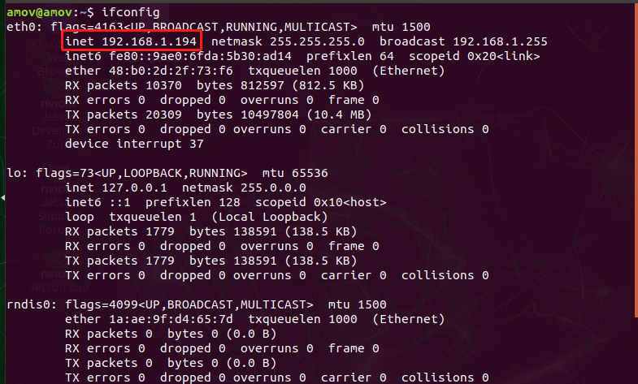
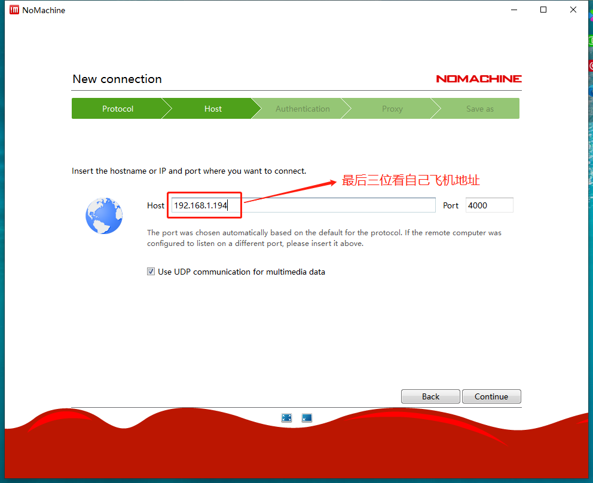
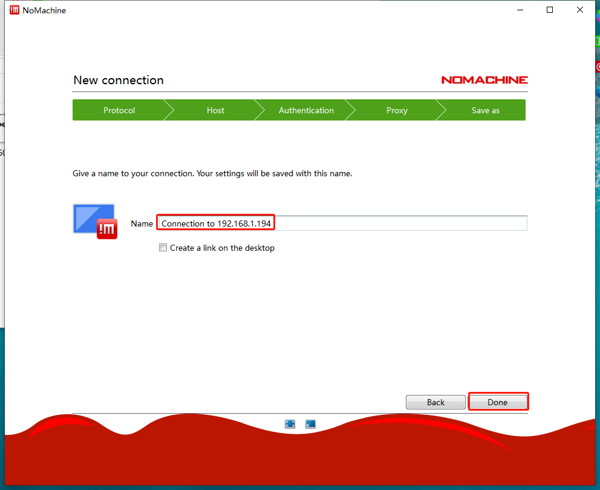
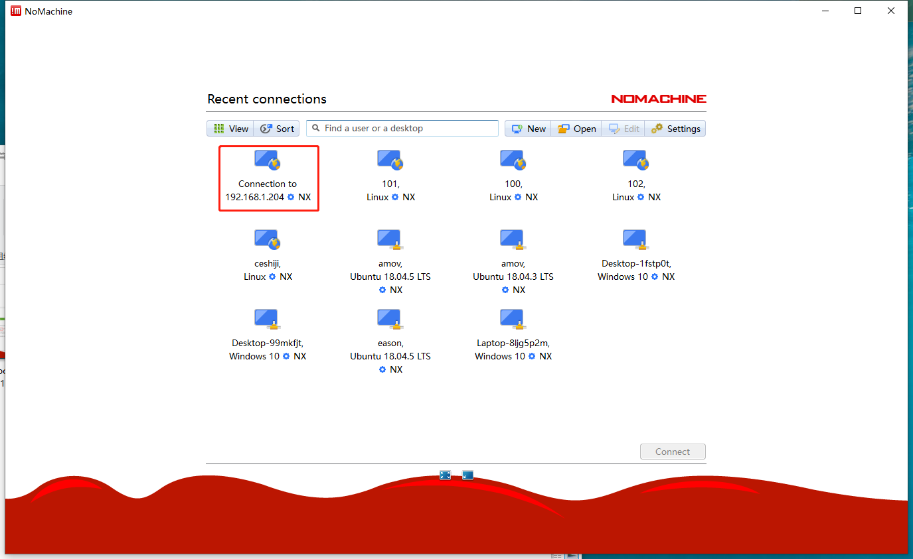
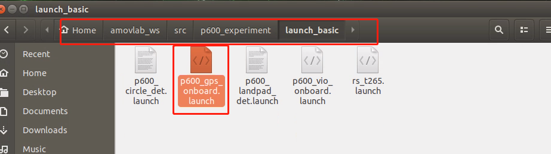
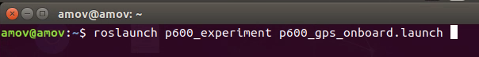
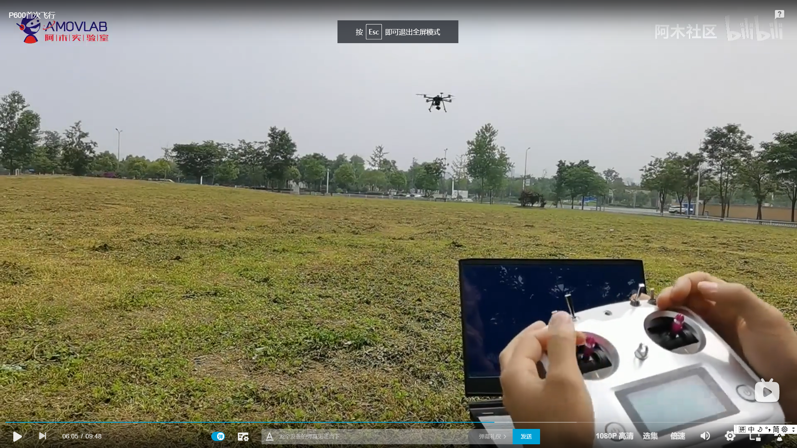

.. 首次飞行:

首次飞行
==============

本节主要讲解室外GPS下的P600首次飞行。

飞行环境
-----------------------------
我们的飞行环境如下图所示

.. attention::

    注意使用室外GPS定位的飞行环境需要在空旷的区域，搜星数量在10颗以上，等待gps尾灯闪烁绿灯的时候即可。

.. image:: ../../images/p600/首次飞行/飞行环境.png

电脑软件准备工作
------------------

准备一台笔记本电脑，电脑系统不做要求，可以是Windows7，Windows10或者是Ubuntu系统。需要安装QGroundControl(以下简称QGC)和nomachine。
QGC的作用是连接到飞机，监控飞机本身的状态（传感器是否正常，参数配置是否正常）；nomachine用作远程连接到板载计算机。

.. hint::

    软件安装包请在百度网盘自主下载
    `网盘链接 <https://pan.baidu.com/share/init?surl=M2ucIqRqnKoFI8ylLpgquQ>`_
    
    提取码: **amov**

.. image:: ../../images/p450/first_fly/package.png

从图中可以看到，有不同操作系统下的安装包，根据自己笔记本电脑系统安装相应的QGC和nomachine。

安装QGC地面站
^^^^^^^^^^^^^^^^^^^^^^^

正确安装上面安装包之后，打开QGC地面站：

.. image:: ../../images/p450/first_fly/1-qgc.png

.. attention::

    最下方的版本是V4.0.8

.. image:: ../../images/p450/first_fly/1-qgc-vision.png

安装nomachine
^^^^^^^^^^^^^^^^^^^^^^^

正常安装按完成之后，打开nomachine：

.. image:: ../../images/p450/first_fly/1-nomachine.png

硬件准备工作
------------------
p600无人机，如下图所示

.. image:: ../../images/p600/首次飞行/p600飞机.png

P600电池

.. image:: ../../images/p600/首次飞行/p600电池.png
   :height: 800px
   :width: 800px
   :scale: 50%
   :alt: None
   :align: center

遥控器电池

.. image:: ../../images/p450/first_fly/2-rcbattery.png
   :height: 912px
   :width: 807px
   :scale: 40%
   :alt: None
   :align: center

安全绳

.. image:: ../../images/p450/first_fly/2-safestring.png
   :height: 434px
   :width: 769px
   :scale: 60%
   :alt: None
   :align: center

QGC连接到飞机
-----------------

首先将地面端的图数传连接到自己电脑（最好将wifi关掉），如下图所示

.. image:: ../../images/p600/首次飞行/地面端连接电脑.png
   :height: 900px
   :width: 900px
   :scale: 80%
   :alt: None
   :align: center
.. image:: ../../images/p600/首次飞行/电脑端IP配置.png
1、点击“未识别的网络”
2、点击“更改适配器”
3、点击“以太网”，
4、点击“属性”
5、点击Internet协议版本4（TCP/IPv4）
6、选中“使用下面的IP地址（s）”
7、IP地址栏中写只要不和飞机端的地面站重合的即可，如192.168.1.188，子网掩码点击后自己填充

然后打开地面站，连接方式如下面两张图所示

打开地面站后：1、点击右上角图标 2、点击通讯连接 3、点击添加

.. image:: ../../images/p600/首次飞行/添加连接.png

点击添加后：1、名称自定义 2、类型选择TCP 3、主机地址为192.168.1.***（最后三位看自己的飞控端地址） 4、端口是8080

.. image:: ../../images/p600/首次飞行/编辑连接.png

然后点击“连接”，连接成功后如下图所示

.. image:: ../../images/p450/first_fly/3-connectsuccess.png
   :height: 452px
   :width: 1267px
   :scale: 60%
   :alt: None
   :align: center

nomachine远程连接
--------------------
.. attention::

    注意查看板载IP首先需要准备个显示器来连接板载计算机。

查看板载计算机ip
^^^^^^^^^^^^^^^^^^^^^^^^^^^^^

查看板载计算机ip有两种方法，第一种方法是点击右上角“wifi信号”，选择“Connection Information”，
在IPv4-IP Address下，用“红框”标记的就是板载计算机的ip地址。

.. image:: ../../images/p450/first_fly/4-boardip1.png
   :height: 419px
   :width: 281px
   :scale: 100%
   :alt: None
   :align: center

.. image:: ../../images/p600/首次飞行/查看板载IP_1.png
   :height: 446px
   :width: 361px
   :scale: 100%
   :alt: None
   :align: center

第二种方法是点击右键，选择“Open Terminal”,输入“ifconfig”,在最下面wlan0下用“红框”标记的就是板载计算机的ip地址。

nomachine远程连接板载计算机
^^^^^^^^^^^^^^^^^^^^^^^^^^^^^^^

点击New

.. image:: ../../images/p450/first_fly/4-nom-1.png
   :height: 232px
   :width: 1004px
   :scale: 50%
   :alt: None
   :align: center

在Protocol下选择NX，点击Continue。

.. image:: ../../images/p450/first_fly/4-nom-2.png
   :height: 676px
   :width: 956px
   :scale: 70%
   :alt: None
   :align: center

在“Host”下填写板载计算机的ip地址，板载计算机地址参考步骤2，“Port”下默认4000。

在Authentication下默认是Password，点击“Continue”。

.. image:: ../../images/p450/first_fly/4-nom-4.png
   :height: 685px
   :width: 1000px
   :scale: 70%
   :alt: None
   :align: center

在Proxy下默认是“Don’t use a proxy”，点击“Continue”。

.. image:: ../../images/p450/first_fly/4-nom-5.png
   :height: 687px
   :width: 983px
   :scale: 70%
   :alt: None
   :align: center

在Save as下会生成默认的name，可以不做更改，点击“Done”。

按照上述步骤操作，会自动生成如下图所示用红框标起的链接，点击“Connect”。

在“Username”和“Password”下输入“amov”

.. image:: ../../images/p450/first_fly/4-nom-8.png

Nomachine成功连接板载计算机后会显示如下界面

.. image:: ../../images/p450/first_fly/4-nom-9.png

此时可同时连接qgc与板载计算机，方便后续实验操作。

.. image:: ../../images/p450/first_fly/4-nom-10.png

启动脚本
-------------------

启动脚本在下图所示的目录下面

在终端输入如下命令，启动脚本

启动脚本后如下图所示

.. image:: ../../images/p450/first_fly/5-roslaunch.png

检查各项数据是否正常
---------------------

在启动脚本后，首先查看地面站，地面站上会显示飞机的航向为正东，就是“E”。

.. image:: ../../images/p450/first_fly/6-qgc-e.png
   :height: 364px
   :width: 248px
   :scale: 100%
   :alt: None
   :align: center

第一个终端正常情况下如下图所示，各项数据均正常

.. image:: ../../images/p450/first_fly/6-first.png

第二个终端如下图所示，查看飞机的位置、速度、角度与角速度信息是否正常，主
要移动飞机查看飞机的位置信息是否正常，飞机向前为X轴正方向，向左为Y轴正方
向，向上为Z轴正方向。下图例子为将飞机向后向上移动大概1m，数据显示正常。

 .. image:: ../../images/p450/first_fly/6-twice.png

 第三个终端如下图所示，显示“Program is running”即表示脚本正常运行。

  .. image:: ../../images/p450/first_fly/6-third.png

遥控器定点模式飞行
-------------------------------------

如下图所示，将“SWC”开关拨到中间一档， 切到“定点模式”

.. image:: ../../images/p450/first_fly/7-pos.png
   :height: 745px
   :width: 998px
   :scale: 60%
   :alt: None
   :align: center

然后左手“右下”解锁飞机，如下图所示。

.. image:: ../../images/p450/first_fly/7-arm.png

起飞后如下图所示，进行定点模式飞行。

   :height: 779px
   :width: 821px
   :scale: 80%
   :alt: None
   :align: center

视频演示
-------------------------

.. raw:: html

    <iframe width="696" height="422" src="//player.bilibili.com/player.html?aid=289495747&bvid=BV1sf4y1478z&cid=311386031&page=3" scrolling="no" border="0" frameborder="no" framespacing="0" allowfullscreen="true"> </iframe>

首次飞行地址：

https://www.bilibili.com/video/BV17V411j7Em?t=365