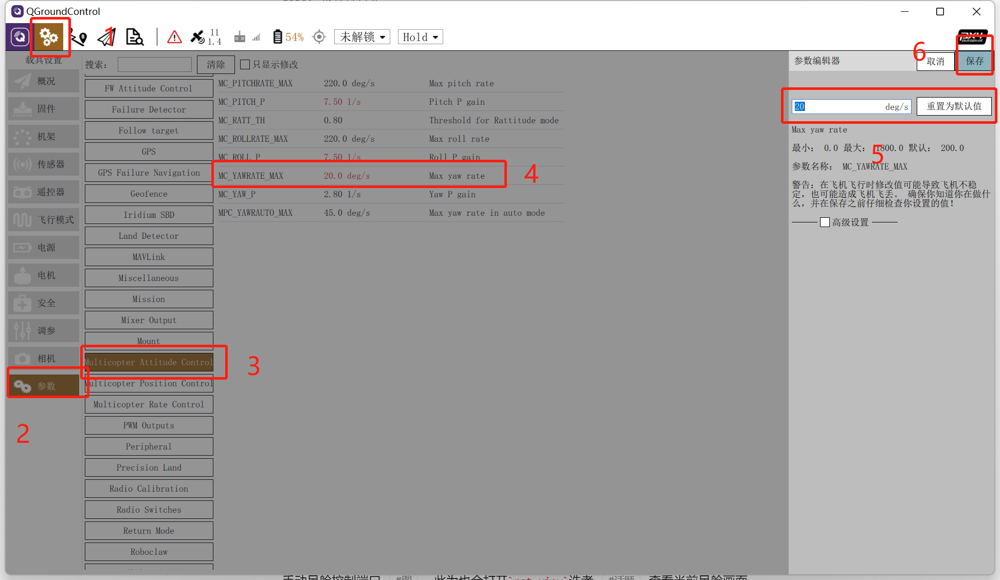
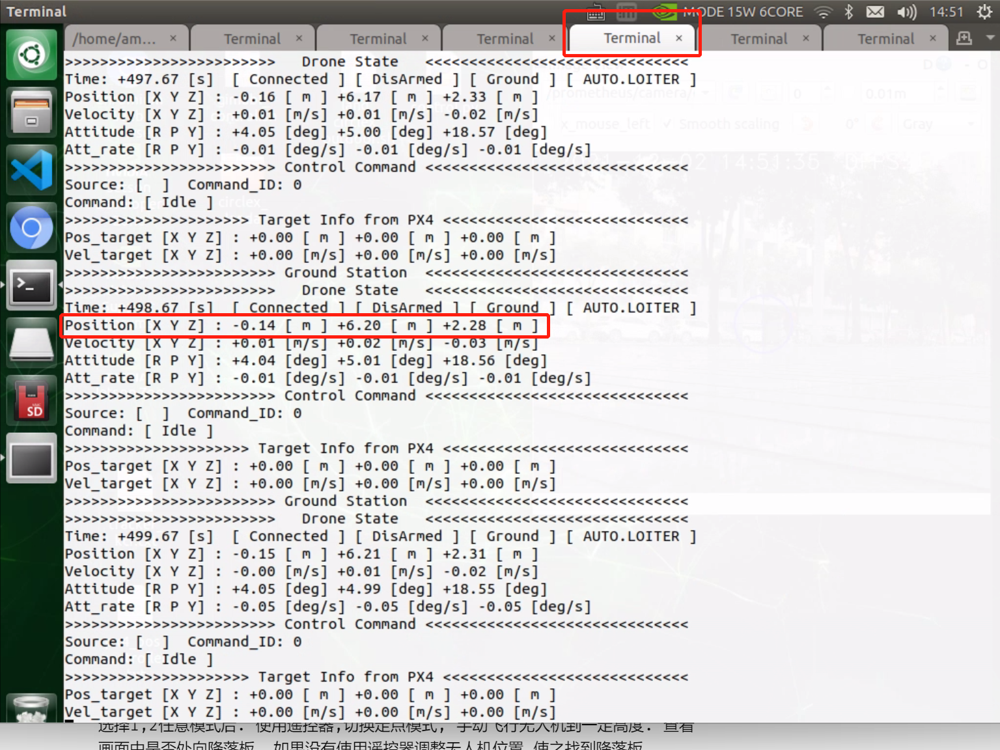
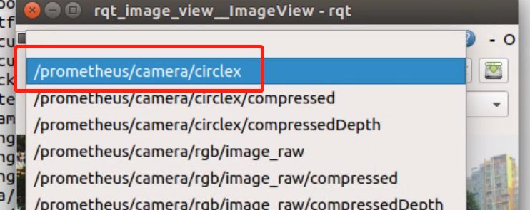
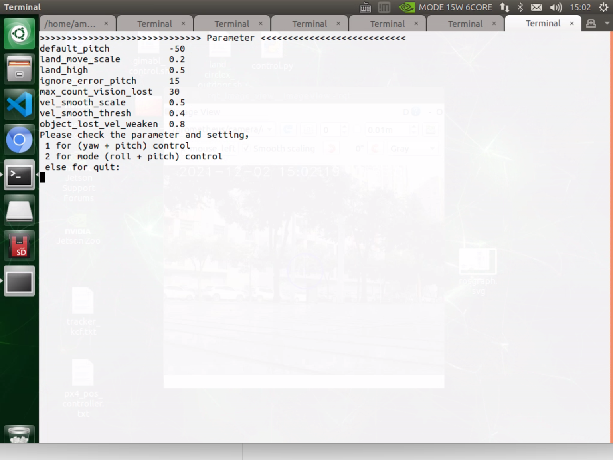
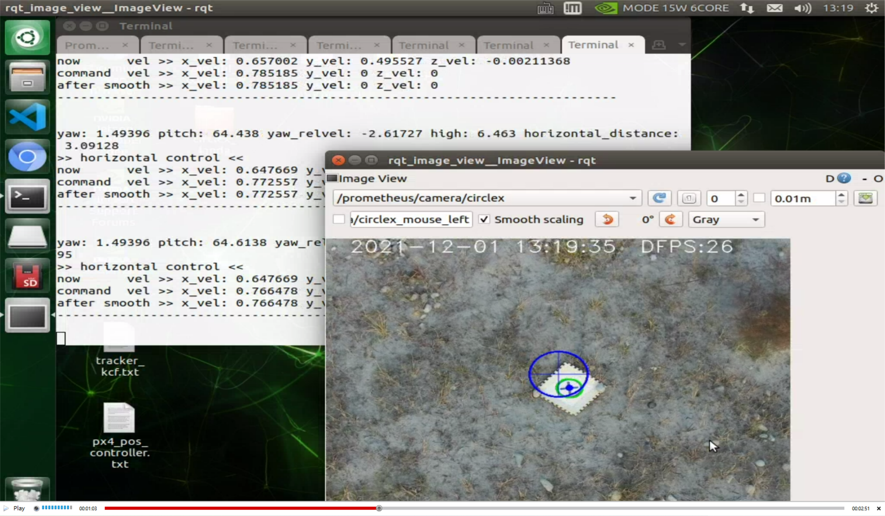

# 5-进阶功能-吊舱圆叉识别降落
P600圆叉吊舱跟踪的无人机自动降落.**默认您已经完成阅读过P600首次飞行**

## 整体流程
无人机起飞后吊舱向下偏转, 如果检测到圆叉降落板出现在画面中, 则吊舱摄像头锁定圆叉降落板中心, 使得降落板中心始终保持在图像中心, 根据yaw, pitch, roll以及无人机高度数据计算降落点在机体坐标系的位置.

## 准备
1. 降落板, 推荐0.5m $\times$ 0.5m 大小,视频中使用的是A2纸打印的.具体大小可自行定制

2. 连接QGC, Nomachine
4. 确保GPS在10颗星以上
5. 在QGC中，将无人机航向角速度设置为20.使得吊舱跟踪速度能匹配无人机旋转速度

6. 矫正地平线

## 启动指令
```sh
roslaunch p600_experiment p600_circlex_landing.launch
```
输入指令后会打开7个终端窗口和一个`rqt_view`可视化窗口，依次检查第各个窗口数据是否有报错,如有问题见本文末尾常见问题。检查倒数第三个窗口，观察数据是否在一定范围内浮动，如果数据一直涨或者一直减低请重启飞控。


在确保窗口无报错，数据正常后。在`rqt_view`中选择`prometheus/camera/circlex`话题。

然后切换到最后一个窗口

有2中种自动降落模式, 区别在于吊舱跟踪降落点时控制轴不一样, 无论那个模式下吊舱pitch都会向下50度:
- 模式1: yaw+pitch控制, 使用yaw角控制无人机航向角, pitch计算无人机到降落点的水平距离. 因为在无人机接近降落点时会出现万向锁问题, 所有在接近降落点正上方时使pitch为向下90度, yaw会到0使之变成一个固定相机进行降落
- 模式2(尚不稳定): roll+pitch控制,无万向锁问题,全程使用roll,pitch计算降落点的位置.

**这里选择1模式后**. 窗口会实时打印当前相关信息。然后使用遥控器,切换定点模式, 手动飞行无人机到一定高度. 查看画面中是否处向降落板. 如果没有使用遥控器调整无人机位置,使之找到降落板.吊舱锁定降落板后,遥控器切入`offboard`模式, 无人机开始自动降落. 降落完成后切出`offboard`模式
)

**降落过程中确保遥控器在手中,如果发生意外,请手动切出`offboard`遥控器控制无人机,如果仍然无法控制则切换`炸机模式`无人机会直接失去供电,掉了下来.**


## 常见问题
### 1.找不到相机设备
重新拔插吊舱电源
### 2.降落时无人机都快触地却还没有上锁
1. 矫正地平线, 确保GPS在10颗星以上
2. 修改`p600_circlex_landing.launch`文件中下自动下降高度.

### 3.FCU: Onboard controller lost
此报错可以忽略
