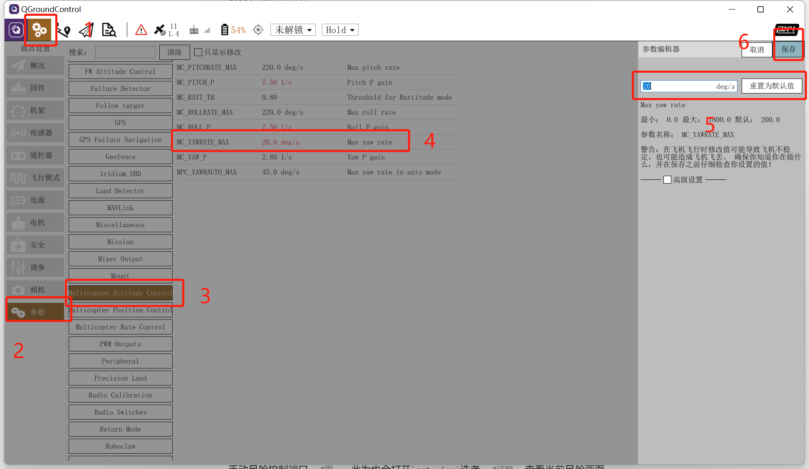
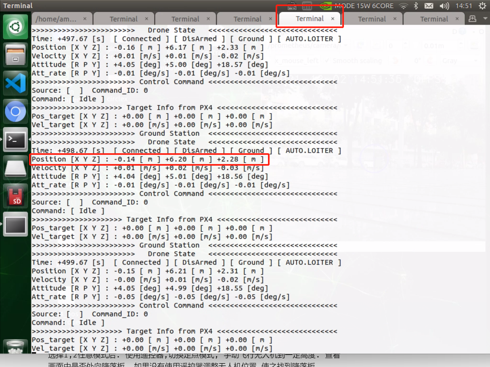
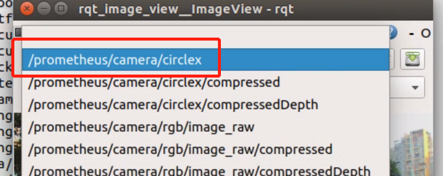
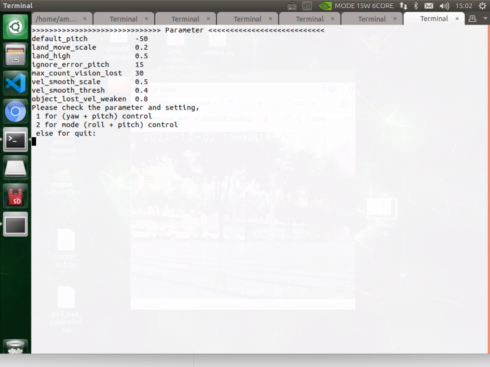
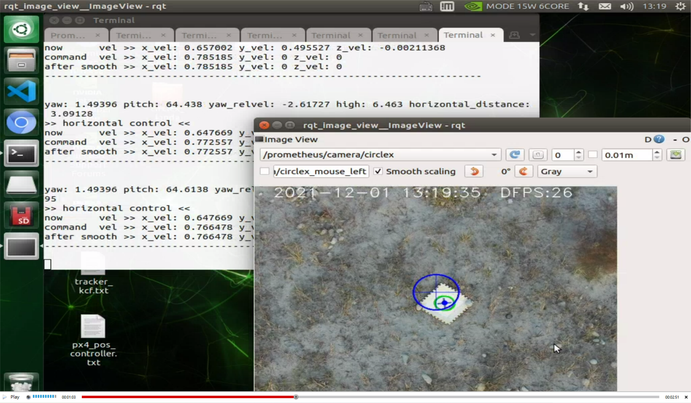
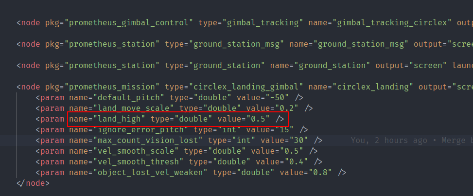

5-进阶功能-吊舱圆叉识别降落
===========================

P600圆叉吊舱跟踪的无人机自动降落.\ **默认您已经完成阅读过P600首次飞行**

整体流程
--------

无人机起飞后吊舱向下偏转, 如果检测到圆叉降落板出现在画面中,
则吊舱摄像头锁定圆叉降落板中心, 使得降落板中心始终保持在图像中心,
根据yaw, pitch, roll以及无人机高度数据计算降落点在机体坐标系的位置.

准备
----

1. 降落板, 推荐0.5m :math:`\times` 0.5m
   大小,视频中使用的是A2纸打印的.具体大小可自行定制 |image1|
2. 连接QGC, Nomachine
3. 确保GPS在10颗星以上
4. 在QGC中，将无人机航向角速度设置为20.使得吊舱跟踪速度能匹配无人机旋转速度
   |image2|
5. 矫正地平线

启动指令
--------

.. code:: sh

   roslaunch p600_experiment p600_circlex_landing.launch

输入指令后会打开7个终端窗口和一个\ ``rqt_view``\ 可视化窗口，依次检查第各个窗口数据是否有报错,如有问题见本文末尾常见问题。检查倒数第三个窗口，观察数据是否在一定范围内浮动，如果数据一直涨或者一直减低请重启飞控。
|image3|

在确保窗口无报错，数据正常后。在\ ``rqt_view``\ 中选择\ ``prometheus/camera/circlex``\ 话题。
|image4| 然后切换到最后一个窗口 |image5| 有2中种自动降落模式,
区别在于吊舱跟踪降落点时控制轴不一样,
无论那个模式下吊舱pitch都会向下50度: - 模式1: yaw+pitch控制,
使用yaw角控制无人机航向角, pitch计算无人机到降落点的水平距离.
因为在无人机接近降落点时会出现万向锁问题,
所有在接近降落点正上方时使pitch为向下90度,
yaw会到0使之变成一个固定相机进行降落 - 模式2(尚不稳定):
roll+pitch控制,无万向锁问题,全程使用roll,pitch计算降落点的位置.

**这里选择1模式后**.
窗口会实时打印当前相关信息。然后使用遥控器,切换定点模式,
手动飞行无人机到一定高度. 查看画面中是否处向降落板.
如果没有使用遥控器调整无人机位置,使之找到降落板.吊舱锁定降落板后,遥控器切入\ ``offboard``\ 模式,
无人机开始自动降落. 降落完成后切出\ ``offboard``\ 模式 |image6|)

**降落过程中确保遥控器在手中,如果发生意外,请手动切出\ ``offboard``\ 遥控器控制无人机,如果仍然无法控制则切换\ ``炸机模式``\ 无人机会直接失去供电,掉了下来.**

视频演示
--------
.. raw:: html

    <iframe width="696" height="422" src="//player.bilibili.com/player.html?aid=934628898&bvid=BV1vM4y1w776&cid=456169034&page=1" scrolling="no" border="0" frameborder="no" framespacing="0" allowfullscreen="true"> </iframe>

常见问题
--------

1. 找不到相机设备

重新拔插吊舱电源 

2. 降落时无人机都快触地却还没有上锁 
1.矫正地平线,确保GPS在10颗星以上 
2.  修改\ ``p600_circlex_landing.launch``\ 文件中下自动下降高度. |image7|

3. FCU: Onboard controller lost 
此报错可以忽略

