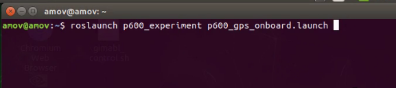
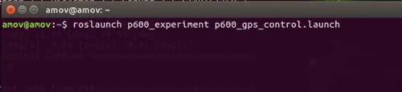
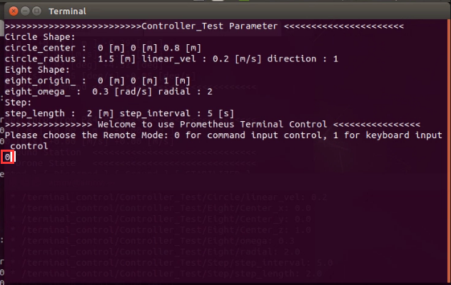
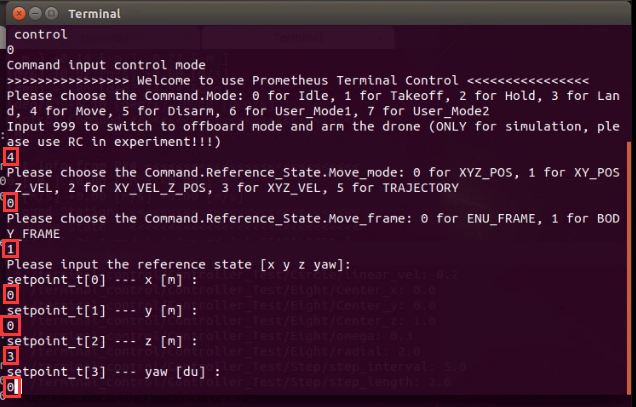
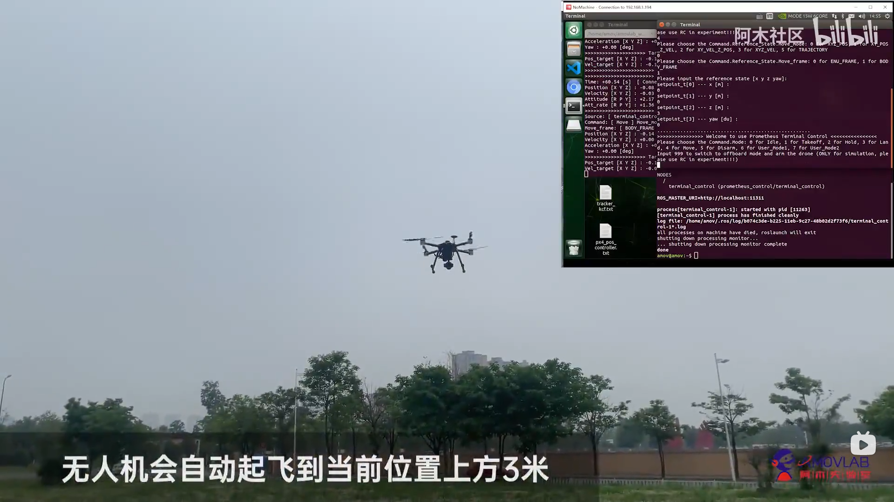
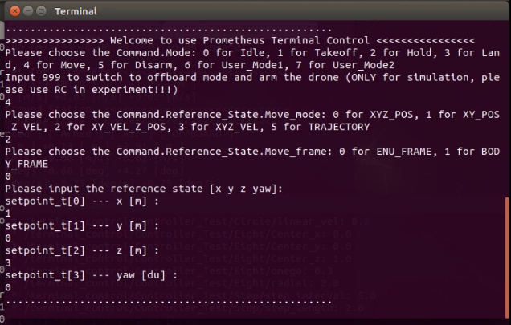
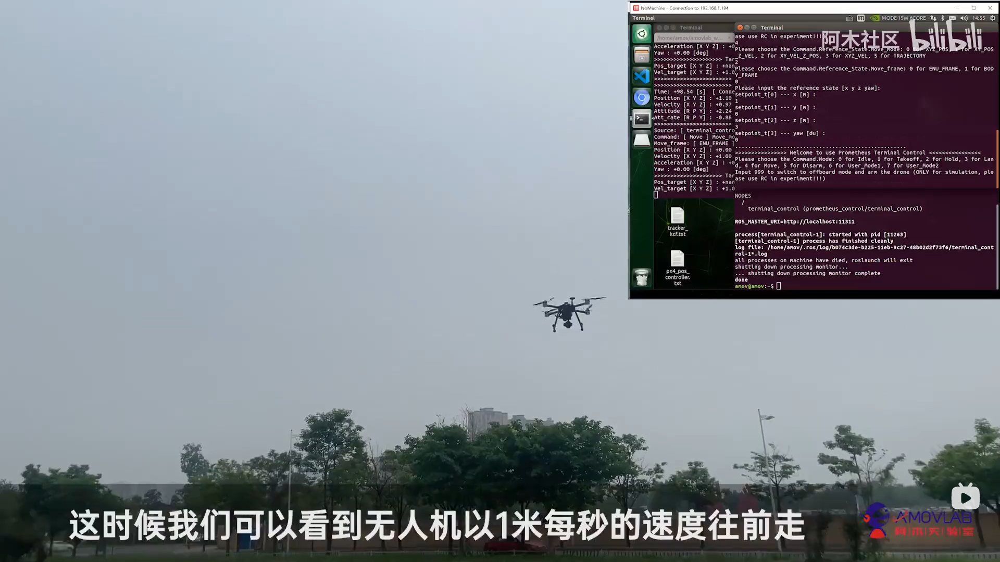
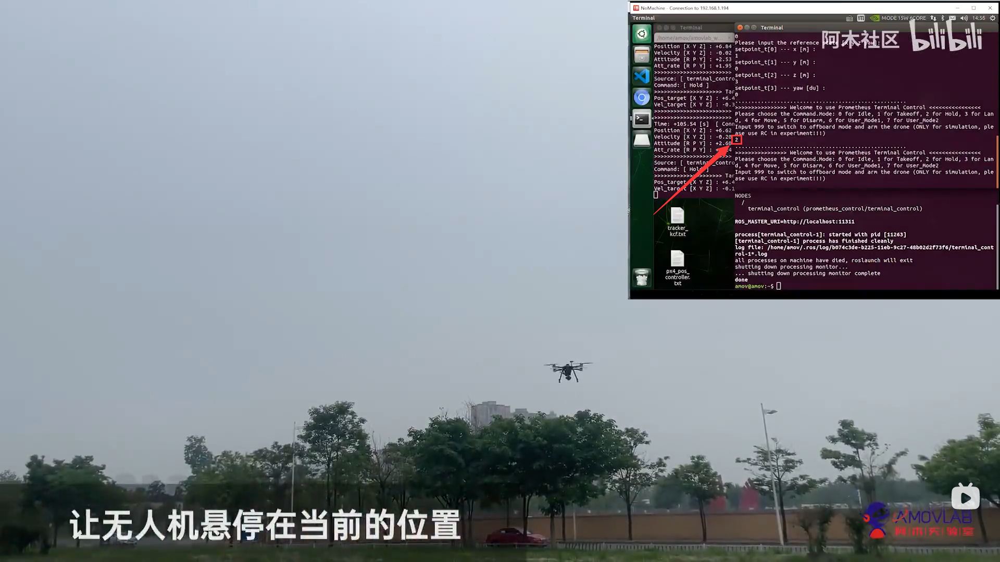
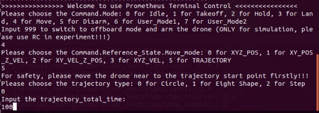

.. 室外指点飞行:

5-进阶功能-室外指点飞行
================================

本节主要讲解P600系列无人机在室外的指点飞行演示。视频紧接上节内容 **首次飞行**  ，默认已经通过home图数传连接到QGC地面站和nomachine远程连接到板载计算机，
主要分为一下几点进行讲解：启动指令，命令行控制终端详解，指点飞，速度控制，绕圆飞行以及最后的视频演示。

启动指令
------------

首先启动命令一

再启动命令二

命令行控制终端详解
---------------------------

.. image:: ../../images/p450/室内指点/命令行控制终端.png
   :height: 327px
   :width: 647 px
   :scale: 80 %
   :alt: None
   :align: center

其中 0 表示的是 怠速；意思就是飞机会进入offboard模式，但是在该模式下，没有对飞机进行任何指令的发送。飞机也不会有任何动作。这个指令一般也可以不用。

1 表示的是 起飞；起飞点为当前点，起飞高度通过 yaml参数设置，单位是米，默认起飞高度是0.5m

2 表示的是 悬停；飞机正在飞行过程中如何接受到 2 指令，会在当前时刻进入悬停状态。

3 表示的是 降落；降落速度通过 yaml参数设置，单位是m/s ，默认降落速度为0.2m/s 。还有一个 上锁高度 到达上锁高度之后飞机会进入飞控的本身降落模式进而缓缓着地，
上锁高度通过 yaml 参数进行设置，单位是米，默认是 0.18m，即认为离地不到20cm的时候进入飞控本身的降落飞行模式。

4 表示的是 move模式；该模式就包含我们所称的指点飞行功能，在此模式下，又有5种子模式：
0对应XYZ_POS,空间位置控制；
1对应XY_POS_Z_VEL,水平面位置控制，高度速度控制；
2对应XY_VEL_Z_POS,水平面速度控制，高度定高控制；
3对应XYZ_VEL,空间速度控制；
5对应TRAJECTORY，轨迹跟踪控制。。

指点飞
--------------------

先在此终端输入0选择命令输入控制

根据终端提示，选择 4 move飞行模式，然后选择 0 空间位置控制，然后选择 1 BODY_FRAME惯性坐标系，最后输入期望的状态，空间位置xyz和航向角yaw。
这里我们发送的指令是x为0，y为0，z为3，yaw为0。让飞机往前x轴飞行0m，往左y轴飞行0m，往上z轴飞行到3m，航向角保持不变发送为0。
即让无人机飞到当前高度上方三米的地方。

如图所示，无人机飞到了起飞点上方三米的位置处

速度控制
------------------------

我们还可以继续输入命令进行速度控制和绕圆飞行。

以下依次输入4 选择move，输入2 选择xy速度控制z位置控制，输入0 选择ENU_FRAME，输入1 表示x方向速度为1m/s，输入0 表示y方向速度为0m/s,输入3 表示高度为3米。

输完之后无人机会以1m/s的速度向前方飞行。

在我们想停止速度控制的时候可以在终端输入2 选择Hold,无人机会停在当前位置。

绕圆飞行
-----------------------

然后我们可以开始绕圆飞行，我们依次输入4 选择move,输入5 选择TRAJECTORY,输入0 选择Circle也就是绕圆飞行，最后输入想进行绕圆飞行的时间，单位是秒，这里输入的100也就是100秒。

然后我们可以看到无人机开始绕圆飞行

.. image:: ../../images/p600/室外指点飞行/绕圆飞行情况截图.png
   :height: 1080px
   :width: 1920 px
   :scale: 35 %
   :alt: None
   :align: center

视频演示
--------------------

视频链接： https://www.bilibili.com/video/BV17V411j7Em?p=2

视频演示如下：

.. raw:: html

    <iframe width="696" height="422" src="//player.bilibili.com/player.html?aid=418128941&bvid=BV17V411j7Em&cid=340362662&page=1" scrolling="no" border="0" frameborder="no" framespacing="0" allowfullscreen="true"> </iframe>