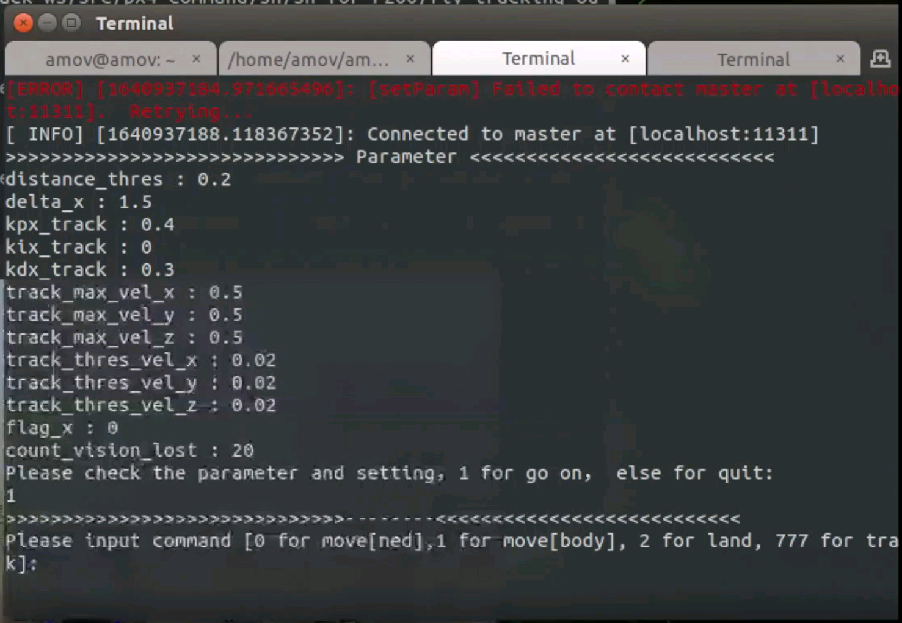
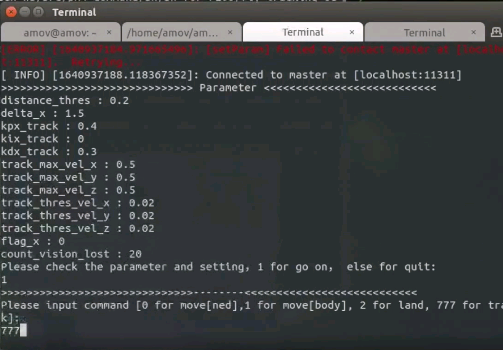

.. 框选跟踪飞行:

5-进阶功能-框选跟踪飞行
================================

本节主要讲解P600系列无人机在室外的框选跟踪飞行演示。视频紧接上节内容 **首次飞行**  ，默认已经通过home图数传连接到QGC地面站和nomachine远程连接到板载计算机，
主要分为以下几点进行讲解：启动指令，命令行控制终端详解，起飞，指点飞，以及最后的视频演示。

.. warning::

   受硬件更新的影响，老版跟踪代码无法使用。当前为新版(2022年1月5日后到货)，新版实际操作和与视频讲解有部分不同（不用担心,新版变得更简单,更易于实现）。 **以文字版为准**

启动指令
------------

首先启动基本脚本。 **总共会打开4个窗口,最后一个窗口可能稍慢些**

`/home/amov/track_ws/src/px4_command/sh/sh_for_P200/fly_tracking_outdoor.sh`

.. image:: ../../images/p600/框选跟踪飞行/启动命令.png
   :height: 122px
   :width: 630 px
   :scale: 100 %

终端输口入
-------------------

待吊舱图像弹出后，依次检查各个终端是否有报错。

.. image:: ../../images/p600/框选跟踪飞行/弹出吊舱图像.png
   :height: 681px
   :width: 874 px
   :scale: 80 %
   :alt: None
   :align: center

没有问题后先在倒数第二个终端输入1

再在倒数第二个终端输入777，（ **不要尝试输入其他命令，硬件更新后除跟踪外其他未测试** )

然后再遥控器切定点解锁，并手动起飞到一定高度，并让人站在机头方向，在吊舱视野范围内。

.. tip:: 

   你也可以一开始就框选目标，这样可以保证无人机在手动切定点上升的过程中吊舱仍然跟踪目标，避免无人机上升到一定高度后目标没有出现在画面中的情况。 **上升到一定高度后请重新框选目标以提高跟踪准确度**

框选跟踪
-----------------

然后手动框选人

.. image:: ../../images/p600/框选跟踪飞行/框选人.png
   :height: 414px
   :width: 635 px
   :scale: 80 %
   :alt: None
   :align: center

框好之后遥控器切offboard，然后无人机会开始进行跟踪，人可以进行自由走动。

.. image:: ../../images/p600/框选跟踪飞行/切offboard.png
   :height: 1080px
   :width: 1920 px
   :scale: 35 %
   :alt: None
   :align: center

结束跟踪只需要遥控器切出offboard，无人机自动进入定点，然后手动操控遥控器降落。

.. image:: ../../images/p600/框选跟踪飞行/切出offboard.png
   :height: 1080px
   :width: 1920 px
   :scale: 35 %
   :alt: None
   :align: center

视频演示
------------------

视频链接： https://www.bilibili.com/video/BV17V411j7Em?p=1

视频演示如下：

.. raw:: html

    <iframe width="696" height="422" src="//player.bilibili.com/player.html?aid=418128941&bvid=BV17V411j7Em&cid=340362662&page=3" scrolling="no" border="0" frameborder="no" framespacing="0" allowfullscreen="true"> </iframe>

常见问题
------------
1. 跟踪太慢,速度能否快点

打开 ``/home/amov/amovlab_ws/src/p600_experiment/launch_detection/p600_outdoor_target_tracking.launch`` 文件, 修改 ``kpx_track`` 为一个更大的直，比如 ``0.6``。 **请不要把值改的过大，以免撞脸上**

.. code-block:: yaml

   ...
      <!-- <node pkg="mission" type="target_tracking" name="UAV_target_tracking" output="screen" launch-prefix="bash -c 'sleep 1.5; gnome-terminal \-\-tab \-\- $0 $@'"> -->
      <!-- <param name="kpx_track" type="double" value="0.6"/> -->
      <!-- <param name="kix_track" type="double" value="0.01"/> -->
      <!-- <param name="kdx_track" type="double" value="0.3"/> -->
   ...

2. 画面卡顿，模糊

检查剩余电量，供电不住会导致画面卡顿模糊。