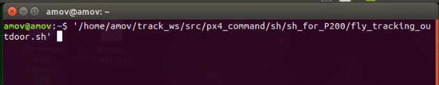
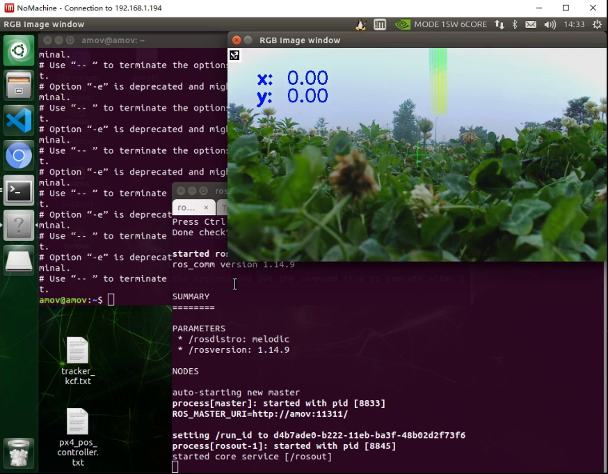
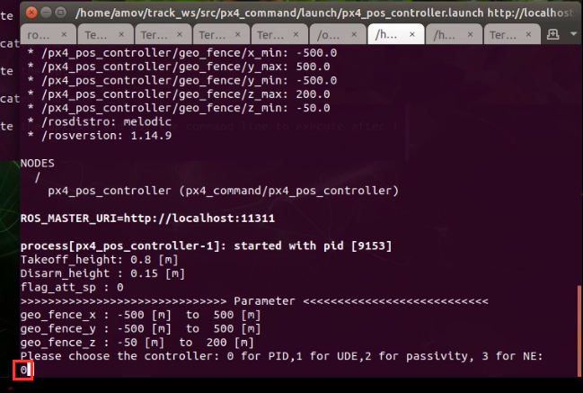
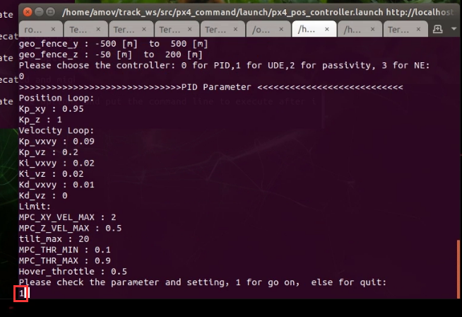
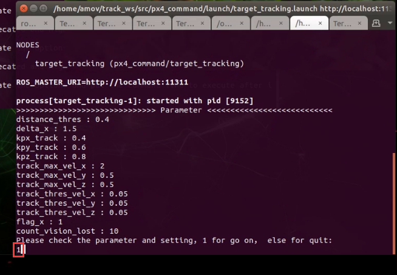
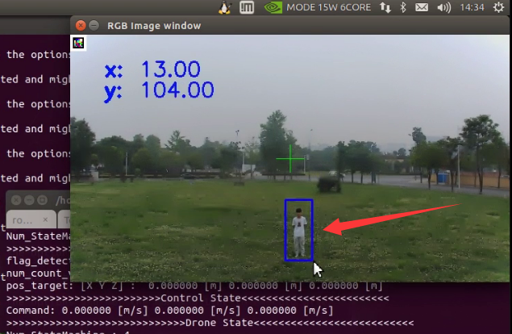
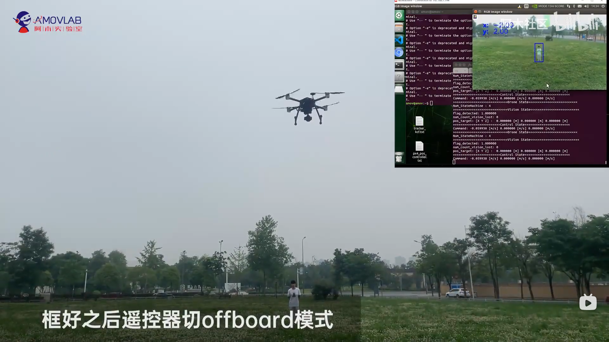
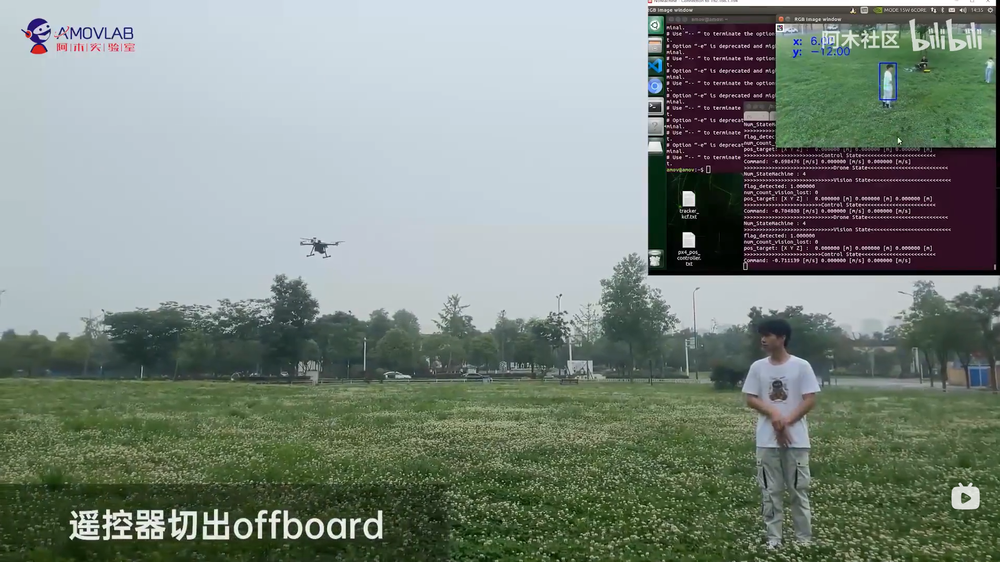

.. 框选跟踪飞行:

5-进阶功能-框选跟踪飞行
================================

本节主要讲解P600系列无人机在室外的框选跟踪飞行演示。视频紧接上节内容 **首次飞行**  ，默认已经通过home图数传连接到QGC地面站和nomachine远程连接到板载计算机，
主要分为一下几点进行讲解：启动指令，命令行控制终端详解，起飞，指点飞，以及最后的视频演示。

启动指令
------------

首先启动基本脚本

`/home/amov/track_ws/src/px4_command/sh/sh_for_P200/fly_tracking_outdoor.sh`

终端输入
-------------------

待吊舱图像弹出后，依次检查各个终端是否有报错。

没有问题后先在倒数第三个终端输入0

再在倒数第三个终端输入1

再在倒数第二个终端输入1

再在倒数第二个终端输入777

.. image:: ../../images/p600/框选跟踪飞行/倒数第二个终端输入777.png
   :height: 452px
   :width: 657 px
   :scale: 80 %
   :alt: None
   :align: center

然后再遥控器切定点解锁，并手动起飞到一定高度，并让人站在机头方向，在吊舱视野范围内。

框选跟踪
-----------------

然后手动框选人

框好之后遥控器切offboard，然后无人机会开始进行跟踪，人可以进行自由走动。

结束跟踪只需要遥控器切出offboard，无人机自动进入定点，然后手动操控遥控器降落。

视频演示
------------------

视频链接： https://www.bilibili.com/video/BV17V411j7Em?p=1

视频演示如下：

.. raw:: html

    <iframe width="696" height="422" src="//player.bilibili.com/player.html?aid=418128941&bvid=BV17V411j7Em&cid=340362662&page=1" scrolling="no" border="0" frameborder="no" framespacing="0" allowfullscreen="true"> </iframe>