.. 航点避障飞行:

5-进阶功能-航点避障飞行
================================

本节主要讲解P600系列无人机在室外的航点避障飞行演示。视频紧接上节内容 **首次飞行**  ，默认已经通过home图数传连接到QGC地面站和nomachine远程连接到板载计算机，
主要分为一下几点进行讲解：启动指令，起飞，避障飞行，以及最后的视频演示。

启动指令
------------

首先启动

`roslaunch p600_experiment astar_onboard_gps.launch`

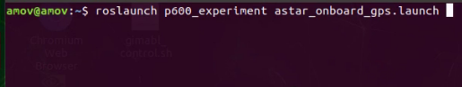

再启动第二个指令

`roslaunch p600_experiment astar_ground_gps.launch`

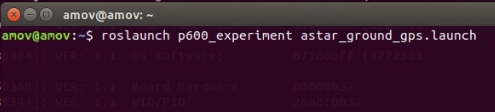

起飞
------------

接着在此终端依次输入指令让无人机起飞到1.4米高度。

先输入0

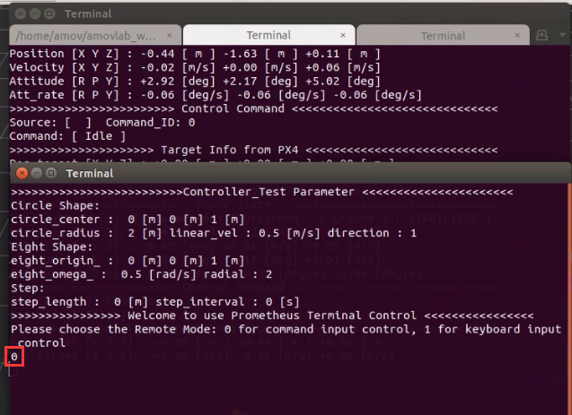

再输入4

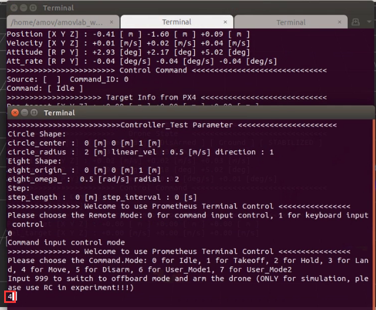

再输入0

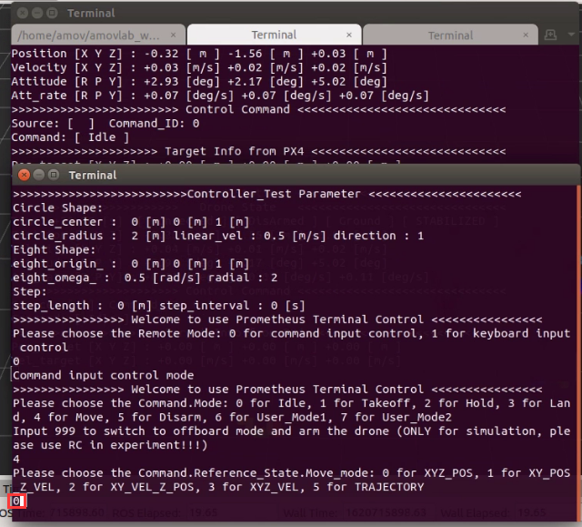

再输入0

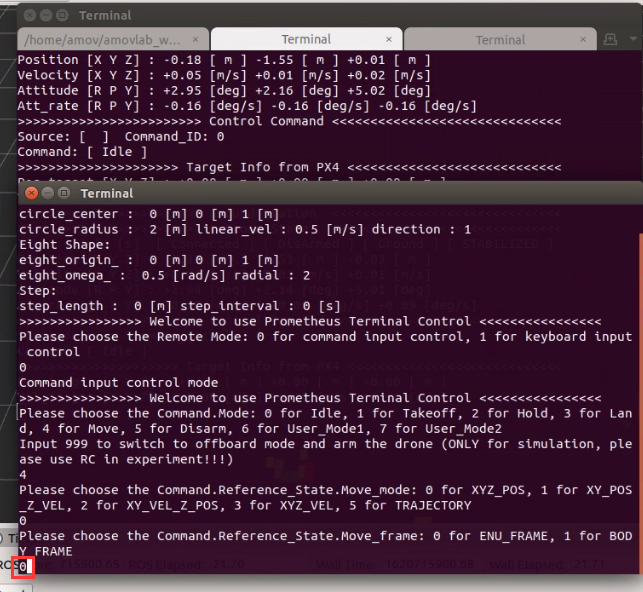

再依据当前飞机的本地位置数据的x输入对应期望x

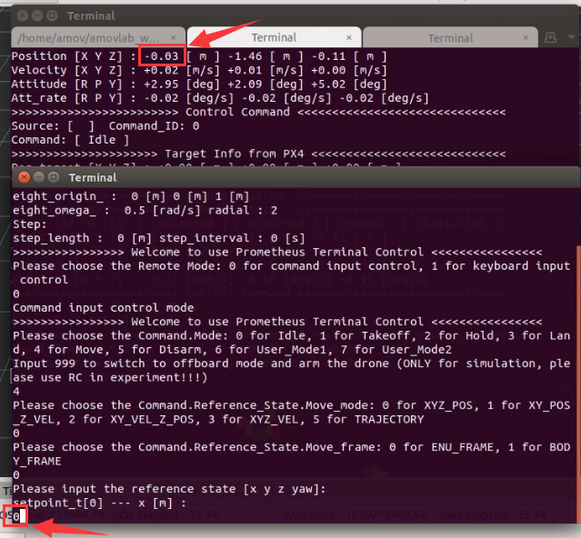

再对应输入y的位置

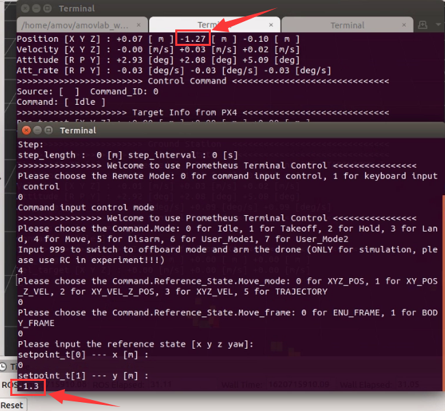

再输入高度z为1.4，这个不需要根据当前无人机本地位置来写

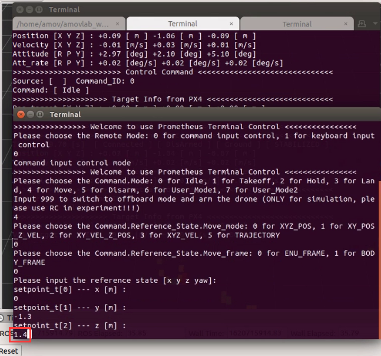

期望偏航为0

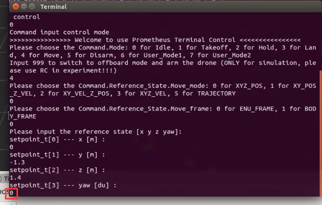

然后遥控器切定点解锁切offboard，无人机会自动起飞到1.4米高度。

避障飞行
--------------

先点击rviz里的3D Nav Goal

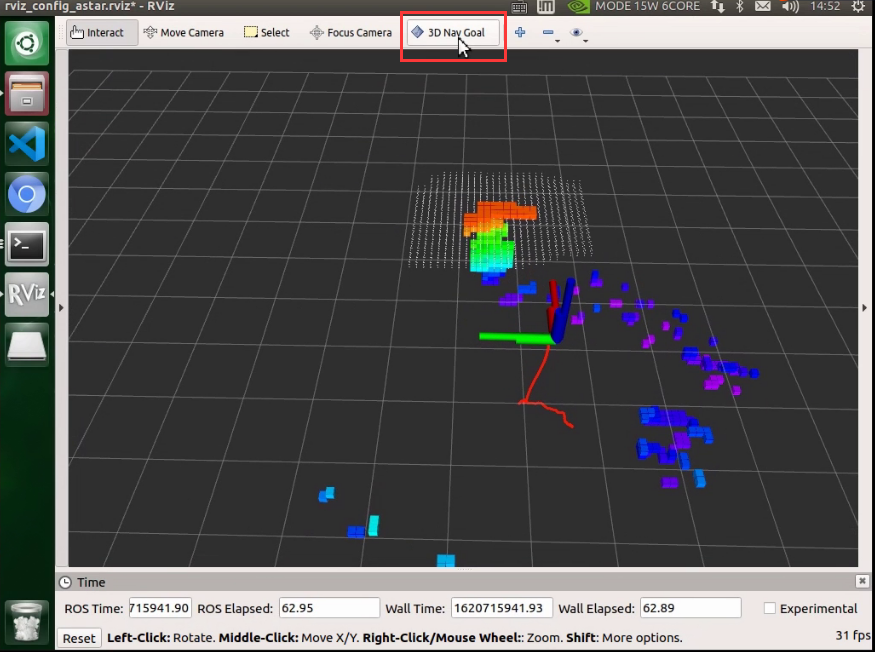

然后在rviz中点一个目标点

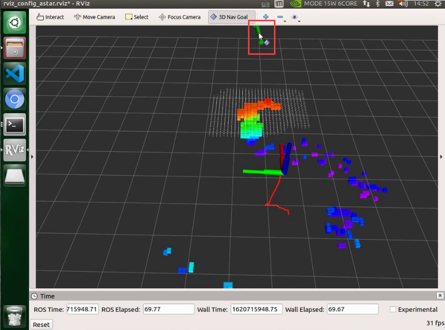

无人机会自动规划出绕开障碍物的路径

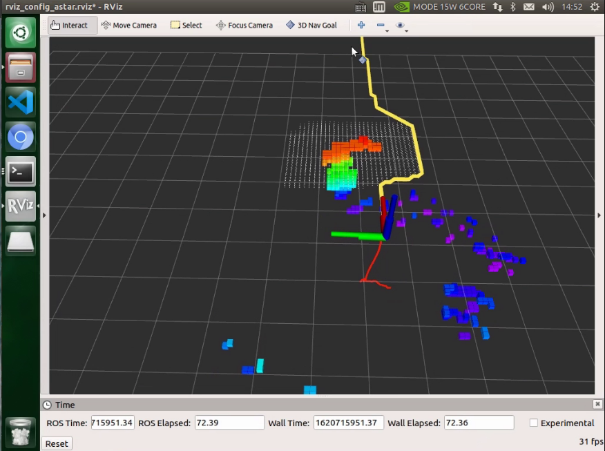

无人机到达目标点后，可以遥控器切出offboard，然后手动操控遥控器降落。

视频演示
-----------------

.. raw:: html

    <iframe width="696" height="422" src="//player.bilibili.com/player.html?aid=418128941&bvid=BV17V411j7Em&cid=345272923&page=4" scrolling="no" border="0" frameborder="no" framespacing="0" allowfullscreen="true"> </iframe>