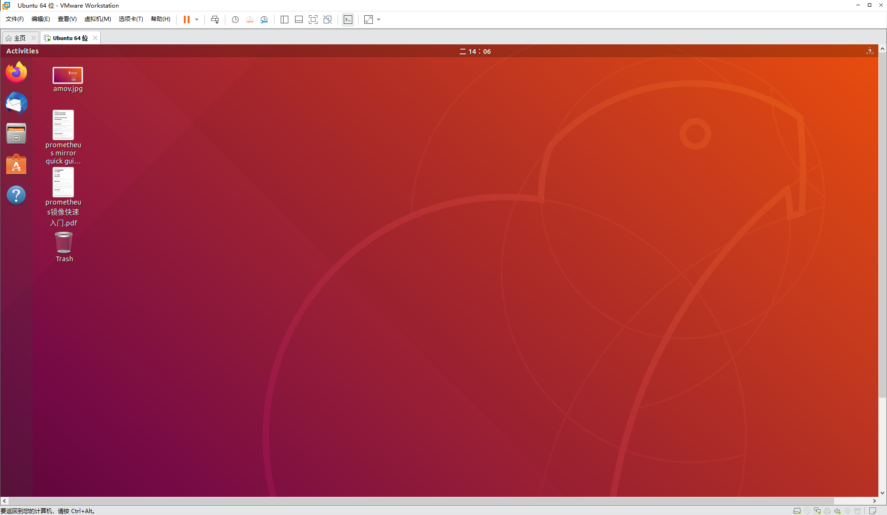
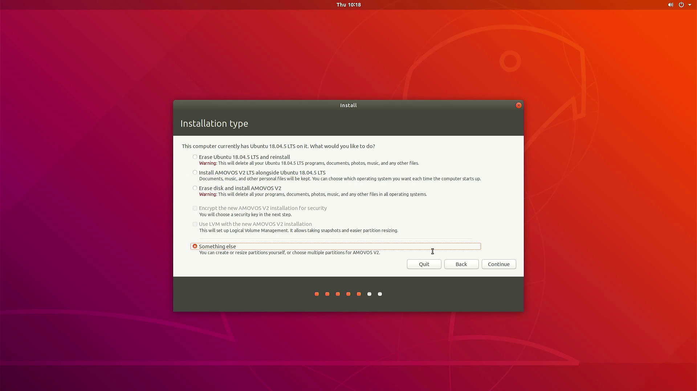

仿真环境
=====================

.. attention::
   如果您不想自己安装下面的仿真镜像且迫不及待想运行prometheus仿真，我们有prometheus仿真主机（到手就可以使用）（淘宝链接）

`Prometheus项目主页 <https://github.com/amov-lab/Prometheus>`_

.. image:: ../../images/p450/simulation/仿真介绍.png
   :height: 664px
   :width: 871px
   :scale: 70 %
   :alt: None
   :align: center

.. note::
   该仿真系统适配prometheus项目,可以实现功能如上图所示。如果你对prometheus项目感兴趣，不用为仿真环境问题而头疼脑大，让你1个小时跑通prometheus代码。让你快速掌握无人机仿真与无人机实机实验的完美契合；让研发更高效！

.. attention::
    * 本镜像提供了两种安装方式：虚拟机安装和单系统安装    
    * 虚拟机安装不用制作启动盘，安装最简单

      * 推荐配置：CPU:i7 6700HQ 内存：16G 硬盘：60G 以上

    * 单系统安装需要制作启动盘，并且保证该电脑的硬盘数据备份
      
      * 推荐配置：CPU:i7 6700HQ 内存：8G 硬盘：60G 以上

虚拟机使用
-----------------------

虚拟机中使用prometheus镜像，一种是Windows下面的vmware虚拟机使用，另外一种是Ubuntu下面的Oracle VM VirtualBox使用

VMware
^^^^^^^^^^^^^^^^^

默认已经安装好vmware虚拟机，如果没有安装过vmware虚拟机，请先下载安装，点击此处 `下载地址 <https://my.vmware.com/en/web/vmware/downloads/info/slug/desktop_end_user_computing/vmware_workstation_pro/16_0>`__ ，
安装vmware问题，可自行百度搜索，在此不做详细说明。

新建虚拟机
>>>>>>>>>>>>>>>>>>>>

.. tip::   
   - 最大磁盘大小：40GB
   - 勾选将虚拟磁盘拆分成为多个文件

- 点击自定义硬件按钮

.. tip::
    - 推荐内存大小8G以上 
    - 处理器数量4个以上（根据自己电脑调节）
    - 网络适配器：桥接模式

- 修改配置如下图所示

安装镜像
>>>>>>>>>>>>>>>>>>>

- 点击开启此虚拟机

- 点击Install AMOVOS V2

- 勾选正常安装，如下图所示

- 勾选Something else选项，如下图所示

- 点击New Partition Table 新建分区，如下图所示
==========  ==========  =====================
分区          容量        挂载点（mount point）
==========  ==========  =====================
第一个分区      0.5G           ``/boot``
第二个分区      8G           ``SWAP``
第三个分区    剩余大小           ``/`` 
==========  ==========  =====================

- 配置分区表，Device for boot loader installation 选项选择/boot挂载点所在的分区/dev/sda1，如下图所示

- 点击Contine按钮，如下图所示

- 输入您的账号和密码，如下图所示

- 点击Restart Now 按钮，如下图所示

- 系统安装完成！！！

Oracle VM VirtualBox
^^^^^^^^^^^^^^^^^^^^^^^^^^^

默认已经安装好Oracle VM VirtualBox虚拟机，如果没有安装过Oracle VM VirtualBox虚拟机，请先下载安装，点击此处 `下载地址 <https://www.virtualbox.org/wiki/Linux_Downloads>`__ ，
相关安装问题，可自行百度搜索，在此不做详细说明。

新建一个虚拟机
>>>>>>>>>>>>>>>>>>>>

安装镜像
>>>>>>>>>>>>>>>>>>>

单系统使用
--------------------

所谓单系统使用，一般你有台崭新的电脑，想让该电脑完美无暇的跑通prometheus仿真功能demo，你可以参考prometheus镜像在单系统中使用。
该系统一般都是在Windows下做好启动盘，进而给电脑装新的系统。大概需要一下几个步骤：

工具准备
^^^^^^^^^^^^^^^^
- Rufus软件：http://rufus.ie/zh/
- U盘一个，推荐USB3.0的接口，容量16G以上：
- prometheus 镜像文件

启动盘制作
^^^^^^^^^^^^^^^

格式化U盘
>>>>>>>>>>>>>>>>>

.. warning:: 在格式U盘之前一定要备份好U盘中的数据！！！！

.. image:: ../../images/p450/simulation/格式化U盘.png
   :height: 864px
   :width: 1488px
   :scale: 50 %
   :alt: None
   :align: center

使用Rufus软件
>>>>>>>>>>>>>>>>>

.. tip::
    - 选择U盘设备
    - 选择镜像文件
    - 其他选项，请查看上图
    - 点击开始
    - 镜像写入到U盘后，拔下U盘，插入到需要装系统的电脑

演示视频
^^^^^^^^^^^^^^^
.. raw:: html

    <iframe width="696" height="422"  src="//player.bilibili.com/player.html?aid=675677013&bvid=BV1eU4y1A7tP&cid=414709792&page=2" scrolling="no" border="0" frameborder="no" framespacing="0" allowfullscreen="true"> </iframe>

系统安装
^^^^^^^^^^^^^^
- 不同电脑开机按启动菜单快捷键参考如图所示，注意有的笔记本电脑需要FN+Fx进行组合：

- 选中U盘启动选项如图所示：

- 开机启动选择U盘启动,选择Install AMOVOS选项如图所示：

- 点击继续，如下图所示

- 选择Normal installation 选项，如下图所示

- 选择Something else 选项，如下图所示

.. warning::
    - Device for boot loader installation 选项选择/boot挂载点所在的分区/dev/sda3
    - 引导分区的挂载点优先选 /boot/efi 没有 /boot 也可以的
==========  ==========  =====================
分区          容量        挂载点（mount point）
==========  ==========  =====================
第一个分区      0.5G        ``/boot/efi``
第二个分区      8G           ``SWAP``
第三个分区    剩余大小           ``/`` 
==========  ==========  =====================

- 点击 ``Install Now`` ，开始安装系统，耐心等待安装完成

- 点击 ``Restart Now`` ，重启电脑

- 拔掉U盘，按下回车，系统安装成功啦！

Prometheus镜像快速使用
-----------------------------

按照上述三种方式安装好prometheus系统镜像之后，你可以在桌面上看到prometheus镜像快速入门文档，或者参考该部分文档。

第一步、更新系统
^^^^^^^^^^^^^^^^^^

打开一个终端，更新一下当前系统。

``sudo apt-get update``

第二步,下载编译
^^^^^^^^^^^^^^^^^^

下载prometheus_px4:
>>>>>>>>>>>>>>>>>>>>>>>>>

打开一个终端(ctrl+alt+t),执行如下的下载指令:

``git clone https://gitee.com/amovlab/prometheus_px4.git``

编译prometheus_px4:
>>>>>>>>>>>>>>>>>>>>>>>>

进入到 prometheus_px4 路径之下,先更新子模块,再编译软件在环代码,指令如下:

``cd ~/ && ./install_requirements.sh``

``cd prometheus_px4/``

``make submodulesclean 更新子模块,时间稍微久一点(5 分钟)(或者使用 git submodules update --init
--recursive)``

``make amovlab_sitl_default 编译指令`` 

下载Prometheus代码:
>>>>>>>>>>>>>>>>>>>>>>>>>

打开一个新的终端(ctrl+alt+t),下载指令如下:

``git clone https://gitee.com/amovlab/Prometheus.git``

编译Prometheus代码:
>>>>>>>>>>>>>>>>>>>>>>>>>

进入到 Prometheus 代码目录之下,执行编译指令如下:

``cd Prometheus/``

``./compile_all.sh``

如果下载编译均正常执行完成,至此,恭喜你,下载编译执行非常好,所打开的终端也可以全
部关闭。

第三步、测试系统是否正常
^^^^^^^^^^^^^^^^^^^^^^^^^^^^^^^

测试prometheus_px4
>>>>>>>>>>>>>>>>>>>>>>>>

打开一个新的终端,进入到 prometheus_px4 路径之下,运行启动 gazebo 仿真,指令执行
如下:

``roscd px4/``

``make amovlab_sitl gazebo_p450``

如果顺利打开了 gazebo,并有 p450 模型的加载,就表示正常,使用 ctrl+c 关闭终端。

随后打开一个新的终端,利用 roslaunch 启动启动 gazebo+mavros+prometheus_px4 仿真,
运行指令如下:

``roslaunch px4 mavros_posix_sitl.launch``

如果顺利打开了 gazebo,并有 p450 模型的加载,就表示正常,使用 ctrl+c 关闭终端。

可以进行 Prometheus 的测试啦!

测试Prometheus
>>>>>>>>>>>>>>>>>>>>>>>>>>>

prometheus 的正常运行是依赖 prometheus_px4 的正常运行,打开一个新的终端,执行指
令如下:

``roslaunch prometheus_gazebo sitl_control.launch``

等待 gazebo 和 rviz 全部正常启动之后,在终端中如果选择 0 进入终端指令操控,根据终
端指令提示,可以进行 Prometheus 系统的仿真了。

如果都没有问题,恭喜你,prometheus 镜像的快速入门你已经掌握了,了解更多的功能吧。

.. tip::
    - Ubuntu下安装deb软件包的方式
    - 输入 ``sudo dpkg -i xxx.deb``

