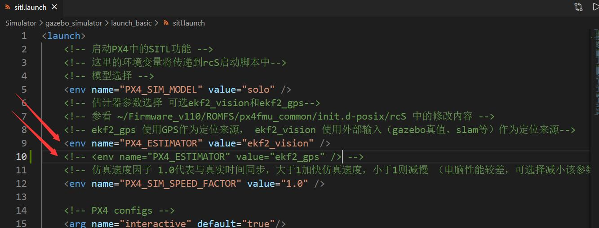
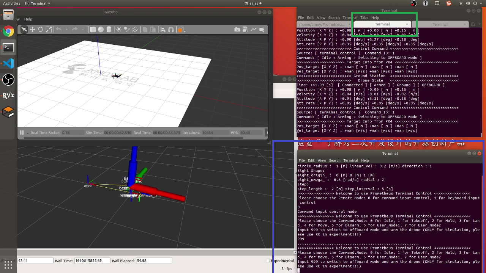

飞行控制模块
=======================

.. attention::
    估计器参数PX4_ESTIMATOR默认是ekf2_vision，估计器参数选择可选ekf2_vision和ekf2_gps，ekf2_gps 使用GPS作为定位来源，ekf2_vision 使用外部输入（gazebo真值、slam等）作为定位来源

1.室内仿真
-------------
.. attention::
    此场景下的估计器参数PX4_ESTIMATOR是ekf2_vision，ekf2_vision 使用外部输入（gazebo真值、slam等）作为定位来源

在终端输入以下命令

``roslaunch prometheus_gazebo sitl_control.launch``

.. important::
    应用启动后如上图所示，其中被绿框圈中的是无人机地面站信息，被蓝框圈中的是控制终端（全自主的offboard控制）。运行之后需要在控制终端选择使用command input control(通过输入目标点的方式控制) 或者keyboard input control(通过键盘控制)两种方式
        **command input control** 模式下，首先输入999解锁并切换至offboard模式，然后输入1起飞，然后再根据提示输入其他指令（悬停、降落、机体系移动、惯性系移动、轨迹追踪等等）
        
        **keyboard input control** 模式下，1 for Arm, Space for Takeoff, L for Land, H for Hold, 0 for Disarm, 8/9 for Trajectory tracking Move mode is fixed (XYZ_VEL,BODY_FRAME): w/s for body_x, a/d for body_y, k/m for z, q/e for body_yaw

*首先输入999解锁并切换至offboard模式
    *输入4选择移动模式
        *输入0选择XYZ_POS(发送坐标指令)
            *输入0选择ENU_FRAME
                *输入X轴的距离（m）

                *输入Y轴的距离（m）

                *输入Z轴的距离（m）

                *输入yaw角度（0-360°）

                *在ENU_FRAME下，无人机飞行到指定位置
        
    *输入4选择移动模式
        *输入0选择XYZ_POS(发送坐标指令)
            *输入1选择BODY_FRAME
                *输入X轴的距离（m）

                *输入Y轴的距离（m）

                *输入Z轴的距离（m）

                *输入yaw角度（0-360°）

                *在BODY_FRAME下，无人机飞行到指定位置
    
    *输入4选择移动模式
        *输入3选择XYZ_VEL(发送速度指令)
            *输入0选择ENU_FRAME
                *输入X轴的速度（m/s）

                *输入Y轴的距离（m/s）

                *输入Z轴的距离（m/s）

                *输入yaw角速度（rad/s）
                
                *在ENU_FRAME下，无人机按照指定速度飞行
    
    *输入4选择移动模式
        *输入3选择XYZ_VEL(发送速度指令)
            *输入1选择BODY_FRAME
                *输入X轴的速度（m/s）

                *输入Y轴的距离（m/s）

                *输入Z轴的距离（m/s）

                *输入yaw角速度（rad/s）

                *在BODY_FRAME下，无人机按照指定速度飞行
    *输入4选择移动模式
        *输入5选择TRAJECTORY
            *输入0选择Circle
                *输入运行时间（s）
            *输入1选择Eight Shape
                *输入运行时间（s）
            *输入2选择Step
                *输入运行时间（s）

演示视频
>>>>>>>>>>>>

.. raw:: html

    <iframe width="696" height="422" src="//player.bilibili.com/player.html?aid=971101299&bvid=BV1wV411i7zW&cid=277323116&page=1" scrolling="no" border="0" frameborder="no" framespacing="0" allowfullscreen="true"> </iframe>

2.室外仿真
-------------
.. attention::
    此场景下的估计器参数PX4_ESTIMATOR是ekf2_gps，ekf2_gps 使用GPS作为定位来源
.. attention::
    控制方式与室内仿真一样

演示视频
>>>>>>>>>>>>