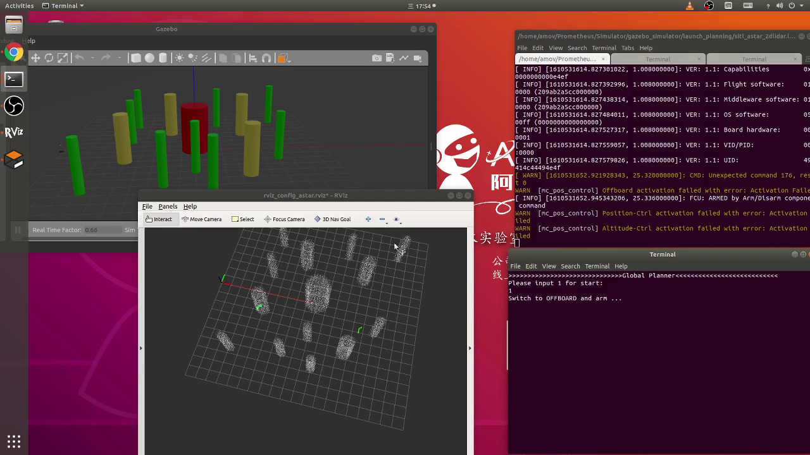
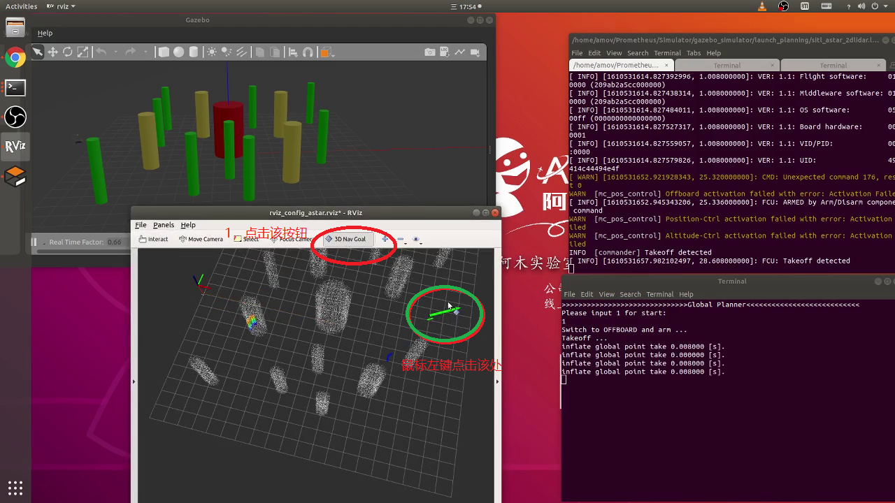

规划模块
=====================

全局规划 - Astar方法
--------------------

.. image:: ../../images/p450/simulation/estimator.jpg
   :height: 509px
   :width: 1333px
   :scale: 50 %
   :alt: None
   :align: center

.. attention::
    估计器参数PX4_ESTIMATOR默认是ekf2_vision，估计器参数选择可选ekf2_vision和ekf2_gps，ekf2_gps 使用GPS作为定位来源，ekf2_vision 使用外部输入（gazebo真值、slam等）作为定位来源

1.室内仿真
>>>>>>>>>>>>

.. attention::
    此场景下的估计器参数PX4_ESTIMATOR是ekf2_vision，ekf2_vision 使用外部输入（gazebo真值、slam等）作为定位来源

在终端输入以下命令

``roslaunch prometheus_gazebo sitl_astar_2dlidar.launch``

.. tip::
     应用启动后如上图所示，其中被蓝框圈中的是控制终端。根据提示，输入1选择开始

.. tip::
     点击 **3D Nav Goal** 按钮（红圈），然后鼠标左键点击地图不放再点击右键往上下滑动（为了确定目标点高度），同时松开鼠标按键，无人机开始自动规划路径。

演示视频
>>>>>>>>>>>>

.. raw:: html

    <iframe width="696" height="422" src="//player.bilibili.com/player.html?aid=971101299&bvid=BV1Fz4y1U7ap&cid=277323116&page=1" scrolling="no" border="0" frameborder="no" framespacing="0" allowfullscreen="true"> </iframe>

2.室外仿真
>>>>>>>>>>>>
.. attention::
    此场景下的估计器参数PX4_ESTIMATOR是ekf2_gps，ekf2_gps 使用GPS作为定位来源
.. attention::
    控制方式与室内仿真一样

演示视频
>>>>>>>>>>>>