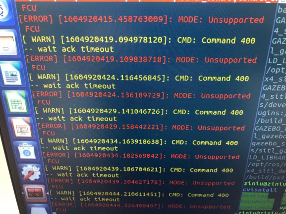
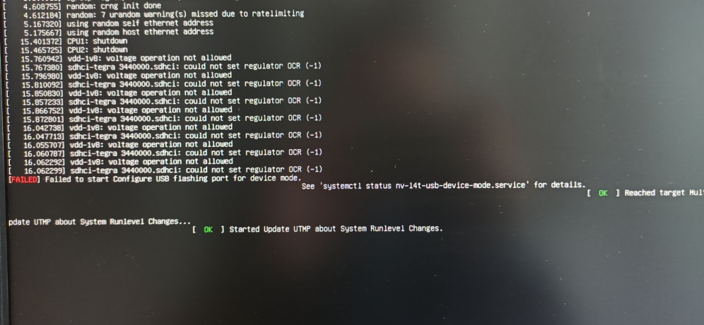
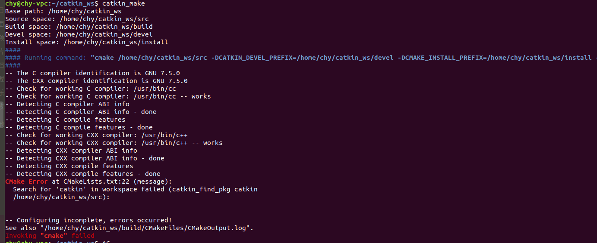
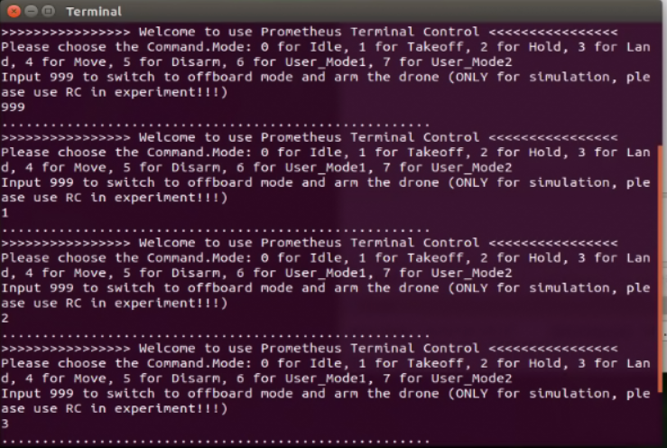
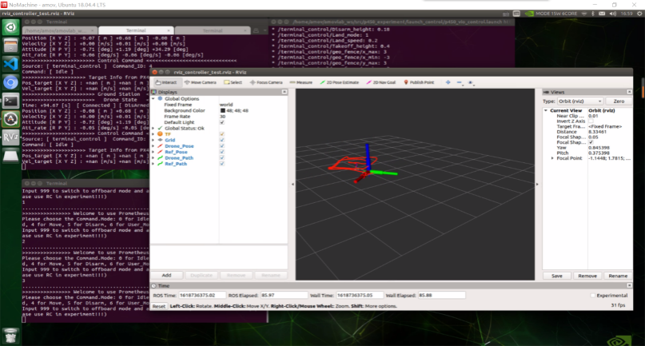
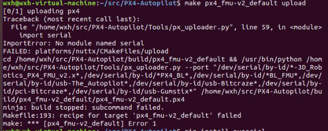
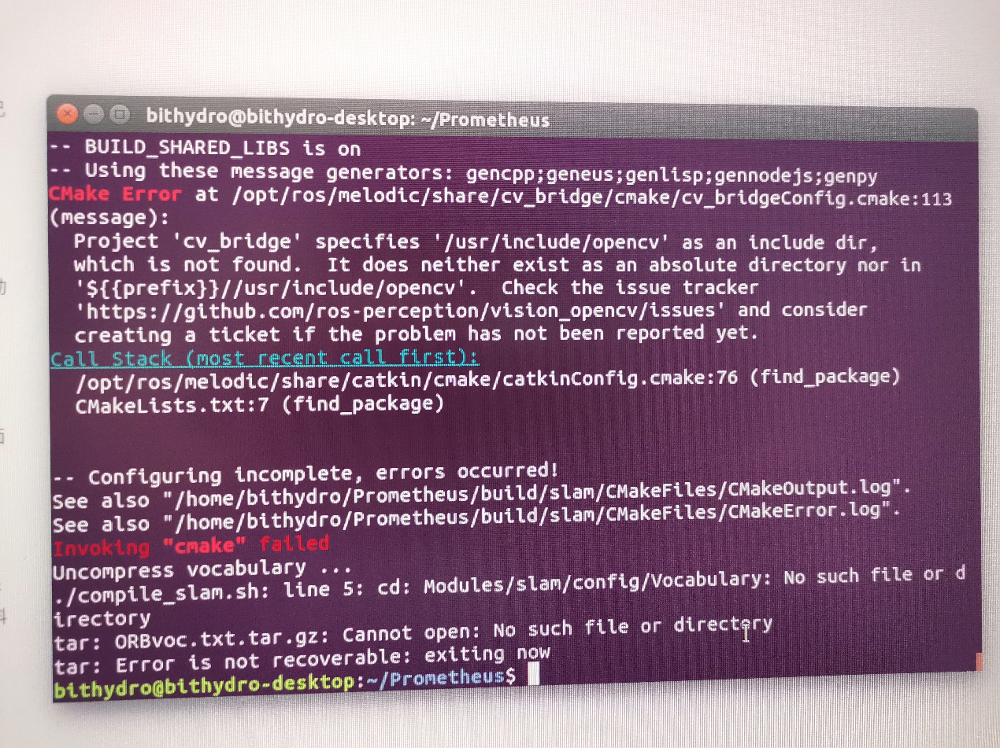
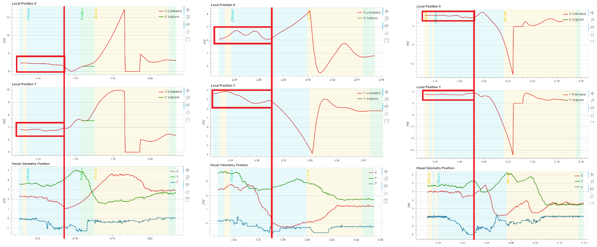
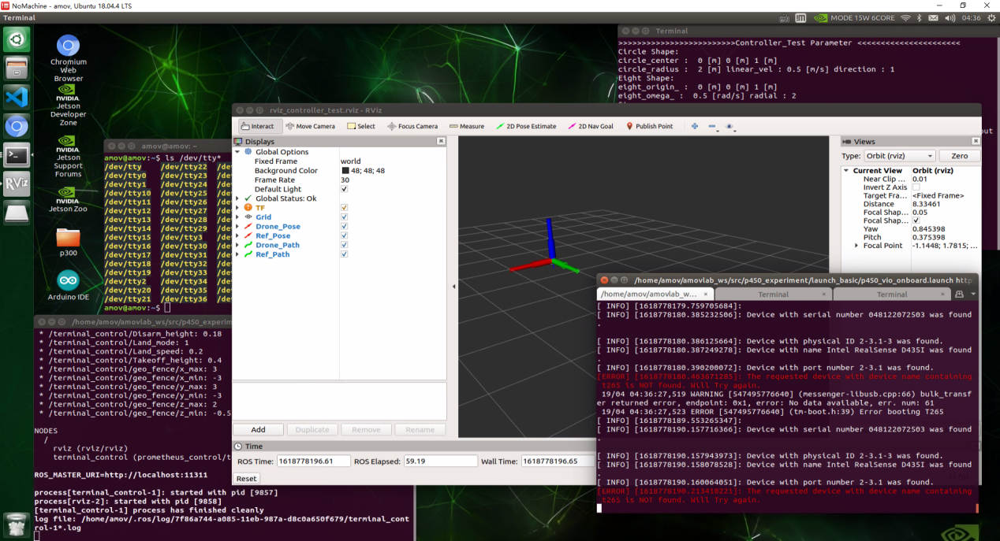

问题总结
==========================

.. attention::
  1、 如果你要跑仿真，安装按照prometheus wiki步骤执行即可，这个我们经过大量测试后的。我们推荐18.04系统，有人遇到子模块无法更新，它使用的是Ubuntu16.04。在真实板载计算机上面，realsense sdk 为2.36.0；realsense-ros 为2.2.15。opencv源码要完整安装3.3.1。不管你的板载计算机是arm，x86最好按照这个要求。

 
  2、我们现在是集成的prometheus的板载计算机有Jetson-Xavier开发套件，Jetson-Xavier-NX开发套件，Jetson-Nano（B01）开发套件。如果各位不想装板载计算机上面的环境，可以联系我们，都是有集成的。（均为18.04系统，jetpack4.3/4.4)。对于飞机上面的Jetson-TX2，它本身是Ubuntu16.04的，只要下载prometheus，也能编译成功。目前还没有将该款板载计算机升级到18.04。

  3、对于px4_command这个项目，在以下环境中运行（ubuntu18.04不行）：
  ubuntu16.04 LTS
  Firmware v1.8.2
  ros kinetic v1.12.17
  gazebo v7.16.1
  QGC v3.3.2 
  以后的同学学习px4_command项目的时候别把环境搞错了。

  4、之前群里讨论了几次的 unsupport fcu问题，这是因为是由于PX4和mavros通信时 udp端口不匹配导致的，一定要使用专用的PX4固件，PX4官方在版本更迭的时候改了默认的udp端口，替换mavros版本的方法只是使用了旧的udp端口号，改一下px4中的rcs文件即可。

  .. image:: ../../images/simulation/固态硬盘无法读取.png
  也可以外接一个硬盘。

Q1：二维码辅助降落的时候，不修改底层EKF2代码的话，那二维码不就只提供一个目标位置信息吗？无人机定位还是靠着gps和imu，这样不还是无法做到精准定位降落吗？
>>>>>>>>>>>>
A：需要多精准？差分gps可以试一试，自身估计不准的话确实很难精准。

Q2：测试自主降落demo出现输入1时飞机炸上天，为什么啊？
>>>>>>>>>>>>
A：初步判断是笔记本处理能力太渣以及起飞高度设定太高导致，可以降低起飞高度或者增加解锁后等待时间解决，我在台式机上并未遇到该问题，证明电脑cpu能力对仿真还是有很大帮助的，同样的代码也会跑出不通的效果。也可能重新装一遍ros就能解决。

Q3：px4固件通过视觉提供位置数据，用来定点，那么视觉需要提供的数据频率最低大概有多少？
>>>>>>>>>>>>
A：gps信号是10HZ比它大就可以。

Q4：定点都飞不稳，超调特别大，一飞冲天
>>>>>>>>>>>>
A：参数基本不需要调，一些重点细节可以看wiki，一飞冲天调一下平衡推力，调小；所有真实飞行的launch和参数我会同步更新到experiment文件夹。

Q5：用t265定位手飞，能开定高模式吗？
>>>>>>>>>>>>
A：不仅可以定高也可以定点，因为它本身就是提供位置信息的。

Q6：Jetson nano通过串口连接px4，启动了 control_onboard，用set_mode节点无法切换模式，如下图所示：
>>>>>>>>>>>>

A：tx，rx反了或者线松了。

Q7：局域网配置里面，可不可以都用飞控热点，看推荐配置里面两种方案都要自备一个路由器，为什么吗？
>>>>>>>>>>>>
A：不行，因为功率不够，但是可以尝试，估计nomachine勉强带的动，程序跑起来有些费劲。

Q8：TX2无法开机，卡在了下图，这个问题怎么解决啊？
>>>>>>>>>>>>

A：重启上电，还不行就重新刷系统。

Q9：请问promethues代码，配什么版本的openCV比较好？
>>>>>>>>>>>>
A：建议3.3.1，源码安装完整的3.3.1，安装完成了，opencv路径就有artuco动态链接库了。

Q10：这种aruco板识别的时候会出现上下翻转，导致数据直接错乱，有没有解决方案（仿真中）？
>>>>>>>>>>>>
A：常遇到，一般都距离太近的时候。

Q11:仿真时怎样获取无人机的飞行日志？
>>>>>>>>>>>>
A：可以打开qgc查看，也可以通过rosbag记录消息

Q12：nvidia-sim不显示显卡信息，为什么？
>>>>>>>>>>>>
A：安装nvidia的驱动

Q13：请问用mavros控制小车的话，一般用哪个消息比较好，我用了/mavros/setpoint_raw/ local下面的Vx与Vy不是很好用，好像因为速度小于零的时候，小车不能识别。
>>>>>>>>>>>>
A：px4小车似乎有点问题，要在1.11以上的版本。

Q14:
>>>>>>>>>>>>

A：一新：删除掉报错的位置。

Q15：做最后一步编译的时候电脑整个卡住，鼠标都动不了的情况
>>>>>>>>>>>>
A：内存爆了，我是i7 3770 配8G内存，编译会爆内存，加8G swap就可以了，或者搜下命令，只用两个核心进行编译，就是在编译命令前面加了taskset -c 0,1,2,3 就是前四个核心。

Q16：如果单纯使用动捕系统做定位的话，我可以直接用relay 工具，把vrpn_client_pose  变成mavros/vision_pose/pose 吗？
>>>>>>>>>>>>
A：阿木_戚博：不一定坐标一致。

Q17：用远程仓库下px4固件 运行提示少模型
>>>>>>>>>>>>
A：不影响，多运行几遍就好了。

Q18：安装镜像到100%出现问题
>>>>>>>>>>>>
A：之前出现过，换了个大空间硬盘解决了（不是分配空间，是你虚拟机目录所在硬盘的空间）

Q19：跟着wiki上步骤走，仿真飞行配置中在px4编译的时候出现这个问题，无法启动gazebo，有人知道是什么原因吗？
>>>>>>>>>>>>
A：你可以运行gzclient和gzserver 看看有啥信息
提示：gazebo最近调试可以遵循这样的流程，
1.先关闭终端重试
2.kill gzclient和kill gzsever
3.关机重启
再不行把error进行谷歌翻译，能解决70%的诡异问题

Q20：自主降落中的这个999在哪定义的呢？
>>>>>>>>>>>>
A：你看哪里订阅了这个话题就知道了，看哪里订阅了这个话题，不用看类型声明

Q21：想请教下，附图GAZEBO我已手动添加p450的模型，为什么还是报错呢，试了很多办法没法解决。 谢谢！
>>>>>>>>>>>>
A：要用prometheus_px4。

Q22：大家好，用ssh 可以通过gnome-terminal 打开新的终端吗？
>>>>>>>>>>>>
A：要在机载电脑开两个终端，那就需要连接两次ssh

Q23：输入指令999--->1---->2--->3、rviz显示如下（），各位大佬问一下我先启用roslaunch p450_experiment p450_vio_onboard.launch后用roslaunch p450_experiment p450_vio_control.launch，遥控器进入offboard模式，然后999解锁，1起飞，2定点后，为什么飞机这么漂啊？
>>>>>>>>>>>>

A: 盲猜可能是t265定位出问题了，我遇到过类似的情况,我之前拿起来晃一圈，轨迹闭环才敢飞 不然直接飘没了,先检查有没有用t265的yaw轴数据，那个velocity数据不要用，可能会炸机。

Q24：投放物体是怎么做的
>>>>>>>>>>>>
A：直接用camera trigger接单片机，电平捕获

Q25：那个vison velocity fusion是干嘛用的啊
>>>>>>>>>>>>
A：速度融合

Q26：话说有没有稳定的降压模块给nx供电啊，我发现我这4s锂电池用12v降压模块，电池电量还有一半nx就关机了
>>>>>>>>>>>>
A：用6s，但是比赛（全国大学生工程训练赛）要求17v电压以下只能4s。

Q27:单目相机得到的是像素点，怎样换算出它相对于无人机的x y位置呢？
>>>>>>>>>>>>
A：结合超声波或者激光雷达模块，得到无人机对地高度，根据像素点流速公式得到无人机对地速度，这个速度和惯导进行积分融合，速度*单位时间就是单位位移xy方向

Q28：px4自带的gps太飘了，有没有什么好的方法？
>>>>>>>>>>>>
A：加了RTK会好一些

Q29：飞控惯导更精准一些相对自己的惯导，但是需要标定，关键问题是惯导数据和相机数据的同步怎样解决呢？
>>>>>>>>>>>>
A：网上有类似的教程，可以搜索下，记得假如用飞控的imu的话频率调高一些，因为vins是两个数据读取一个，所以飞控imu调到200hz之后其实vins用的是100hz

Q30：真机用vins大家用什么板载呢？
>>>>>>>>>>>>
A：nx或nuc，tx2的arm核比较菜，nuc比较稳，重量在600g左右，p200也带的动

Q31:解决bashrc工作空间覆盖问题
>>>>>>>>>>>>
A：按照source的顺序来，先全部注释，哪个解开注释后导致了有工作空间找不到的问题，就重新编译一次这个解开注释的工作空间因该就可以了

Q32：RGB-D相机推荐哪款啊？D435i和structure core比哪个比较好啊？
>>>>>>>>>>>>
A：D435i吧，资料多一些

Q33：下载下来的px4代码版本过高怎么办？有办法降低代码版本吗？
>>>>>>>>>>>>
A：git checkout v（低版本） 然后git submodule update –init --resur

Q34：烧录px4代码时弹出以下错误，怎么解决？
>>>>>>>>>>>>

A：安装pyseria

Q35：nano换源只有两个源，没有中国源，在终端添加也总失败
>>>>>>>>>>>>
A：直接在source.list中改，参考教程：https://zhuanlan.zhihu.com/p/69849653

Q36：请问下飞控日志里能否读取无人机的位置信息啊？只有gps，gps会记录位置信息嘛？
>>>>>>>>>>>>
A：日志里 本地NED位置信息可以搜索关键词local，全球位置信息可以搜索关键词global，gps精度几米左右，px4融合后精度0.5米左右

Q37：prometheus以后可能会兼容cv4，但是ROS melodic用cv4肯定是要改cv桥路径的，躲是躲不开了; 我把opencv3.3.1安到了/usr目录下，但是一直在找ros的opencv，是不是要安到/usr/local下，改prometheus的cmake里的opencv路径。还是卸载ros的opencv
>>>>>>>>>>>>
A：直接把cmakelists里面的路径改了, find那里面改成 OpenCV 3 required, 原本是没有3的，Linux会通过系统环境变量优先找4的, Phill:
安装路径没要求,别跟系统的东西混装,之后卸载麻烦,自己装的，塞到/usr/local里面

Q38：请问一下大家改过mavros输出的IMU频率吗，最高可以达到多少呢？
>>>>>>>>>>>>
A: 试过200hz,实际180hz就不行了

Q39：为什么港科大的无人机路径规划飞得很平滑，而阿木的是一段一段飞的？
>>>>>>>>>>>>
A: 如果只是发位置的话，那就是飞的一段一段飞，要是把轨迹的位置转化为无人机实时飞行的姿态环的话，那就是平滑飞

Q40：请问有人遇到同样的问题吗，编译Prometheus中的slam模块时cv_brige报错，如下图，我用的是xavier nx机载电脑，opencv版本是4.1.1
>>>>>>>>>>>>

A：cv bridge里面把路径改了，默认支持的是3

Q41：请问怎么查fcu_url的端口号和波特率？
>>>>>>>>>>>>
A：波特率是设置的，端口号 ls /dev/tty*

Q42：我再详细解释一下哈~这里是三次飞行log数据；第一行第二行是融合之后的位置，第三行是uwb给的位置里程计。我在做定点飞行，飞行效果不好，飞机会漂移。但是观察数据发现，local position其实很稳，飞控觉得自己并没有漂移,如下图：
>>>>>>>>>>>>

A: 怀疑是EKF2融合位置数据不够敏感，以至于飞机没感觉到自己飘走了，尽管uwb已经反映出来漂移情况了

Q43：prometheus里面的仿真运行时报错，飞机也没法起飞，是什么原因呢？MODE: Unsupported FCU [ WARN] [1615635403.059604673, 13328.328000000]: CMD: Command 400 -- wait ack timeout
>>>>>>>>>>>>
A：需要打开src/Firmware/launch/mavros_posix_sitl.launch（如需使用其他launch文件修改方法类似）
将这一行:
<arg name="fcu_url" default="udp://:14540@localhost:14557"/>
改成:
<arg name="fcu_url" default="udp://:14540@127.0.0.1:14557"/>

Q44：问一下我的t265再rviz里显示正常，但在终端里一直报错是什么情况啊，报错如下图：
>>>>>>>>>>>>

A：貌似是没找到设备，可以尝试t265拔了重插

Q45：请问一下，树莓派4B上可以运行promethes项目吗?
>>>>>>>>>>>>
A：控制模块问题不大, opcv估计够呛
