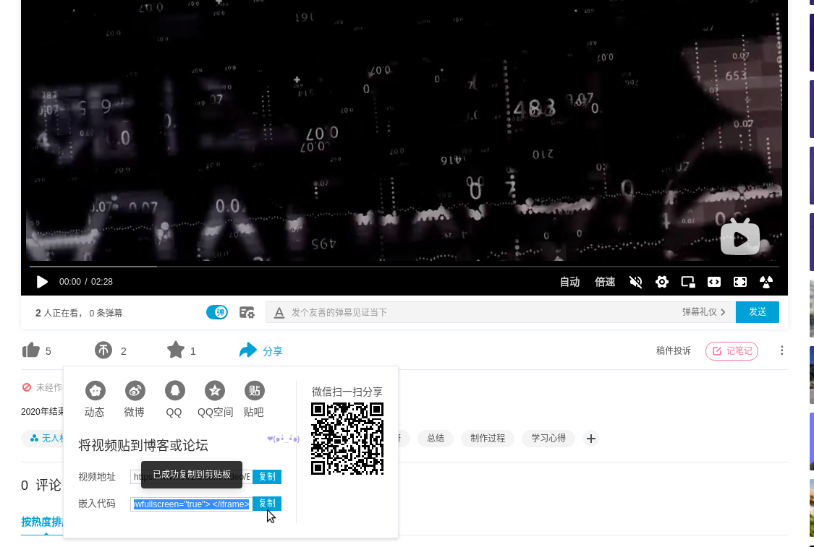

图片与视频的添加
=========================

图片
-------------

图片添加的语法：
::

        .. image:: ../../images/test/get_raw_html.png（图片的绝对路径）

实际效果如下图。

视频
-----------------

哔哩哔哩
^^^^^^^^^^^^^^^^
以B站视频为例，如何将B站视频嵌入到wiki之内

在此 `视频链接 <https://www.bilibili.com/video/BV1Tp4y1x7Rw>`__ 中，点击分享，选中如下图所示的复制嵌入代码

视频的语法为：
::

        .. raw::html

            （上图拷贝的嵌入代码）<iframe src="//player.bilibili.com/player.html?aid=971101299&bvid=BV1Tp4y1x7Rw&cid=277323116&page=1" scrolling="no" border="0" frameborder="no" framespacing="0" allowfullscreen="true"> </iframe>

如果是直接拷贝过来的嵌入代码，也可以调用视频，但是视频大小特别的小，所以需要设置视频的宽度和高度，使用 width="696" height="422" 可以实现。

所以完美添加视频的语法为：
::

        ..raw::html

           <iframe width="696" height="422" src="//player.bilibili.com/player.html?aid=971101299&bvid=BV1Tp4y1x7Rw&cid=277323116&page=1" scrolling="no" border="0" frameborder="no" framespacing="0" allowfullscreen="true"> </iframe> 

.. raw:: html

    <iframe width="696" height="422" src="//player.bilibili.com/player.html?aid=971101299&bvid=BV1Tp4y1x7Rw&cid=277323116&page=1" scrolling="no" border="0" frameborder="no" framespacing="0" allowfullscreen="true"> </iframe>

特殊提示
-----------------------

语法:

::

    .. note:: 这个是注解

    .. hint:: 这个是提示
    
    .. important:: 这个是重点
    
    .. tip:: 这个是小技巧
    
    .. warning:: 这个是警告
    
    .. caution:: 这也是个警告
    
    .. attention:: 这个是注意
    
    .. error:: 这是个错误
    
    .. danger:: 这个是危险

效果如下：

.. note:: 这个是注解

.. hint:: 这个是提示
    
.. important:: 这个是重点
    
.. tip:: 这个是小技巧
    
.. warning:: 这个是警告
    
.. caution:: 这也是个警告
    
.. attention:: 这个是注意
    
.. error:: 这是个错误
    
.. danger:: 这个是危险