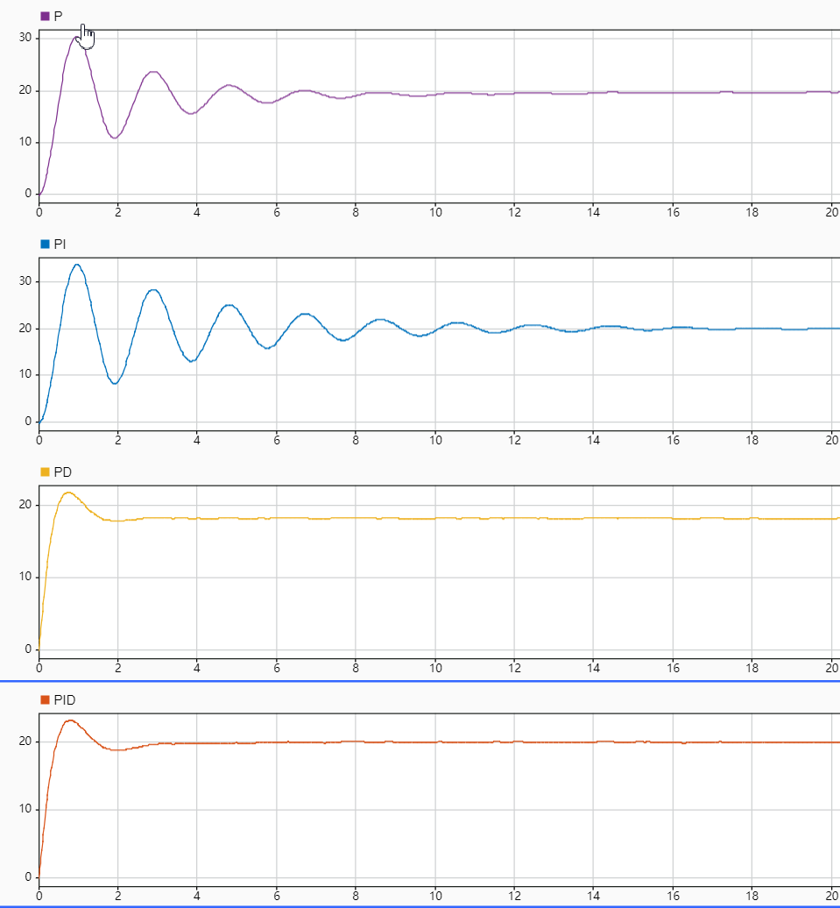
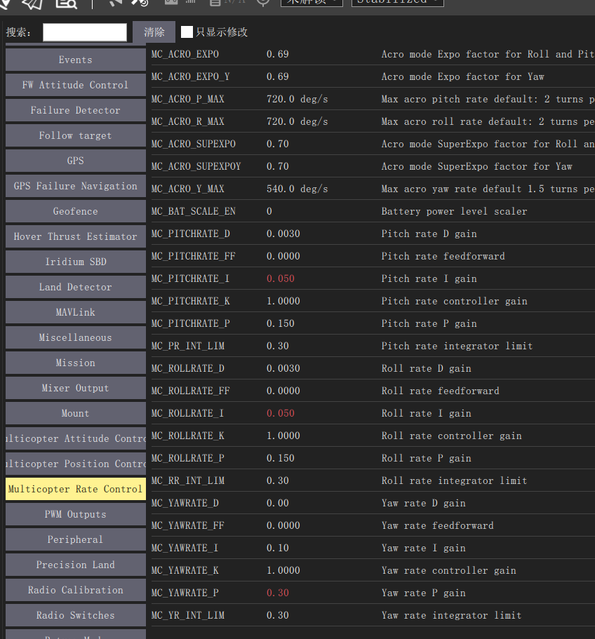

PID调参
=================

PID调节图示
--------------

p为比例项、i为积分项、d为微分项。pid调参可用如下一张图来解释说明。
纯比例P作用下在稳定后有些许的静态误差，因此引入积分项I。
PI作用下，虽然弥补了静态误差，但是因为引入了积分项，使得调节过程中振幅增加，调节周期增长，单纯PI作用未免有“因小失大”之疑。
PD作用下，加快了调节时间减小了调节幅度，但是当系统稳定时与输入有较大误差。
综合以上，PID作用下，调节的又快又好还没有误差，因此PID调节是理想的控制调节策略。

参数调节
------------------

在调节参数之前，应该了解px4的代码框架，了解位置控制与姿态控制的关系，内环与外环的关系。

姿态控制的角度环参数

.. image:: ../../images/baseconfig_for_px4/9-pid-att.png

姿态控制的角速度环参数

位置控制参数

.. image:: ../../images/baseconfig_for_px4/9-pid-position.png